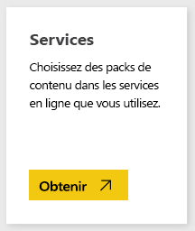
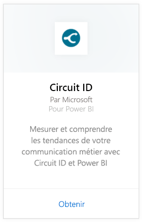
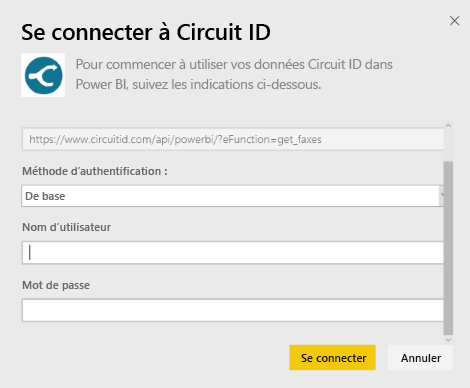
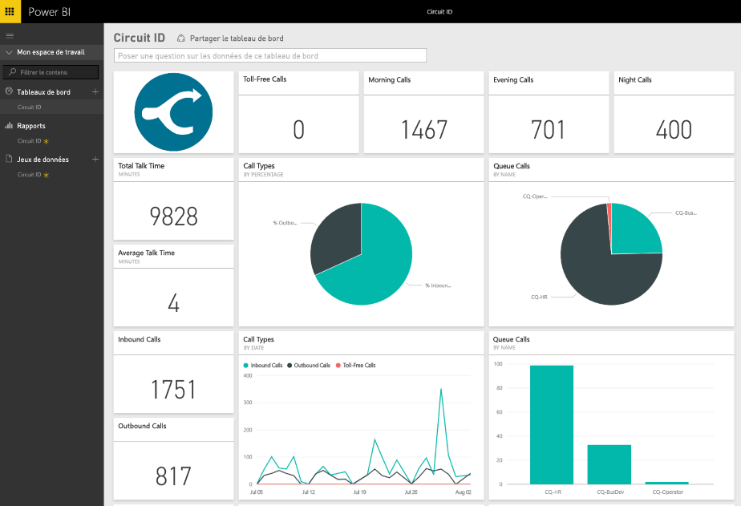

# Se connecter à Circuit ID avec Power BI
L’analyse de vos données de communication à partir de Circuit ID est facile avec Power BI. Power BI récupère vos données, puis génère un tableau de bord par défaut et des rapports associés à partir de ces données. Une fois la connexion établie, vous pouvez explorer vos données et personnaliser le tableau de bord selon vos besoins. Les données sont actualisées automatiquement chaque jour.

Connectez-vous au [pack de contenu Circuit ID](https://app.powerbi.com/getdata/services/circuitid) pour Power BI.

## Comment se connecter
1. Sélectionnez **Obtenir des données** en bas du volet de navigation gauche.
   
    
2. Dans la zone **Services** , sélectionnez **Obtenir**.
   
    
3. Sélectionnez **Circuit ID** \> **Obtenir**.
   
    
4. Pour la méthode d’authentification, sélectionnez De base et indiquez vos nom d’utilisateur et mot de passe. Appuyez ensuite sur Se connecter.
   
    
5. Une fois les données importées dans Power BI, vous verrez un nouveau tableau de bord, un nouveau rapport et un nouveau jeu de données dans le volet de navigation gauche. Les nouveaux éléments sont signalés par un astérisque jaune.
   
    

**Et maintenant ?**

* Essayez de [poser une question dans la zone Q&R](power-bi-q-and-a.md) en haut du tableau de bord.
* [Modifiez les vignettes](service-dashboard-edit-tile.md) dans le tableau de bord.
* [Sélectionnez une vignette](service-dashboard-tiles.md) pour ouvrir le rapport sous-jacent.
* Même si une actualisation quotidienne de votre jeu de données est planifiée, vous pouvez modifier la planification de l’actualisation ou essayer d’actualiser le jeu de données sur demande à l’aide de l’option **Actualiser maintenant**.

## Étapes suivantes
[Qu’est-ce que Power BI ?](power-bi-overview.md)

[Obtenir des données pour Power BI](service-get-data.md)

