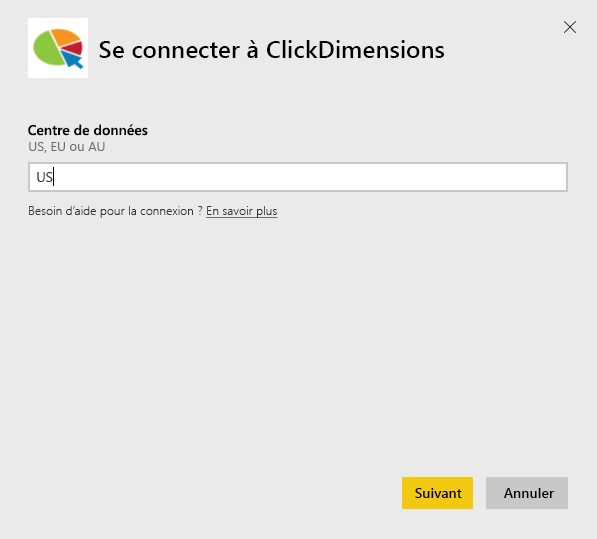
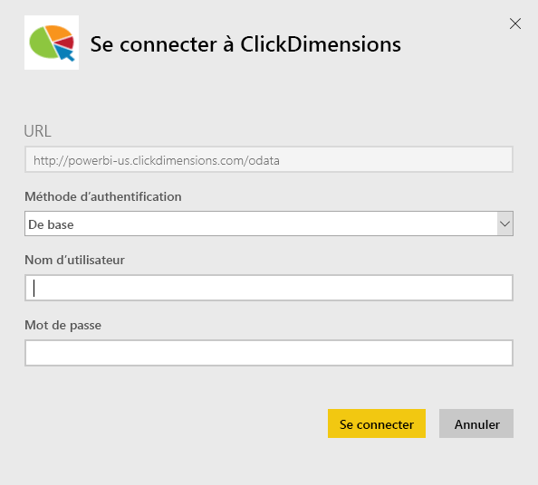
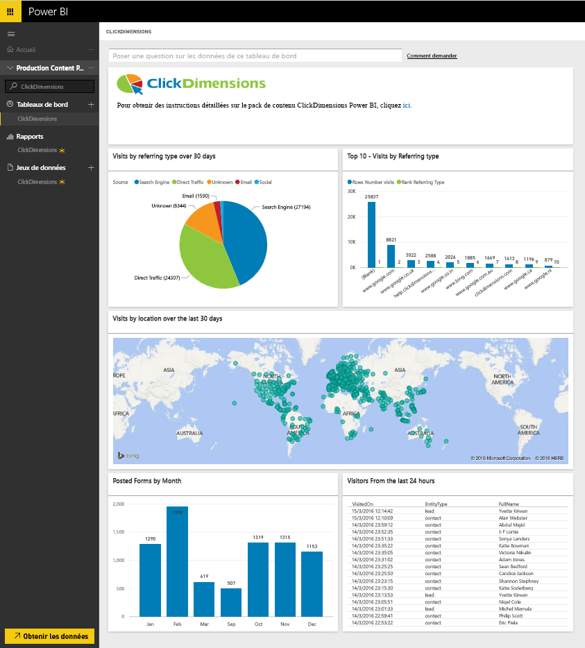
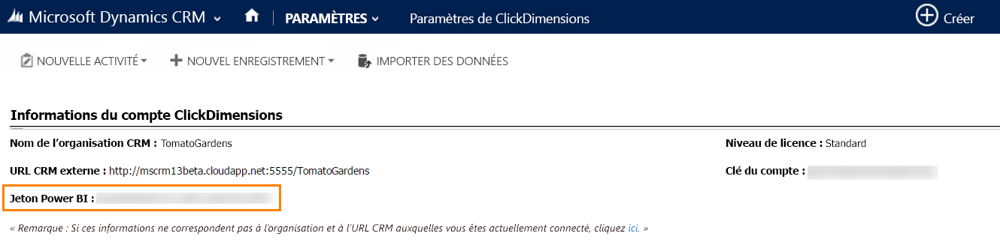

# Se connecter à ClickDimensions avec Power BI
Le pack de contenu ClickDimensions pour Power BI permet aux utilisateurs d’utiliser les données marketing ClickDimensions dans Power BI, donnant ainsi aux équipes de gestion une analyse approfondie de leurs efforts de ventes et marketing. Visualisez et analysez les interactions de la messagerie, les visites web et les envois de formulaire dans les rapports et tableaux de bord Power BI.

Connectez-vous au [pack de contenu ClickDimensions](https://app.powerbi.com/getdata/services/click-dimensions) pour Power BI.

## Comment se connecter
1. Sélectionnez **Obtenir des données** en bas du volet de navigation gauche.
   
   
2. Dans la zone **Services** , sélectionnez **Obtenir**.
   
   
3. Sélectionnez **ClickDimensions** \>  **Obtenir**.
   
   
4. Indiquez l'emplacement de votre centre de données (US, EU ou AU), puis sélectionnez **Suivant**.
   
   
5. Pour la **méthode d’authentification**, sélectionnez **De base** \> **Se connecter**. Quand vous y êtes invité, entrez vos informations d’identification ClickDimensions. Voir les détails sur la [recherche de ces paramètres](#FindingParams) ci-dessous.
   
    
6. Après l’approbation, le processus d’importation démarre automatiquement. Une fois terminé, de nouveaux tableau de bord, rapport et modèle apparaîtront dans le volet de navigation. Sélectionnez le tableau de bord pour afficher vos données importées.
   
     

**Et maintenant ?**

* Essayez de [poser une question dans la zone Q&R](service-q-and-a.md) en haut du tableau de bord.
* [Modifiez les vignettes](service-dashboard-edit-tile.md) dans le tableau de bord.
* [Sélectionnez une vignette](service-dashboard-tiles.md) pour ouvrir le rapport sous-jacent.
* Même si une actualisation quotidienne de votre jeu de données est planifiée, vous pouvez modifier la planification de l’actualisation ou essayer d’actualiser le jeu de données sur demande à l’aide de l’option **Actualiser maintenant**.

## Configuration requise
Pour utiliser le pack de contenu Power BI, vous devez indiquer le centre de données correspondant dans votre compte et vous connecter avec votre compte ClickDimensions. Si vous ne savez pas quel centre de données indiquer, contactez votre administrateur.

## Recherche de paramètres
La clé de compte se trouve dans Paramètres CRM \> Paramètres ClickDimensions. Copiez la clé de compte à partir de Paramètres ClickDimensions et collez-la dans le champ Nom d’utilisateur.  

  

Copiez le jeton Power BI à partir de Paramètres ClickDimensions et collez-le dans le champ Nom d’utilisateur. Le jeton Power BI se trouve dans Paramètres CRM \> Paramètres ClickDimensions.  

  

## Étapes suivantes
[Prise en main de Power BI](service-get-started.md)

[Obtenir des données dans Power BI](service-get-data.md)

