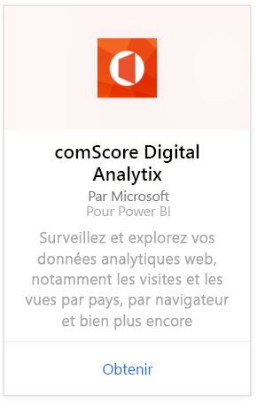
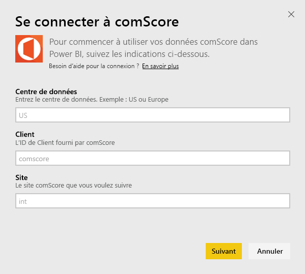
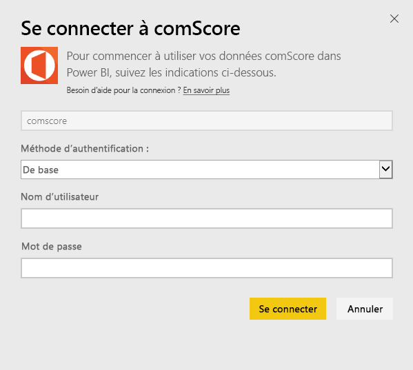
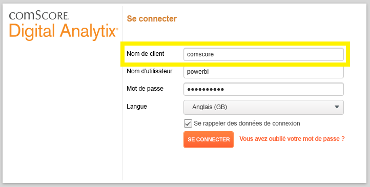
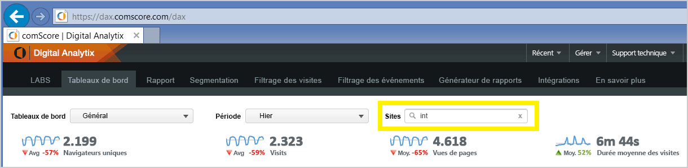

# Se connecter à comScore Digital Analytix avec Power BI
Visualisez et explorez vos données comScore Digital Analytix dans Power BI avec le pack de contenu Power BI. Les données sont actualisées automatiquement une fois par jour.

Connectez-vous au [pack de contenu comScore pour Power BI.](https://app.powerbi.com/getdata/services/comscore)

>[!NOTE]
>Pour vous connecter au pack de contenu, vous avez besoin d’un compte utilisateur DAx comScore et d’un accès à l’API comScore. Vous trouverez plus de [détails](#Requirements) ci-dessous.

## Comment se connecter
1. Sélectionnez Obtenir des données en bas du volet de navigation gauche.
   
   
2. Dans la zone **Services** , sélectionnez **Obtenir**.
   
   
3. Sélectionnez **comScore Digital Analytix** \> **Obtenir**.
   
   
4. Indiquez le centre de données, l’ID client comScore et le site auquel vous souhaitez vous connecter. Pour plus de détails sur la démarche pour trouver ces valeurs, consultez [Trouver vos paramètres comScore](#FindingParams) ci-dessous.
   
   
5. Fournissez vos nom d’utilisateur comScore et mot de passe pour vous connecter. Voir les détails sur la recherche de cette valeur ci-dessous.
   
   
6. Le processus d’importation démarre automatiquement. Une fois terminé, de nouveaux tableau de bord, rapport et modèle apparaîtront dans le volet de navigation. Sélectionnez le tableau de bord pour afficher vos données importées.

**Et maintenant ?**

* Essayez de [poser une question dans la zone Q&R](consumer/end-user-q-and-a.md) en haut du tableau de bord.
* [Modifiez les vignettes](service-dashboard-edit-tile.md) dans le tableau de bord.
* [Sélectionnez une vignette](consumer/end-user-tiles.md) pour ouvrir le rapport sous-jacent.
* Même si une actualisation quotidienne de votre jeu de données est planifiée, vous pouvez modifier la planification de l’actualisation ou essayer d’actualiser le jeu de données sur demande à l’aide de l’option **Actualiser maintenant**.

## Configuration requise
Un compte utilisateur comScore DAx et un accès à l’API comScore DAx sont nécessaires pour vous connecter. Veuillez contacter votre administrateur DAx comScore pour confirmer votre compte.

## Recherche de paramètres
Des détails sur la recherche de chacun des paramètres comScore figurent ci-dessous.

**Centre de données**

Le centre de données auquel vous vous connectez est déterminé par l’URL à laquelle vous accédez dans comScore.

 

**Client**

Le client est le même que celui que vous indiquez lors de la connexion à comScore DAx.

 

**Site**

Le site comScore détermine le site duquel vous aimeriez voir les données. Vous pouvez trouver la liste des sites dans votre compte comScore.

## Étapes suivantes
[Prise en main de Power BI](service-get-started.md)

[Obtenir des données dans Power BI](service-get-data.md)

