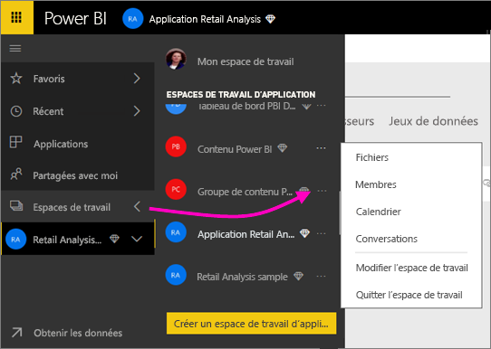
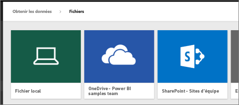
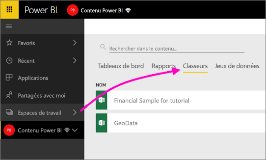

# Se connecter à des fichiers stockés dans OneDrive pour votre espace de travail d’application Power BI
Après avoir [créé un espace de travail d’application dans Power BI](consumer/end-user-create-apps.md), vous pouvez stocker vos fichiers Excel, CSV et Power BI Desktop sur le OneDrive Entreprise de l’espace de travail de votre application Power BI. Vous pouvez continuer de mettre à jour les fichiers que vous stockez sur Entreprise. Ces mises à jour sont alors répercutées automatiquement dans les rapports et tableaux de bord Power BI basés sur les fichiers. 

> [!NOTE]
> L’expérience des nouveaux espaces de travail en préversion change la relation entre les espaces de travail Power BI et les groupes Office 365. Vous ne créez plus automatiquement un groupe Office 365 chaque fois que vous créez un nouvel espace de travail. Pour plus d’informations, consultez [Création des nouveaux espaces de travail (préversion)](service-create-the-new-workspaces.md)

L’ajout de fichiers à l’espace de travail de votre application est un processus en deux étapes : 

1. Tout d’abord, [chargez des fichiers sur OneDrive Entreprise](service-connect-to-files-in-app-workspace-onedrive-for-business.md#1-upload-files-to-the-onedrive-for-business-for-your-app-workspace) pour l’espace de travail de votre application.
2. Ensuite, [connectez-vous à ces fichiers à partir de Power BI](service-connect-to-files-in-app-workspace-onedrive-for-business.md#2-import-excel-files-as-datasets-or-as-excel-online-workbooks).

> [!NOTE]
> Les espaces de travail d’application sont disponibles uniquement avec [Power BI Pro](service-free-vs-pro.md).
> 
> 

## 1 Charger des fichiers sur le OneDrive Entreprise pour l’espace de travail de votre application
1. Dans le service Power BI, sélectionnez la flèche située en regard de Espaces de travail, puis sélectionnez les points de suspension (**…**) en regard du nom de votre espace de travail. 
   
   
2. Sélectionnez **Fichiers** pour ouvrir OneDrive Entreprise pour l’espace de travail de votre application sur Office 365.
   
   > [!NOTE]
   > Si vous ne voyez pas **Fichiers** dans le menu de l’espace de travail d’application, sélectionnez **Membres** pour ouvrir le OneDrive Entreprise pour l’espace de travail de votre application. Sélectionnez ici **Fichiers**. Office 365 définit un emplacement de stockage OneDrive pour les fichiers de l’espace de travail de groupe de votre application. Ce processus peut prendre un certain temps. 
   > 
   > 
3. Ici, vous pouvez charge des fichiers sur le OneDrive Entreprise pour l’espace de travail de votre application. Sélectionnez **Charger**et accédez à vos fichiers.
   
   

## 2 Importer des classeurs Excel en que jeux de données ou classeurs Excel Online
À présent que vos fichiers se trouvent sur le OneDrive Entreprise pour l’espace de travail de votre application, vous avez le choix. Vous pouvez soit : 

* [Importer les données du classeur Excel en tant que jeux de données](service-get-data-from-files.md) et vous en servir pour générer des rapports et des tableaux de bord, que vous pouvez ensuite afficher dans un navigateur web et sur des appareils mobiles.
* [Vous connecter à des classeurs Excel complets dans Power BI](service-excel-workbook-files.md) et les afficher exactement tels qu’ils apparaissent dans Excel Online.

### Importer ou se connecter aux fichiers dans l’espace de travail de votre application
1. Dans Power BI, basculez vers l’espace de travail de l’application de façon à ce que le nom de celui-ci apparaisse dans l’angle supérieur gauche. 
2. Sélectionnez **Obtenir des données** en bas du volet de navigation gauche. 
   
   
3. Dans la zone **Fichiers**, sélectionnez **Obtenir**.
   
   
4. Sélectionnez **OneDrive** - *Nom de l’espace de travail de votre application*.
   
    
5. Sélectionnez le fichier souhaité > **Se connecter**.
   
    C’est ici que vous décidez s’il faut [importer les données du classeur Excel](service-get-data-from-files.md) ou [se connecter aux classeurs Excel tout entiers](service-excel-workbook-files.md).
6. Sélectionnez **Importer** ou **Se connecter**.
   
    
7. Si vous sélectionnez **Importer**, le classeur apparaît sous l’onglet **Jeux de données**. 
   
    
   
    Si vous sélectionnez **Se connecter**, le classeur apparaît sous l’onglet **Classeurs**.
   
    

## Étapes suivantes
* [Créer des applications et des espaces de travail d’application dans Power BI](consumer/end-user-create-apps.md)
* [Importer des données de classeurs Excel](service-get-data-from-files.md)
* [Se connecter à des classeurs Excel tout entiers](service-excel-workbook-files.md)
* D’autres questions ? [Essayez la communauté Power BI](http://community.powerbi.com/)
* Vous souhaitez formuler des commentaires ? Consultez la page des [suggestions concernant Power BI](https://ideas.powerbi.com/forums/265200-power-bi).

