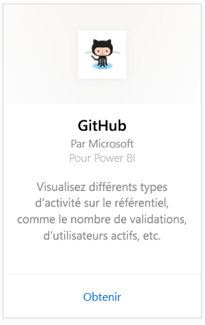
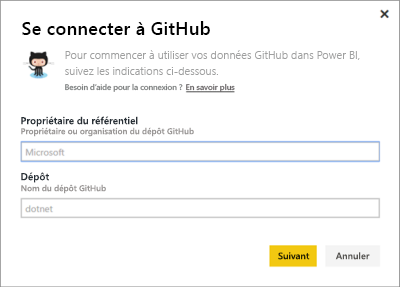
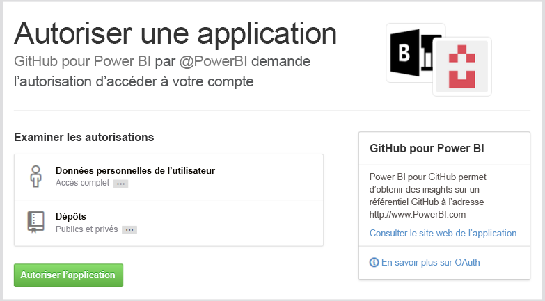
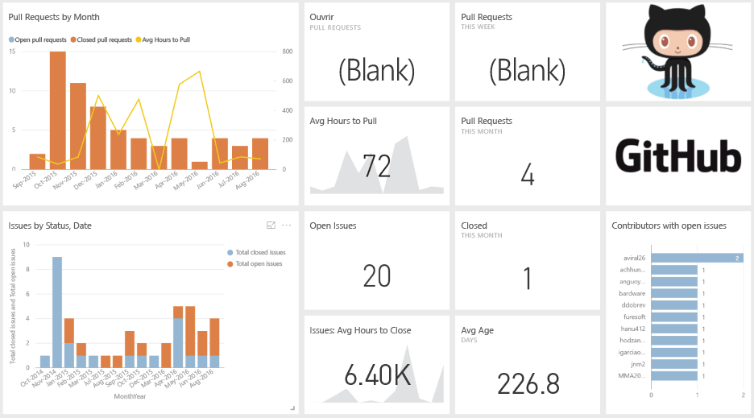

# Se connecter à GitHub avec Power BI
Le pack de contenu GitHub pour Power BI vous permet d’explorer un dépôt GitHub avec des données relatives à des contributions, des problèmes, des requêtes d’extraction et des utilisateurs actifs.

Connectez-vous au [pack de contenu GitHub](https://app.powerbi.com/getdata/services/github) ou obtenez davantage d’informations sur l’[intégration de GitHub](https://powerbi.microsoft.com/integrations/github) à Power BI.

>[!NOTE]
>Le pack de contenu exige que le compte GitHub ait accès au dépôt. Vous trouverez plus d’informations sur la configuration requise ci-dessous.

## Comment se connecter
1. Sélectionnez **Obtenir des données** en bas du volet de navigation gauche.
   
    
2. Dans la zone **Services** , sélectionnez **Obtenir**.
   
    
3. Sélectionnez **GitHub** \> **Obtenir**.
   
   
4. Entrez le nom et le propriétaire du dépôt. Consultez les détails sur la [recherche de ces paramètres](#FindingParams) ci-dessous.
   
   
5. Entrez vos informations d’identification GitHub (cette étape peut être ignorée si vous êtes déjà connecté avec votre navigateur). 
6. Pour la **Méthode d’authentification**, sélectionnez **oAuth2** \> **Se connecter**. 
7. Suivez les écrans d’authentification Github. Accordez au pack de contenu GitHub pour Power BI l’autorisation d’accéder aux données GitHub.
   
   
   
   Vous connectez ainsi Power BI à GitHub et permettez à Power BI de se connecter aux données.  Les données sont actualisées une fois par jour.
8. Une fois que vous êtes connecté à votre dépôt, Power BI importe les données. Vous verrez un nouveau [tableau de bord GitHub](https://powerbi.microsoft.com/integrations/github), un nouveau rapport et un nouveau jeu de données dans le volet de navigation gauche. Les nouveaux éléments sont signalés par un astérisque jaune \*.
   
   

**Et maintenant ?**

* Essayez de [poser une question dans la zone Q&R](power-bi-q-and-a.md) en haut du tableau de bord.
* [Modifiez les vignettes](service-dashboard-edit-tile.md) dans le tableau de bord.
* [Sélectionnez une vignette](service-dashboard-tiles.md) pour ouvrir le rapport sous-jacent.
* Même si une actualisation quotidienne de votre jeu de données est planifiée, vous pouvez modifier la planification de l’actualisation ou essayer d’actualiser le jeu de données sur demande à l’aide de l’option **Actualiser maintenant**.

## Ce qui est inclus
Les données suivantes sont disponibles à partir de GitHub dans Power BI :     

| Nom du tableau | Description |
| --- | --- |
| Contributions |Le tableau Contributions indique les ajouts, suppressions et validations totaux créés par le contributeur, agrégés par semaine. Les 100 premiers collaborateurs sont inclus. |
| Issues |Ce tableau répertorie tous les problèmes pour le dépôt sélectionné et contient des calculs tels que le temps total et moyen pour fermer un problème, le nombre total de problèmes ouverts et le nombre total de problèmes fermés. Ce tableau est vide si le dépôt ne contient aucun problème. |
| Pull requests |Ce tableau contient toutes les requêtes d’extraction pour le dépôt et leurs auteurs. Elle indique également le nombre de requêtes d’extraction ouvertes, fermées et totales, le temps nécessaire pour extraire les requêtes et la durée moyenne des requêtes d’extraction. Ce tableau est vide si le dépôt ne contient aucun problème. |
| Users |Ce tableau répertorie les utilisateurs ou contributeurs GitHub qui ont collaboré, enregistré des problèmes ou résolu des requêtes d’extraction pour le dépôt sélectionné. |
| Milestones |Ce tableau recense les étapes majeures pour le dépôt sélectionné. |
| DateTable |Ce tableau, qui contient des dates sur plusieurs années dans le passé à partir de la date du jour, vous permet d’analyser vos données GitHub par date. |
| ContributionPunchCard |Ce tableau peut être utilisé comme une carte à perforer des contributions pour le dépôt sélectionné. Il indique les validations par jour de la semaine et heure de la journée. Ce tableau n’est pas connecté aux autres tableaux du modèle. |
| RepoDetails |Ce tableau fournit des détails sur le dépôt sélectionné. |

## Configuration requise
* Compte GitHub ayant accès au dépôt.  
* Autorisation accordée à l’application Power BI pour GitHub à la première connexion. Consultez les détails ci-dessous sur la révocation de l’accès.  
* Suffisamment d’appels d’API sont disponibles pour l’extraction et l’actualisation des données.  

### Retirer l’autorisation à Power BI
Pour retirer à Power BI l’autorisation de se connecter à votre dépôt GitHub, vous pouvez révoquer l’accès dans GitHub. Pour plus d’informations, consultez cette rubrique d’[aide GitHub](https://help.github.com/articles/keeping-your-ssh-keys-and-application-access-tokens-safe/#reviewing-your-authorized-applications-oauth).

## Recherche de paramètres
Vous pouvez déterminer le propriétaire et le dépôt en examinant le dépôt GitHub lui-même :

La première partie « Azure » représente le propriétaire, tandis que la deuxième partie « azure-sdk-for-php » correspond au dépôt proprement dit.  Ces deux mêmes éléments apparaissent dans l’URL du dépôt :

    <https://github.com/Azure/azure-sdk-for-php> .

## Résolution des problèmes
Si nécessaire, vous pouvez vérifier vos informations d’identification GitHub.  

1. Dans une autre fenêtre de navigateur, accédez au site web GitHub et connectez-vous à GitHub. Vous pouvez voir que vous êtes connecté dans le coin supérieur droit du site GitHub.    
2. Dans GitHub, accédez à l’URL du dépôt auquel vous envisagez d’accéder dans Power BI. Par exemple : https://github.com/dotnet/corefx.  
3. Dans Power BI, essayez de vous connecter à GitHub. Dans la boîte de dialogue Configurer GitHub, utilisez les noms du dépôt et du propriétaire de ce même dépôt.  

## Étapes suivantes
* [Prise en main de Power BI](service-get-started.md)
* [Obtenir des données](service-get-data.md)
