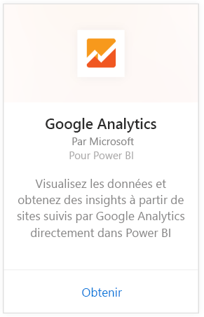
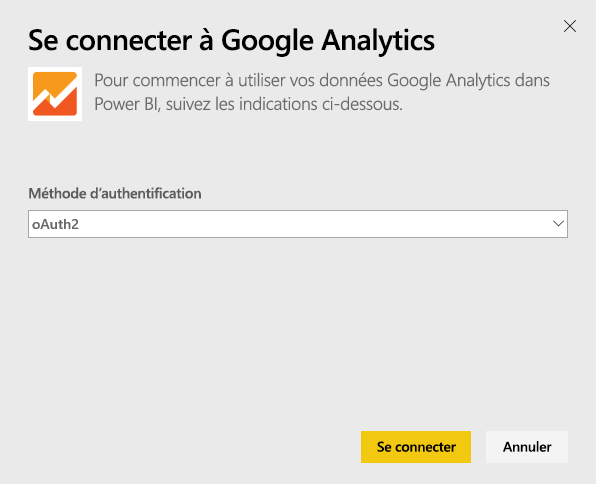
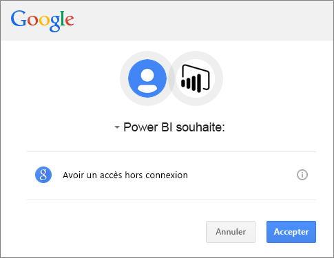
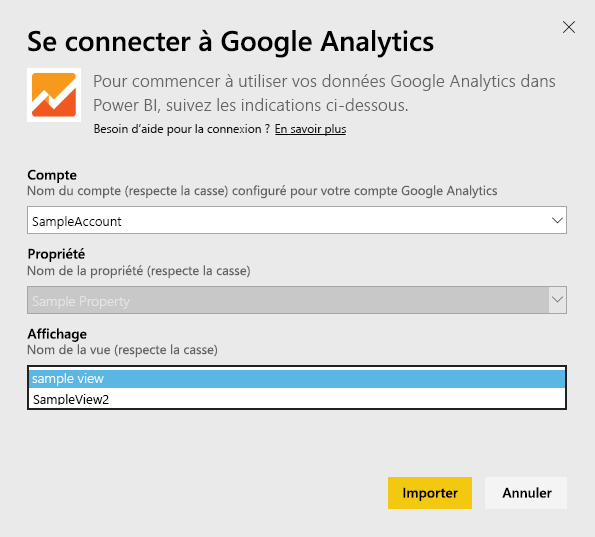
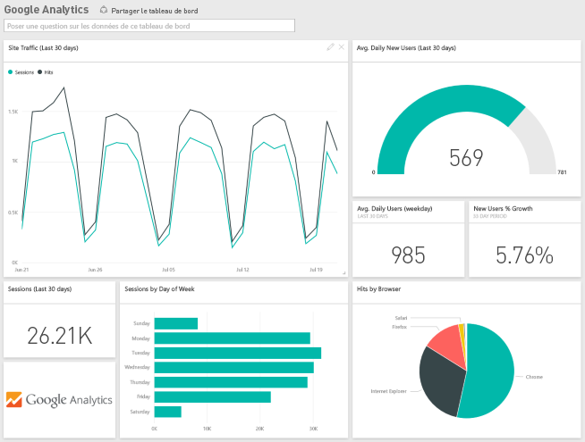
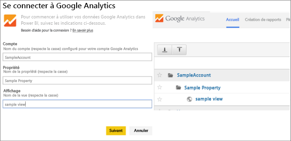

# Se connecter à Google Analytics avec Power BI
La connexion à Google Analytics via Power BI commence par la connexion à votre compte Google Analytics. Vous obtenez un tableau de bord Power BI et un ensemble de rapports Power BI qui fournissent des analyses relatives aux dimensions utilisateur et au trafic sur votre site. Vous pouvez interagir avec le tableau de bord et les rapports, mais vous ne pouvez pas enregistrer les modifications. Les données sont actualisées automatiquement une fois par jour.

Connectez-vous à [Google Analytics](https://app.powerbi.com/getdata/services/google-analytics) pour Power BI. Apprenez-en davantage sur l’[intégration de Google Analytics](https://powerbi.microsoft.com/integrations/google-analytics) avec Power BI.

Vous pouvez créer des tableaux de bord et rapports personnalisés en partant du [connecteur Google Analytics](service-google-analytics-connector.md) dans Power BI Desktop. Connectez-vous simplement à votre compte Google Analytics et créez vos rapports personnalisés que vous pouvez publier sur le service Power BI.

## Comment se connecter
[!INCLUDE [powerbi-service-apps-get-more-apps](./includes/powerbi-service-apps-get-more-apps.md)]

1. Sélectionnez **Google Analytics** \> **Obtenir**.
   
   
2. Lorsque vous y êtes invité, entrez vos informations d’identification Google Analytics. Sélectionnez **oAuth2** comme mécanisme d’authentification et cliquez sur **Se connecter**. Suivez le flux d’authentification Google qui peut inclure une authentification à 2 facteurs si vous l’avez configurée.
   
   
3. Cliquez sur **Accepter** pour autoriser Power BI à accéder à vos données Google Analytics.
   
   
4. Power BI se connecte à un affichage spécifique de Google Analytics. Sélectionnez le nom du compte, le nom de la propriété et le nom de la vue à laquelle vous souhaitez vous connecter. Vous trouverez ces informations dans votre compte Google Analytics, en haut à gauche ou sous l’onglet **Accueil** . Passez en revue les détails ci-dessous. 
   
   
5. Cliquez sur **Se connecter** pour commencer le processus d’importation. 

## Afficher le tableau de bord et les rapports de Google Analytics
[!INCLUDE [powerbi-service-apps-open-app](./includes/powerbi-service-apps-open-app.md)]

      

[!INCLUDE [powerbi-service-apps-open-app](./includes/powerbi-service-apps-what-now.md)]

## Configuration requise
Pour vous connecter à partir de Power BI, vous devez disposer d’un compte [Google Analytics](https://www.google.com/analytics/). Si vous utilisez un autre compte Google qui n’est pas connecté à un compte Google Analytics, vous obtiendrez une erreur d’authentification.

## Résolution des problèmes
**Informations d’identification** Si vous possédez plusieurs comptes Google, utilisez une fenêtre de navigateur en mode furtif ou privé lors de la connexion pour garantir que le compte correct est utilisé.

Si une erreur indique que vos informations d’identification ne sont pas valides alors que vous avez pu vous connecter à Google, vérifiez que vous disposez d’un compte [Google Analytics](https://www.google.com/analytics/).

**Paramètres** Des noms uniques sont actuellement requis pour les paramètres. Si vous voyez un message d’erreur indiquant que la valeur que vous avez sélectionnée figure en double, sélectionnez une autre valeur ou modifiez les noms dans Google Analytics pour les rendre uniques. Nous travaillons activement pour améliorer cette situation.

>[!NOTE]
>Les paramètres respectent la casse. Entrez-les exactement tels qu’ils apparaissent dans votre compte Google Analytics.

Les problèmes persistent ? Ouvrez un ticket de support pour contacter l’équipe Power BI :

* Dans l’application Power BI, sélectionnez le point d’interrogation \> **Contacter le support technique**
* Sur le site de support technique de Power BI (où vous lisez cet article), sélectionnez **Contacter le support technique** sur le côté droit de la page.

## Étapes suivantes
* [Que sont les applications dans Power BI ?](consumer/end-user-apps.md)
* [Obtenir des données dans Power BI](service-get-data.md)
* D’autres questions ? [Essayez d’interroger la communauté Power BI](http://community.powerbi.com/)

