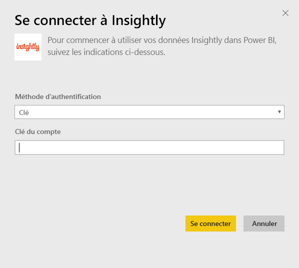
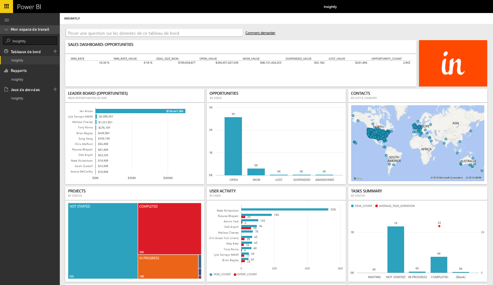
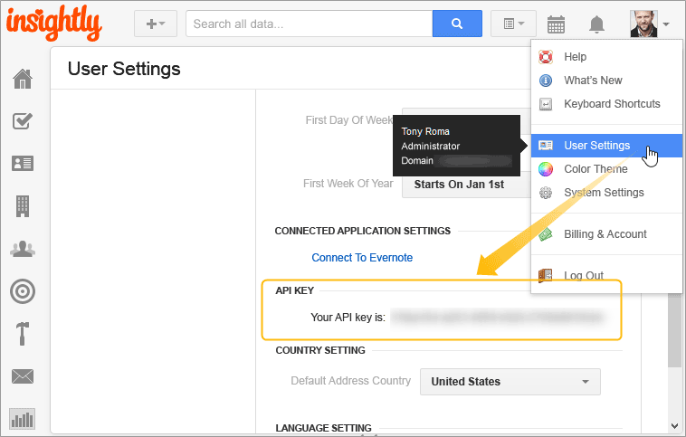

# Se connecter à Insightly avec Power BI
Visualisez et partagez vos données CRM Insightly dans Power BI avec le pack de contenu Insightly. Connectez-vous à Power BI à l'aide de votre clé d'API Insightly pour afficher et créer des rapports ainsi que des tableaux de bord à partir de vos données CRM. Avec Power BI, vous pouvez analyser vos données autrement, créer des diagrammes et des graphiques complexes, et afficher les contacts, les prospects et les organisations sur une carte.

Connectez-vous au [pack de contenu Insightly](https://app.powerbi.com/getdata/services/insightly)pour Power BI.

## Comment se connecter
1. Sélectionnez **Obtenir des données** en bas du volet de navigation gauche.
   
   
2. Dans la zone **Services** , sélectionnez **Obtenir**.
   
   
3. Sélectionnez **Insightly** \>  **Obtenir**.
   
   
4. Sélectionnez **Clé** pour le type d'authentification et indiquez votre clé d'API Insight, puis sélectionnez **Connexion**. Voir les détails sur la [recherche de cet élément](#FindingParams) ci-dessous.
   
   
5. Après l’approbation, le processus d’importation démarre automatiquement. Une fois terminé, de nouveaux tableau de bord, rapport et modèle apparaîtront dans le volet de navigation. Sélectionnez le tableau de bord pour afficher vos données importées.
   
     

**Et maintenant ?**

* Essayez de [poser une question dans la zone Q&R](power-bi-q-and-a.md) en haut du tableau de bord.
* [Modifiez les vignettes](service-dashboard-edit-tile.md) dans le tableau de bord.
* [Sélectionnez une vignette](service-dashboard-tiles.md) pour ouvrir le rapport sous-jacent.
* Même si une actualisation quotidienne de votre jeu de données est planifiée, vous pouvez modifier la planification de l’actualisation ou essayer d’actualiser le jeu de données sur demande à l’aide de l’option **Actualiser maintenant**.

## Ce qui est inclus
Le pack de contenu inclut les tableaux suivants, avec des champs provenant des enregistrements correspondants :

| Tableaux |  |  |  |
| --- | --- | --- | --- |
| Contacts |Opportunités |Étapes de pipeline |Date d’achèvement de la tâche |
| Champs personnalisés |Date de clôture de l’opportunité |Date d’achèvement du projet |Tâches |
| Événements |Date d’opportunité prévisionnelle |Projets |Équipes / membres |
| Leads |Organisations |Balises |Users |

De nombreux tableaux et rapports incluent également des champs calculés uniques, comme :  

* Les tableaux avec des dates de clôture d’opportunité prévisionnelles, les dates de clôture d’opportunité réelles, les dates d’achèvement de projet et les dates d’achèvement de tâche pour les analyses par mois, par trimestre ou par an.  
* Un champ de valeur pondérée pour les opportunités (valeur de l’opportunité * probabilité d’obtention).  
* Champs de durée moyenne et totale des tâches, en fonction des dates de début et d’achèvement.  
* Rapports avec des champs calculés pour le taux d’obtention d’opportunité (nombre d’obtentions / nombre total d’opportunités) et valeur de taux d’obtention (valeur de l’obtention / valeur des opportunités totales).  

## Configuration requise
Un compte Insightly ayant accès à l'API Insightly est requis. Les autorisations de visibilité dépendront de la clé d'API utilisée pour établir la connexion à Power BI. Tous les enregistrements Insightly visibles par vous seront également visibles dans les tableaux de bord et les rapports Power BI que vous partagez avec d'autres utilisateurs.

## Recherche de paramètres
**Clé d’API**

Pour copier votre clé d'API depuis Insightly, sélectionnez les paramètres utilisateur dans le menu du profil Insightly et faites défiler vers le bas. Cette chaîne de caractères sera utilisée pour connecter vos données à Power BI.

## Résolution des problèmes
Vos données sont importées via l'API Insightly, avec une limite quotidienne qui dépend de votre niveau de plan d'abonnement Insightly. Les limites sont répertoriées dans la section Demandes de limitation des taux de notre documentation de l’API : https://api.insight.ly/v2.2/Help#!/Overview/Introduction#ratelimit

Les rapports fournis utilisent des champs par défaut d’Insightly et ne peuvent pas inclure vos personnalisations. Modifiez le rapport pour afficher tous les champs disponibles.

## Étapes suivantes
[Prise en main de Power BI](service-get-started.md)

[Obtenir des données dans Power BI](service-get-data.md)

