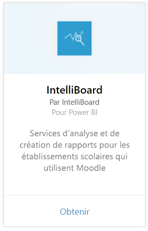
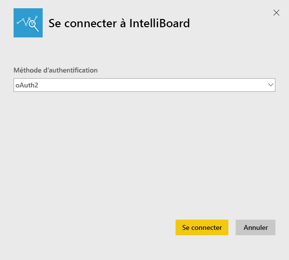
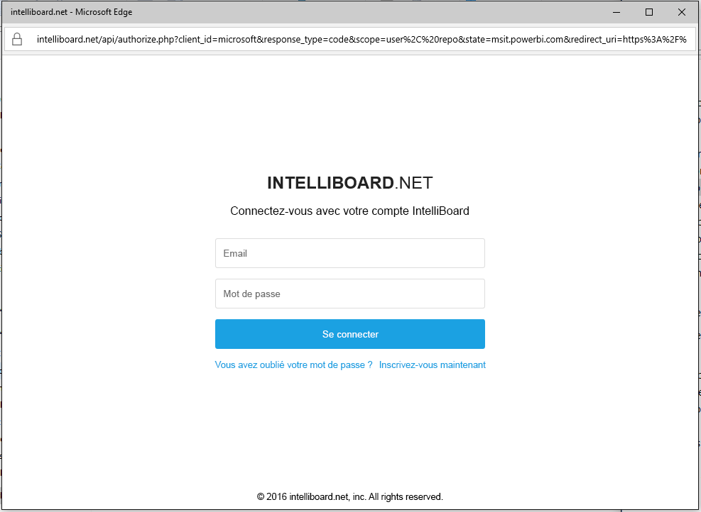
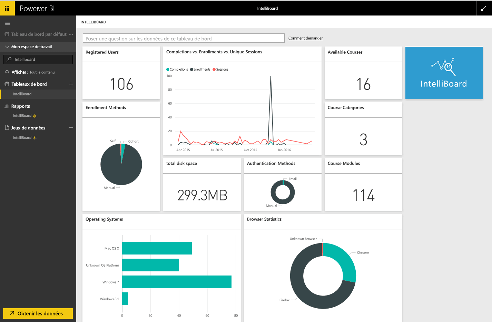

# Se connecter à IntelliBoard avec Power BI
IntelliBoard offre un accès simplifié à vos données du système de gestion d’apprentissage Moodle par le biais de services de reporting. Le pack de contenu IntelliBoard pour Power BI propose des analyses supplémentaires, y compris des indicateurs sur les cours, les utilisateurs inscrits, les performances globales et votre activité LMS.

Connectez-vous au [pack de contenu IntelliBoard](https://app.powerbi.com/getdata/services/intelliboard) pour Power BI.

## Comment se connecter
1. Sélectionnez **Obtenir des données** en bas du volet de navigation gauche.  
   
    
2. Dans la zone **Services** , sélectionnez **Obtenir**.  
   
    
3. Sélectionnez **IntelliBoard**, puis **Obtenir**.  
   
    
4. Sélectionnez **OAuth 2**, puis **Se connecter**. Quand vous y êtes invité, indiquez vos informations d’identification IntelliBoard.
   
    
   
    
5. Après connexion, un tableau de bord, un rapport et un ensemble de données sont chargés automatiquement. Les vignettes sont ensuite mises à jour avec des données de votre compte IntelliBoard.
   
    

**Et maintenant ?**

* Essayez de [poser une question dans la zone Q&R](service-q-and-a.md) en haut du tableau de bord.
* [Modifiez les vignettes](service-dashboard-edit-tile.md) dans le tableau de bord.
* [Sélectionnez une vignette](service-dashboard-tiles.md) pour ouvrir le rapport sous-jacent.
* Même si une actualisation quotidienne de votre jeu de données est planifiée, vous pouvez modifier la planification de l’actualisation ou essayer d’actualiser le jeu de données sur demande à l’aide de l’option **Actualiser maintenant**.

## Ce qui est inclus
Le pack de contenu inclut les tables suivantes :  

    - Activity  
    - Agents  
    - Auth  
    - Countries  
    - CoursesProgress  
    - Enrollments
    - Lang  
    - Platform  
    - Totals  
    - UsersProgress    

## Configuration requise
Un compte IntelliBoard avec des autorisations sur les tables ci-dessus est nécessaire afin d'instancier ce pack de contenu.

## Étapes suivantes
[Prise en main de Power BI](service-get-started.md)

[Power BI – Concepts de base](service-basic-concepts.md)

