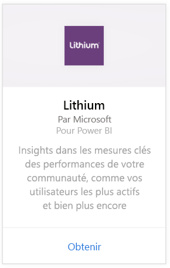
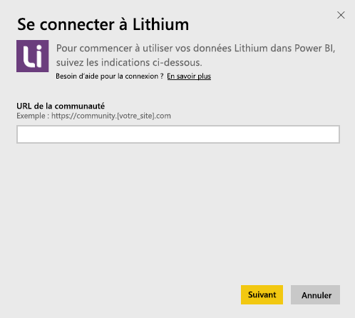
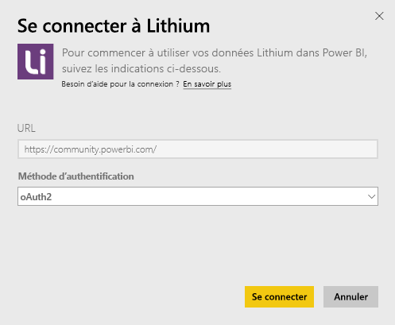
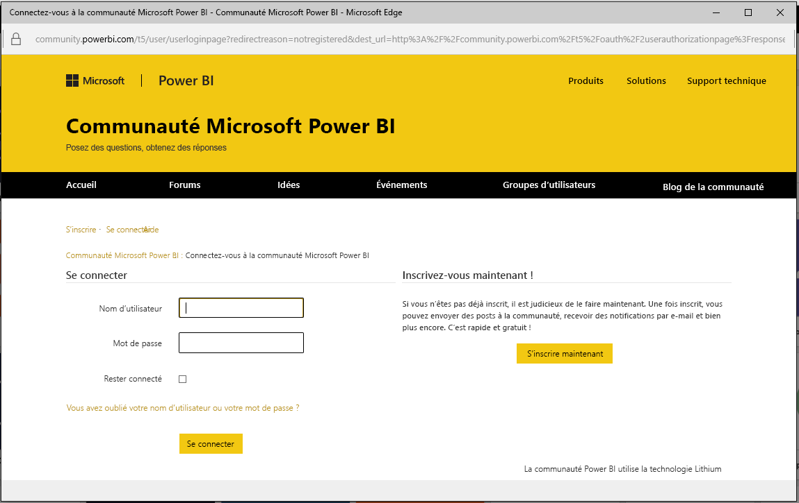
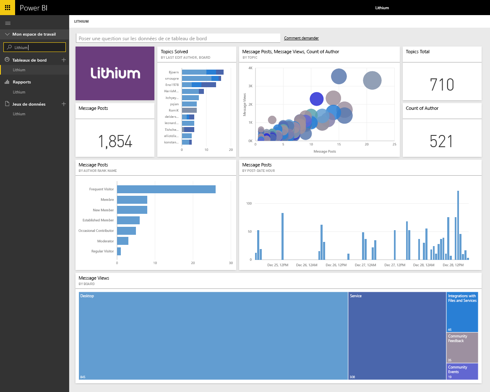

# Se connecter à Lithium avec Power BI
Lithium crée des relations de confiance entre les meilleures marques du monde et leurs clients, en aidant les personnes à obtenir des réponses et à partager leurs expériences. En connectant le pack de contenu Lithium à Power BI, vous pouvez obtenir des chiffres clés sur votre communauté en ligne qui vous aideront à dynamiser les ventes, à réduire les coûts de service et à fidéliser davantage. 

Connectez-vous au [Pack de contenu Lithium](https://app.powerbi.com/getdata/services/lithium) pour Power BI.

>[!NOTE]
>Le pack de contenu Power BI utilise l’API Lithium. Des appels en trop grand nombre à l’API peuvent entraîner des frais supplémentaires au niveau de Lithium. Vérifiez avec votre administrateur Lithium.

## Comment se connecter
1. Sélectionnez **Obtenir des données** en bas du volet de navigation gauche.
   
    
2. Dans la zone **Services** , sélectionnez **Obtenir**.
   
    
3. Sélectionnez **Lithium** \> **Obtenir**.
   
   
4. Spécifiez l’URL de votre communauté Lithium. Le format de cette URL est *https://community.yoursite.com*.
   
   
5. Quand vous y êtes invité, entrez vos informations d’identification Lithium. Sélectionnez **oAuth 2** comme mécanisme d’authentification et cliquez sur **Se connecter** , puis suivez le flux d’authentification de Lithium.
   
   
   
   
6. Une fois le flux de connexion terminé, le processus d’importation commence. Une fois terminé, de nouveaux tableau de bord, rapport et modèle apparaîtront dans le volet de navigation. Sélectionnez le tableau de bord pour afficher vos données importées.
   
    

**Et maintenant ?**

* Essayez de [poser une question dans la zone Q&R](power-bi-q-and-a.md) en haut du tableau de bord.
* [Modifiez les vignettes](service-dashboard-edit-tile.md) dans le tableau de bord.
* [Sélectionnez une vignette](service-dashboard-tiles.md) pour ouvrir le rapport sous-jacent.
* Même si une actualisation quotidienne de votre jeu de données est planifiée, vous pouvez modifier la planification de l’actualisation ou essayer d’actualiser le jeu de données sur demande à l’aide de l’option **Actualiser maintenant**.

## Configuration requise
Le pack de contenu Lithium nécessite une communauté Lithium version 15.9 ou ultérieure. Contactez votre administrateur Lithium pour confirmer.

## Étapes suivantes
[Qu’est-ce que Power BI ?](power-bi-overview.md)

[Power BI – Concepts de base](service-basic-concepts.md)

