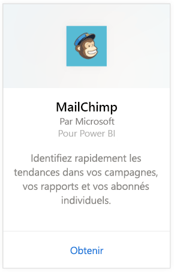
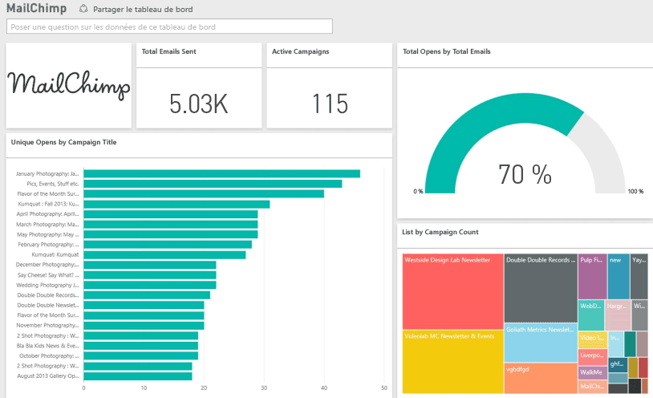

# Se connecter à MailChimp avec Power BI
Le pack de contenu Power BI extrait des données de votre compte MailChimp et génère un tableau de bord, un ensemble de rapports et un jeu de données qui vous permettent d’explorer vos données. Exploitez la fonctionnalité d’analyse pour créer des [tableaux de bord MailChimp](https://powerbi.microsoft.com/integrations/mailchimp) et identifier rapidement les tendances de vos campagnes, rapports et abonnés. Les données sont actualisées tous les jours. Ainsi, vous êtes sûr que les données que vous utilisez sont à jour.

Connectez-vous au [pack de contenu MailChimp](https://app.powerbi.com/getdata/services/mailchimp) pour Power BI.

## Comment se connecter
1. Sélectionnez **Obtenir des données** en bas du volet de navigation gauche.
   
    
2. Dans la zone **Services** , sélectionnez **Obtenir**.
   
   
3. Sélectionnez **MailChimp** \> **Obtenir**.
   
   
4. Pour la méthode d’authentification, sélectionnez **oAuth2** \> **Se connecter**.
   
    Quand vous y êtes invité, entrez vos informations d’identification MailChimp et suivez le processus d’authentification.
   
    Lors de votre première connexion, vous êtes invité à autoriser l’accès en lecture seule à votre compte à Power BI. Sélectionnez **Autoriser** pour commencer le processus d’importation. Celui-ci peut prendre quelques minutes selon le volume de données présentes dans votre compte.
   
    
5. Une fois les données importées dans Power BI, vous verrez un nouveau tableau de bord, un nouveau rapport et un nouveau jeu de données dans le volet de navigation gauche. Il s’agit du tableau de bord par défaut créé par Power BI pour afficher vos données. Vous pouvez modifier ce tableau de bord pour afficher vos données comme vous le souhaitez.
   
   

**Et maintenant ?**

* Essayez de [poser une question dans la zone Q&R](service-q-and-a.md) en haut du tableau de bord.
* [Modifiez les vignettes](service-dashboard-edit-tile.md) dans le tableau de bord.
* [Sélectionnez une vignette](service-dashboard-tiles.md) pour ouvrir le rapport sous-jacent.
* Même si une actualisation quotidienne de votre jeu de données est planifiée, vous pouvez modifier la planification de l’actualisation ou essayer d’actualiser le jeu de données sur demande à l’aide de l’option **Actualiser maintenant**.

## Étapes suivantes
[Prise en main de Power BI](service-get-started.md)

[Power BI – Concepts de base](service-basic-concepts.md)

