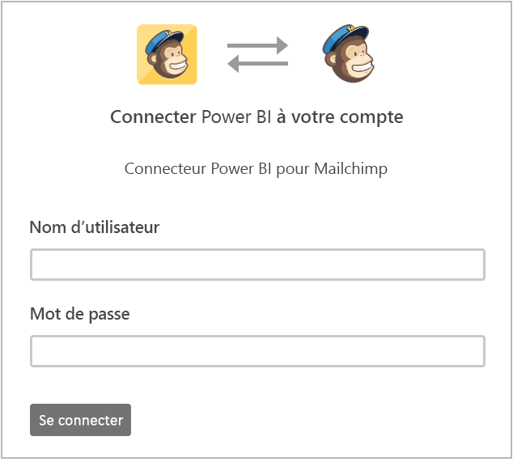
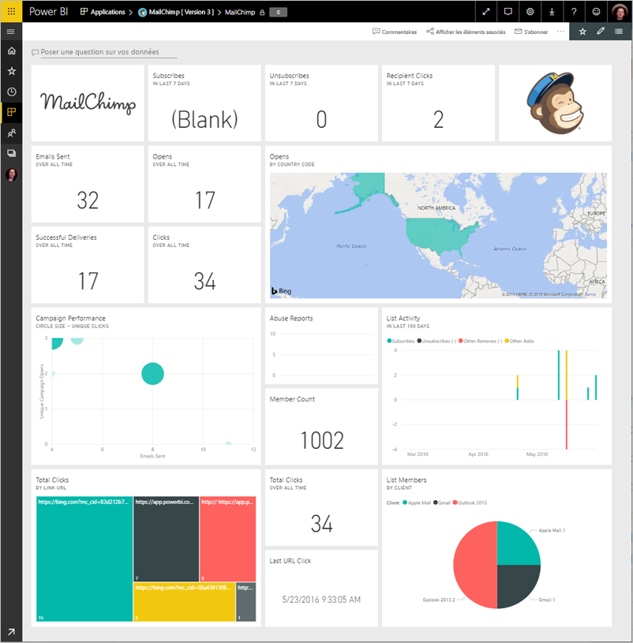
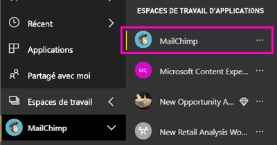
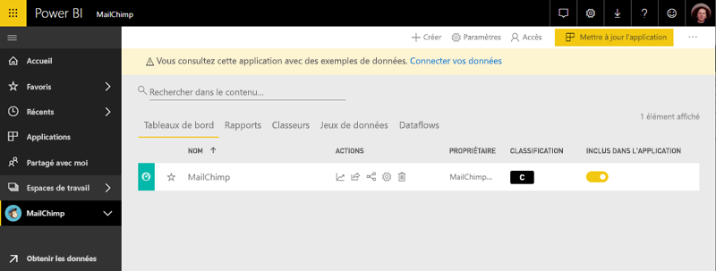

# Se connecter à MailChimp avec Power BI
Cet article vous guide tout au long de l’extraction de vos données à partir de votre compte MailChimp avec une application de modèle Power BI. Le modèle d’application génère un espace de travail avec un tableau de bord, un ensemble de rapports et un jeu de données qui vous permettent d’Explorer vos données MailChimp. Exploitez la fonctionnalité d’analyse pour créer des [tableaux de bord MailChimp](https://powerbi.microsoft.com/integrations/mailchimp) et identifier rapidement les tendances de vos campagnes, rapports et abonnés. Les données sont actualisées tous les jours, les données que vous effectuez le suivi doit être à jour.

Une fois que vous avez installé le modèle d’application, vous pouvez modifier le tableau de bord et rapports. Vous pouvez distribuer en tant qu’application à vos collègues dans votre organisation.

Se connecter à la [MailChimp d’application du modèle](https://app.powerbi.com/getdata/services/mailchimp) pour Power BI.

## Comment se connecter

[!INCLUDE [powerbi-service-apps-get-more-apps](./includes/powerbi-service-apps-get-more-apps.md)]

3. Sélectionnez **MailChimp** \> **obtenez-le maintenant**.
4. Dans **installer cette application Power BI ?** sélectionnez **installer**.
4. Dans le **applications** volet, sélectionnez le **MailChimp** vignette.

    

6. Dans **prise en main votre nouvelle application**, sélectionnez **se connecter aux données**.

    

1. Pour la méthode d’authentification, sélectionnez **oAuth2** \> **Se connecter**.
   
    Quand vous y êtes invité, entrez vos informations d’identification MailChimp et suivez le processus d’authentification.
   
    Lors de votre première connexion, Power BI vous invite à autoriser l’accès en lecture seule à votre compte. Sélectionnez **Autoriser** pour commencer le processus d’importation. Il peut prendre quelques minutes, selon le volume de données de votre compte.
   
    

5. Une fois que Power BI importe les données, le tableau de bord MailChimp s’ouvre.
   
    

## Modifier et distribuer votre application

Vous avez installé le modèle d’application MailChimp. Cela signifie que vous avez également créé l’espace de travail MailChimp. Dans l’espace de travail, vous pouvez modifier le rapport et un tableau de bord et distribuez-la comme un *application* à vos collègues de votre organisation. 

1. Pour afficher tout le contenu de votre nouvel espace de travail MailChimp, dans la barre de navigation gauche, sélectionnez **espaces de travail** > **MailChimp**. 

    

    Cette vue est la liste de contenu pour l’espace de travail. Dans le coin supérieur droit, vous voyez **mise à jour application**. Lorsque vous êtes prêt à distribuer votre application à vos collègues, c’est là que vous allez commencer.

    

2. Sélectionnez **rapports** et **jeux de données** pour voir les autres éléments dans l’espace de travail. 

    En savoir plus sur [distribution d’applications](service-create-distribute-apps.md) à vos collègues.

## Étapes suivantes

* [Créer de nouveaux espaces de travail dans Power BI](service-create-the-new-workspaces.md)
* [Installer et utiliser des applications dans Power BI](consumer/end-user-apps.md)
* [Applications Power BI pour des services externes](service-connect-to-services.md)
* Vous avez des questions ? [Essayez d’interroger la communauté Power BI](http://community.powerbi.com/)

