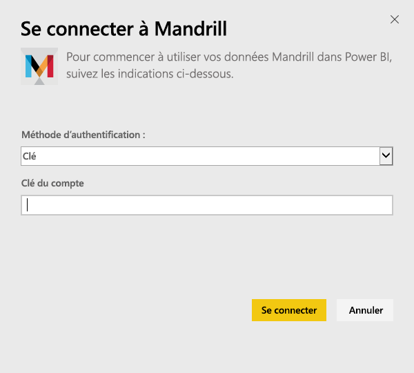
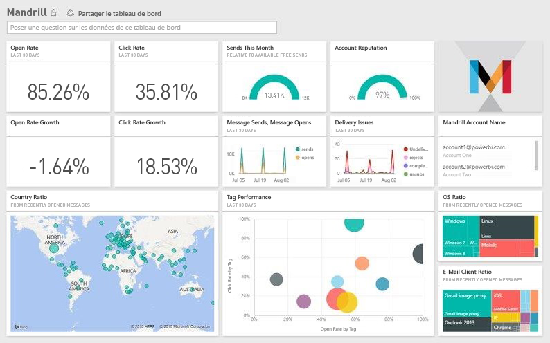

# Se connecter à Mandrill avec Power BI
Le pack de contenu Power BI extrait des données de votre compte Mandrill et génère un tableau de bord, un ensemble de rapports et un jeu de données qui vous permettent d’explorer vos données. Utilisez les analyses de Mandrill pour obtenir rapidement une vue d’ensemble de votre bulletin d’informations ou campagne marketing. Les données sont actualisées tous les jours. Ainsi, vous êtes sûr que les données que vous utilisez sont à jour.

[!INCLUDE [include-short-name](./includes/service-deprecate-content-packs.md)]

Connectez-vous au [pack de contenu Mandrill pour Power BI](http://app.powerbi.com/getdata/services/mandrill).

## Comment se connecter
1. Sélectionnez **Obtenir des données** en bas du volet de navigation gauche.
   
    
2. Dans la zone **Services** , sélectionnez **Obtenir**.
   
    
3. Sélectionnez **Mandrill** > **Obtenir**.
   
    
4. Pour **Méthode d’authentification**, sélectionnez **Clé** , puis indiquez votre clé API. Vous pouvez trouver la clé sous l’onglet **Paramètres** du tableau de bord Mandrill. Sélectionnez **Se connecter** pour commencer le processus d’importation. Celui-ci peut prendre quelques minutes, selon le volume de données contenues dans votre compte.
   
    
5. Une fois les données importées dans Power BI, vous verrez un nouveau tableau de bord, un nouveau rapport et un nouveau jeu de données dans le volet de navigation gauche. Il s’agit du tableau de bord par défaut créé par Power BI pour afficher vos données.
   
    

**Et maintenant ?**

* Essayez de [poser une question dans la zone Q&R](consumer/end-user-q-and-a.md) en haut du tableau de bord.
* [Modifiez les vignettes](service-dashboard-edit-tile.md) dans le tableau de bord.
* [Sélectionnez une vignette](consumer/end-user-tiles.md) pour ouvrir le rapport sous-jacent.
* Même si une actualisation quotidienne de votre jeu de données est planifiée, vous pouvez modifier la planification de l’actualisation ou essayer d’actualiser le jeu de données sur demande à l’aide de l’option **Actualiser maintenant**.

## Étapes suivantes
[Qu’est-ce que Power BI ?](power-bi-overview.md)

[Fondamentaux pour les concepteurs dans le service Power BI](service-basic-concepts.md)

