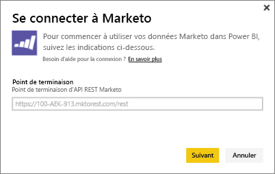
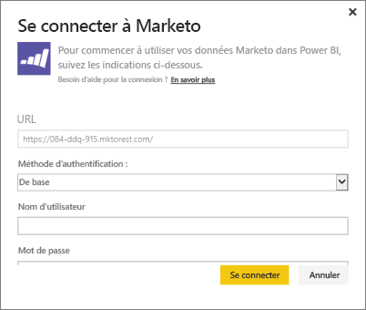
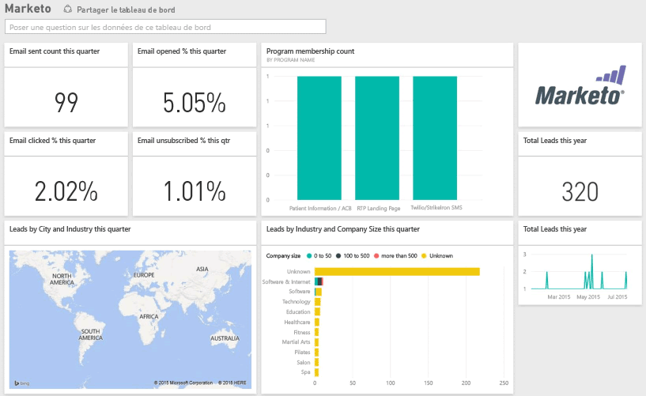

# Se connecter à Marketo avec Power BI
Le pack de contenu Marketo pour Power BI permet d’explorer votre compte Marketo avec des données relatives à des prospects et à leurs activités. Créez cette connexion pour récupérer vos données et disposer automatiquement d’un tableau de bord et de rapports connexes basés sur ces données.

Connectez-vous au [pack de contenu Marketo](https://app.powerbi.com/getdata/services/marketo) pour Power BI.

## Comment se connecter
1. Sélectionnez **Obtenir des données** en bas du volet de navigation gauche.
   
   
2. Dans la zone **Services**, sélectionnez **Obtenir**.
   
    
3. Sélectionnez **Marketo** \> **Obtenir**.
   
   
4. Entrez le point de terminaison REST Marketo qui vous a été fourni par Marketo ou par votre administrateur Marketo, puis cliquez sur Suivant.
   
   
   
   En savoir plus sur le point de terminaison REST Marketo : [http://developers.marketo.com/documentation/rest/endpoint-url/ ](http://developers.marketo.com/documentation/rest/endpoint-url/).
5. À l’aide de la méthode d’authentification **De base**, entrez l’ID client comme **Nom d’utilisateur** et la question secrète du client comme **Mot de passe**. L’ID client et la question secrète du client sont disponibles dans Marketo ou auprès de votre administrateur Marketo ([http://developers.marketo.com/documentation/rest/custom-service/](http://developers.marketo.com/documentation/rest/custom-service/)). 
   
   
   
   Ainsi, vos [données Marketo](https://powerbi.microsoft.com/integrations/marketo) sont accessibles au pack de contenu *Marketo pour Power BI* et vous pouvez analyser les données dans Power BI. Les données sont actualisées une fois par jour.
6. Une fois que vous êtes connecté à votre compte Marketo, un tableau de bord contenant toutes les données est chargé :
   
   

**Et maintenant ?**

* Essayez de [poser une question dans la zone Q&R](service-q-and-a.md) en haut du tableau de bord.
* [Modifiez les vignettes](service-dashboard-edit-tile.md) dans le tableau de bord.
* [Sélectionnez une vignette](service-dashboard-tiles.md) pour ouvrir le rapport sous-jacent.
* Même si une actualisation quotidienne de votre jeu de données est planifiée, vous pouvez modifier la planification de l’actualisation ou essayer d’actualiser le jeu de données sur demande à l’aide de l’option **Actualiser maintenant**.

## Ce qui est inclus
Les données suivantes sont disponibles à partir de Marketo dans Power BI et couvrent les activités ayant eu lieu entre la date du jour et un an en arrière :

| Nom du tableau | Description |
| --- | --- |
| EmailActivities |Données sur les messages électroniques envoyés aux prospects/contacts, avec des détails sur les appareils, les catégories, les nombre et pourcentage de rejets, les nombre et pourcentage de clics, les nombre et pourcentage d’ouvertures et le nom du programme. Les activités de la messagerie indiquées dans Power BI constituent un rapport absolu sur la remise des messages électroniques, qui n’applique aucune logique supplémentaire aux données. De ce fait, le client Marketo et Power BI peuvent présenter des résultats différents. |
| ProgramActivites |Données sur les programmes dont le statut a changé. Cela inclut des détails tels que la raison, la réussite, les nombre et pourcentage d’acquisitions du programme et les nombre et pourcentage de réussites du programme. |
| WebPageActivities |Données relatives aux visites des pages web par l’utilisateur, notamment l’agent de recherche, l’agent utilisateur, la page web et l’heure de la journée. |
| Datetable |Dates couvrant la date du jour et l’année précédente.  Vous permet d’analyser vos données Marketo par date. |
| Leads |Informations sur les prospects telles que la société, la tranche de revenu, le nombre d’employés, le pays, le secteur, ainsi que le score et le statut du prospect. Les prospects sont récupérés en fonction de leur présence dans les données d’activités sur la messagerie, le programme et les pages web. |

Toutes les dates sont au format UTC. Selon le fuseau horaire de votre compte, les dates peuvent varier (comme dans le cas du client Marketo).

## Configuration requise
* Le compte Marketo que vous utilisez pour la connexion est autorisé à accéder aux prospects et aux activités.
* Suffisamment d’appels d’API sont disponibles pour la connexion aux données.  Marketo a une API par compte.  Quand la limite est atteinte, vous ne pouvez pas charger de données dans Power BI. 

**Détails sur les limites des API**

L’importation de données de Marketo utilise des API Marketo. Chaque client de Marketo dispose d’un quota quotidien de 10 000 appels d’API partagés entre toutes les applications qui utilisent les API Marketo. Vous pouvez utiliser les API pour d’autres intégrations que l’intégration à Power BI. Pour plus d’informations sur les API, consultez : <http://developers.marketo.com/documentation/rest/>.

La quantité d’appels d’API que Power BI effectue à destination de Marketo dépend de la quantité de données dans votre compte Marketo. Power BI importe tous les prospects et toutes les activités relatifs à l’année écoulée. Voici un exemple de données issues de Marketo et la quantité d’appels d’API utilisées par Power BI pendant l’importation :  

| Type de données | Nombre de lignes | Appels d’API |
| --- | --- | --- |
| Informations sur les prospects |15,000 |50 |
| Activités de messagerie |150,000 |1,000 |
| Activités de programme |15,000 |100 |
| Activités web |150,000 |1,000 |
| Modifications du programme |7,500 |50 |
| **Nombre total d’appels d’API** | |**2 200** |

## Étapes suivantes
[Prise en main de Power BI](service-get-started.md)

[Obtenir des données pour Power BI](service-get-data.md)

[Blog Power BI sur la surveillance et l’analyse des données Marketo avec Power BI](http://blogs.msdn.com/b/powerbi/archive/2015/03/19/monitor-and-analyze-your-marketo-data-with-power-bi.aspx)

