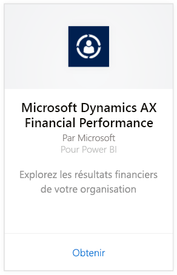
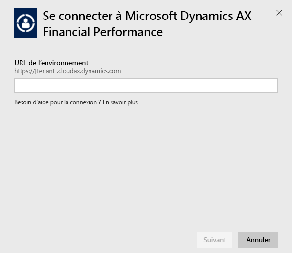
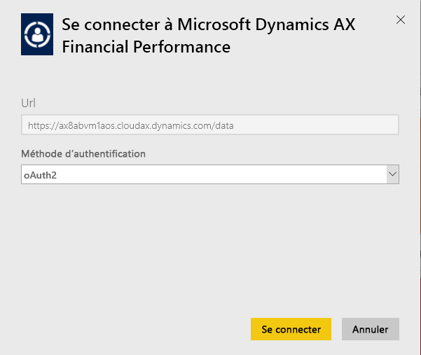
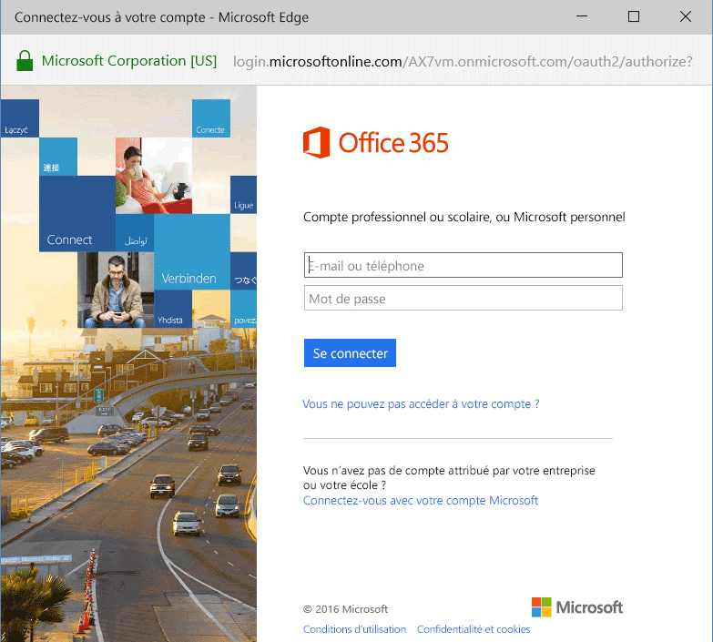
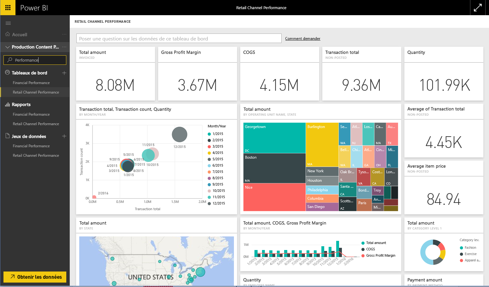

# Se connecter au Pack de contenu Microsoft Dynamics AX avec Power BI
Microsoft Dynamics AX propose trois packs de contenu Power BI destinés aux différents utilisateurs professionnels. Le pack de contenu Performances financières, conçu spécifiquement pour les directeurs financiers, donne accès à des informations sur les résultats financiers de votre organisation. Les pack de contenu Performances des canaux de vente au détail est destiné aux gestionnaires des canaux et se concentre sur les résultats de ventes pour anticiper les tendances et identifier des informations utiles en s’appuyant directement sur les données de Vente au détail et de commerce. La gestion des coûts est désignée pour les directeurs de l’exploitation et financiers, et fournit des détails sur les performances d’exploitation.

Connectez-vous à [Performances des canaux de vente au détail](https://app.powerbi.com/getdata/services/dynamics-ax-retail-channel-performance) Microsoft Dynamics AX ou au pack de contenu [Performances financières](https://app.powerbi.com/getdata/services/dynamics-ax-financial-performance) ou [Gestion des coûts](https://app.powerbi.com/getdata/services/dynamics-ax-cost-management) pour Power BI.

## Comment se connecter
1. Sélectionnez **Obtenir des données** en bas du volet de navigation gauche.
   
   
2. Dans la zone **Services** , sélectionnez **Obtenir**.
   
   
3. Sélectionnez un des packs de contenu Dynamics AX puis sélectionnez **Obtenir**.
   
   
4. Spécifiez l’URL de votre environnement Dynamics AX 7. Voir les détails sur la [recherche de ces paramètres](#FindingParams) ci-dessous.
   
   
5. Pour la **Méthode d’authentification**, sélectionnez **oAuth2** \> **Se connecter**. Quand vous y êtes invité, entrez vos informations d’identification Dynamics AX.
   
    
   
    
6. Après l’approbation, le processus d’importation démarre automatiquement. Une fois terminé, de nouveaux tableau de bord, rapport et modèle apparaîtront dans le volet de navigation. Sélectionnez le tableau de bord pour afficher vos données importées.
   
     

**Et maintenant ?**

* Essayez de [poser une question dans la zone Q&R](power-bi-q-and-a.md) en haut du tableau de bord.
* [Modifiez les vignettes](service-dashboard-edit-tile.md) dans le tableau de bord.
* [Sélectionnez une vignette](service-dashboard-tiles.md) pour ouvrir le rapport sous-jacent.
* Même si une actualisation quotidienne de votre jeu de données est planifiée, vous pouvez modifier la planification de l’actualisation ou essayer d’actualiser le jeu de données sur demande à l’aide de l’option **Actualiser maintenant**.

## Ce qui est inclus
Le pack de contenu utilise le flux Dynamics AX 7 OData pour importer des données liées aux performances des canaux de vente au détail, de performances financières et de gestion des coûts, respectivement.

## Configuration requise
Ce pack de contenu requiert une URL d’environnement Dynamics AX 7 et l’utilisateur doit avoir accès au flux OData.

## Recherche de paramètres

L’URL de l’environnement Dynamics AX 7 se trouve dans le navigateur, lorsque l’utilisateur se connecte. Copiez simplement l’URL de l’environnement Dynamics AX racine dans la boîte de dialogue Power BI.

## Résolution des problèmes
Les données peuvent prendre un certain temps à charger, selon la taille de votre instance. Si vous voyez des rapports vides dans Power BI, confirmez que vous avez accès aux tables OData requises pour les rapports.

## Étapes suivantes
[Prise en main de Power BI](service-get-started.md)

[Obtenir des données dans Power BI](service-get-data.md)

