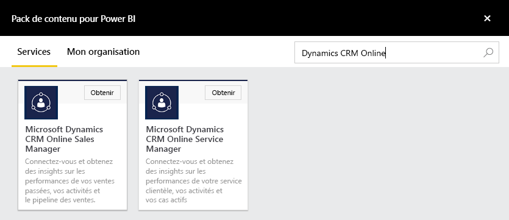
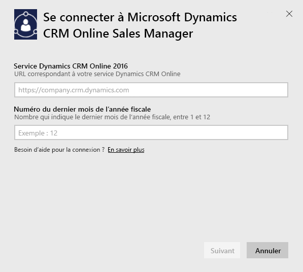
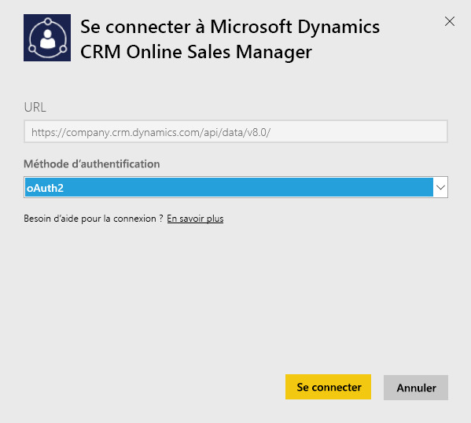
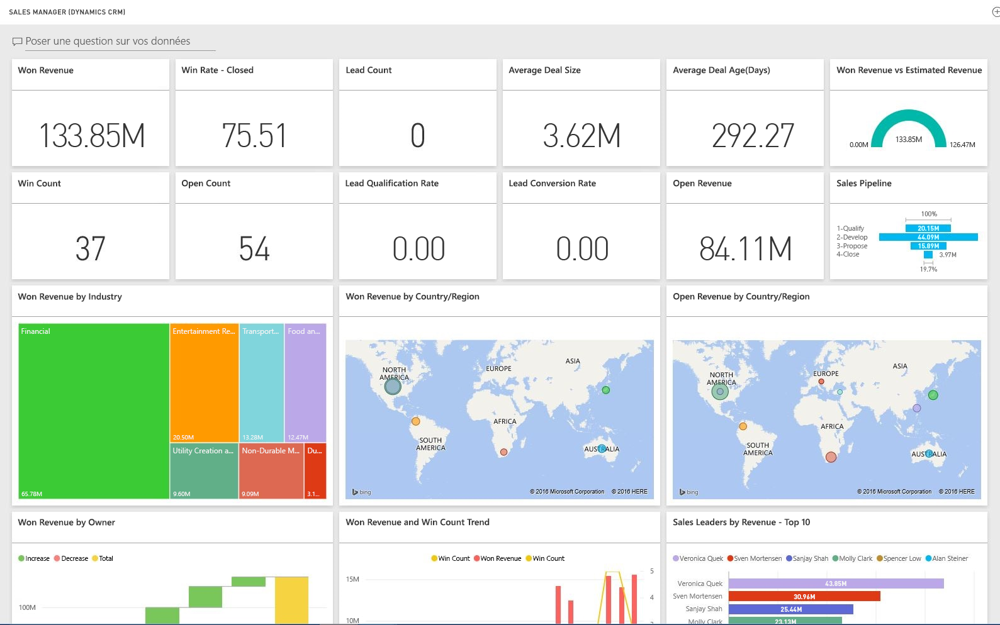

# Se connecter à Microsoft Dynamics CRM avec Power BI
Microsoft Dynamics CRM Online pour Power BI vous permet d’accéder à vos données et de les analyser facilement. Power BI utilise le flux OData pour créer un modèle descriptif, avec toutes les entités et mesures nécessaires, telles que Comptes, Activités, Opportunités, Produits, Prospects, Utilisateurs, et bien plus encore. Une fois l’application installée, vous pouvez voir le tableau de bord et les rapports dans le service Power BI ([https://powerbi.com](https://powerbi.com)) et dans les applications mobiles Power BI. 

Connectez-vous au [Responsable des ventes](https://msit.powerbi.com/groups/me/getdata/services/dynamics-crm-sales-manager) ou au [Responsable clientèle](https://msit.powerbi.com/groups/me/getdata/services/dynamics-crm-customer-service) de Dynamics CRM Online. Apprenez-en davantage sur l’[intégration de Dynamics CRM Online](https://powerbi.microsoft.com/integrations/microsoft-dynamicscrm) avec Power BI.

Cette connexion requiert **Microsoft Dynamics CRM Online 2016 ou une version ultérieure**. Vous trouverez plus de détails sur la [configuration requise](#Requirements) à la suite.

## Comment se connecter
[!INCLUDE [powerbi-service-apps-get-more-apps](./includes/powerbi-service-apps-get-more-apps.md)]

1. Sélectionnez **Microsoft Dynamics CRM Sales Manager** ou **Microsoft Dynamics CRM Service Manager** et cliquez sur **Se connecter**.
   
   
2. Indiquez l’URL de service associée à votre compte.  Cela se présentera sous la forme `https://company.crm.dynamics.com`, voir plus de détails [ci-dessous](#FindingParams).
   
   
3. Quand vous y êtes invité, indiquez vos informations d’identification (cette étape peut être ignorée si vous êtes déjà connecté avec votre navigateur). Pour la méthode d’authentification, entrez **oAuth2** et cliquez sur **Se connecter**:
   
   
4. Une fois connecté, un tableau de bord personnalisé pour un responsable des ventes ou un responsable des services s’affiche, rempli avec vos propres données :
   
   

## Afficher le tableau de bord et les rapports Microsoft Dynamics CRM
[!INCLUDE [powerbi-service-apps-open-app](./includes/powerbi-service-apps-open-app.md)]

[!INCLUDE [powerbi-service-apps-open-app](./includes/powerbi-service-apps-what-now.md)]

## Ce qui est inclus
Les sections suivantes décrivent ce qui est inclus pour le [Responsable des ventes](#Sales) et le [Responsable clientèle](#Service).

Notez que les données sont également limitées en fonction du rôle de sécurité assigné à l’utilisateur de Dynamics CRM Online.

Le tableau de bord et les rapports visent à proposer des rapports opérationnels sur des données à très court terme, en se focalisant sur un groupe ou une équipe. Chaque requête est limitée pour extraire un maximum de 100 000 enregistrements de Dynamics CRM Online. En cas de dépassement de cette limite en raison d’un volume important de données au sein de votre organisation, l’approvisionnement échoue, car l’actualisation des données dans Dynamics CRM Online est interrompue. Si votre compte est trop volumineux, envisagez une connexion via Power BI Desktop pour créer une solution personnalisée.

### Sales Manager
Le tableau de bord et les rapports contiennent des métriques clés telles que les suivantes :  

* Won Revenue   
* Taux d’opportunités   
* Chiffre d’affaires en cours   
* Chiffre d’affaires perdu   
* Chiffre d’affaires attendu  
* Taille moyenne de la transaction et bien plus encore.  

Il contient également des graphiques clés tels que les suivants :  

* Tendances du chiffre d’affaires gagné et perdu, chiffre d’affaires gagné/chiffre d’affaires estimé  
* Chiffre d’affaires gagné dans diverses dimensions, par secteur, région, territoire   
* Meilleurs vendeurs par chiffre d’affaires, activités,   
* Meilleurs comptes, transactions réussies/annulées,    
* Tendances des nouveaux prospects, Pipeline des ventes et bien plus encore.   

Ces mesures et graphiques aident à comprendre les performances de votre organisation de ventes et à analyser les opportunités de vente de l’ensemble de votre équipe de vente.

Le tableau suivant répertorie les entités CRM disponibles pour ce service, et fournit des détails sur les filtres appliqués à chaque enregistrement d’entité.

| Entité CRM | Filtres appliqués |
| --- | --- |
| Account |Tous les comptes qui possèdent des opportunités qui ont été modifiées au cours des 365 derniers jours. |
| Activité |Toutes les activités modifiées au cours des 90 derniers jours   [modifiedon] > today - 90 days |
| Division |Toutes les divisions qui ne sont pas désactivées   [isdisabled] = false |
| Prospect |Toutes les prospects modifiés au cours des 180 derniers jours   [modifiedon] > today - 180 days |
| Opportunité |Toutes les opportunités modifiées au cours des 365 derniers jours   [modifiedon] > today - 365 days |
| Opportunité produit |Toutes les opportunités produit modifiées au cours des 365 derniers jours   [modifiedon] > today - 365 days |
| Product |Tous les produits actifs   [statecode] <> 1 |
| Territoire |Tous les territoires |
| Utilisateur |Tous les utilisateurs actifs et qui ne sont pas administrateurs délégués    [isdisabled] = false and [accessmode] <> 4 |

### Responsable des services
Ces tableaux de bord et rapports contiennent des métriques clés telles que les suivantes :  

* Pourcentage de satisfaction   
* Pourcentage de SLA atteint   
* Pourcentage de cas réaffectés   
* Durée moyenne de traitement   
* Total des cas résolus  
* Total des cas actifs  
* Nombre de fois que l’article de la base de connaissances a été utilisé dans les cas, et bien plus encore.    

Il contient également des graphiques clés tels que les suivants :   

* Tendances de volume de cas pour les cas entrants, les cas résolus, les cas réaffectés   
* Volume de cas selon différentes dimensions, comme l’origine, l’emplacement, la priorité, le type  
* Leaders en pourcentage de satisfaction, pourcentage de SLA atteint, activités, cas résolus  
* Fréquence d’utilisation et de consultation des articles de la base de connaissances et bien plus encore.  
    Ces mesures et graphiques aident à comprendre les performances de votre organisation de support technique et à analyser la charge de travail des cas en cours et les files d’attente dans l’ensemble de votre équipe.

Le tableau suivant répertorie les entités CRM disponibles pour ce service, et fournit des détails sur les filtres appliqués à chaque enregistrement d’entité.

| Entité CRM | Filtres appliqués |
| --- | --- |
| Account |Tous les comptes qui possèdent des cas associés modifiés au cours des 90 derniers jours |
| Activité |Toutes les activités modifiées au cours des 90 derniers jours   [modifiedon] > today - 90 days |
| Cas |Tous les cas modifiés au cours des 90 derniers jours   [modifiedon] > today - 90 days |
| Activité de résolution du cas |Toutes les activités de résolution de cas modifiées au cours des 90 derniers jours   [modifiedon] > today - 90 days |
| Contacter |Tous les contacts qui possèdent des cas associés modifiés au cours des 90 derniers jours |
| Article de base de connaissances |Toutes les dernières versions des articles de la base de connaissances    [islatestversion] = true |
| Incident de l’article de base de connaissances |Tous les incidents d’article de base de connaissances modifiés au cours des 90 derniers jours   [modifiedon] > today - 90 days |
| File d’attente |Toutes les files d’attente actives    [statecode] = 0 |
| Élément de file d’attente |Tous les éléments de file d’attente associés aux cas créés au cours des 365 derniers jours    [createdon] > today - 365 days and   [objecttypecode] = 112 |
| Utilisateur |Tous les utilisateurs actifs    [isdisabled] = false |

## Configuration requise
* Une instance Dynamics CRM Online 2016 ou version ultérieure valide (Power BI ne fonctionne pas avec une version de CRM locale). Si vous n’avez pas la version 2016 ou une version ultérieure :
* Un administrateur doit activer le point de terminaison OData dans les paramètres du site.
* Un compte avec moins de 100 000 enregistrements dans l’une des tables. Notez que si le compte a accès à plus de 100 000 enregistrements l’importation échouera.

## Recherche de paramètres
Vous trouverez l’adresse de l’instance dans la barre d’adresse de votre navigateur. Son format est généralement le suivant : `https://[instance_name].crm.dynamics.com`.

Power BI prend uniquement en charge les points de terminaison Dynamics CRM 2016. La connexion ne fonctionne pas avec des versions antérieures de CRM Online. Utilisez Power BI Desktop pour vous connecter directement à votre compte.

## Résolution des problèmes
Si vous éprouvez des difficultés à vous connecter, vérifiez les points suivants :  

* Vous indiquez la bonne URL de l’instance (vérifiez auprès de votre administrateur).  
* L’instance est CRM Online 2016.  
* Le point de terminaison OData est activé.  

Essayez également de vous connecter directement dans Power BI Desktop, avec l’URL OData `https://[instance_name].crm.dynamics.com/api/data/v8.0/`.

Si vous confirmez que vous disposez de Dynamics CRM Online 2016, mais continuez à rencontrer des problèmes de connexion, contactez votre administrateur CRM pour vérifier que vous avez toutes les mises à jour disponibles.

Si vous ne disposez pas de CRM Online 2016 ou version ultérieure, utilisez Power BI Desktop pour vous connecter directement à votre compte.

Si vous voyez une erreur dont le message indique que l’actualisation des données a échoué parce que la requête dépassait la limite maximale de 100 000 enregistrements, envisagez de vous connecter directement à partir de Power BI Desktop ou d’utiliser le modèle de solution CRM.

## Étapes suivantes
* [Que sont les applications dans Power BI ?](service-install-use-apps.md)
* [Obtenir des données dans Power BI](service-get-data.md)
* D’autres questions ? [Essayez d’interroger la communauté Power BI](http://community.powerbi.com/)

