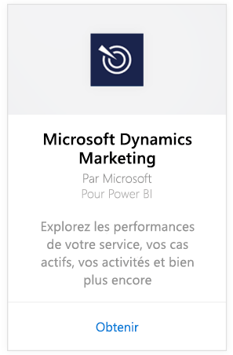
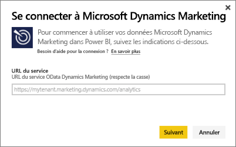
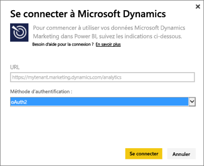
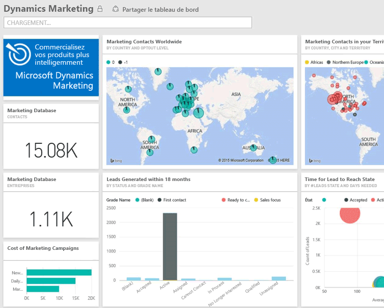

# Se connecter à Microsoft Dynamics Marketing avec Power BI
Le pack de contenu Microsoft Dynamics Marketing pour Power BI vous permet d’accéder à vos données et de les analyser facilement depuis Dynamics Marketing. Le pack de contenu utilise un modèle descriptif s’appuyant sur le flux OData, avec toutes les entités et les mesures nécessaires, telles que les programmes, les campagnes, les contacts et entreprises de marketing, les prospects, les interactions avec les prospects, la notation des prospects, les e-mails marketing, les sites web, les observations des comportements, les budgets, les transactions financières, les indicateurs de performance clés, et bien plus encore. 

Connectez-vous au [pack de contenu Dynamics Marketing](https://app.powerbi.com/getdata/services/microsoft-dynamics-marketing) pour Power BI.

>[!NOTE]
>Vous devez spécifier une URL OData valide pour une instance de Dynamics Marketing (le pack de contenu ne fonctionne pas avec une version CRM locale). Consultez les conditions supplémentaires ci-dessous.

## Comment se connecter
1. Sélectionnez Obtenir des données en bas du volet de navigation gauche.
   
    
2. Dans la zone **Services** , sélectionnez **Obtenir**.
   
    
3. Sélectionnez **Microsoft Dynamics Marketing** \> **Obtenir**.
   
   
4. Indiquez l’URL OData associée à votre compte.  Cela se présentera sous la forme  "`https://[instance\_name].marketing.dynamics.com/analytics.`"
   
   
5. Quand vous y êtes invité, indiquez vos informations d’identification (cette étape peut être ignorée si vous êtes déjà connecté avec votre navigateur). Pour la méthode d’authentification, entrez **oAuth2** et cliquez sur **Se connecter**:
   
   
6. Une fois connecté, un tableau de bord Dynamics Marketing s’affiche, rempli avec vos propres données. Les astérisques jaunes indiquent les nouveaux éléments dans le volet de navigation gauche.
   
   

**Et maintenant ?**

* Essayez de [poser une question dans la zone Q&R](power-bi-q-and-a.md) en haut du tableau de bord.
* [Modifiez les vignettes](service-dashboard-edit-tile.md) dans le tableau de bord.
* [Sélectionnez une vignette](service-dashboard-tiles.md) pour ouvrir le rapport sous-jacent.
* Même si une actualisation quotidienne de votre jeu de données est planifiée, vous pouvez modifier la planification de l’actualisation ou essayer d’actualiser le jeu de données sur demande à l’aide de l’option **Actualiser maintenant**.

## Configuration requise
* Vous devez spécifier une URL OData valide pour une instance de Dynamics Marketing (le pack de contenu ne fonctionne pas avec une version CRM locale).  
* Un administrateur doit activer le point de terminaison OData dans les paramètres du site. L’adresse du point de terminaison OData peut être obtenue en accédant à **Accueil \> Paramètres \> Paramètres du site** dans la section **Service de données d’organisation**.  Le format de l’URL OData est le suivant : https://[nom\_instance].marketing.dynamics.com/analytics.  
* Le compte utilisateur ou l’identité que vous utilisez pour accéder à Microsoft Dynamics Marketing doit être celui ou celle sous lequel ou laquelle vous vous êtes inscrit pour utiliser Power BI. Quand vous vous connectez à Microsoft Dynamics Marketing, vous êtes automatiquement connecté sous l’identité que vous utilisez pour Power BI. Si vous souhaitez vous connecter à Microsoft Dynamics Marketing avec un autre compte, inscrivez-vous en tant qu’utilisateur Power BI en utilisant ce compte. Nous espérons résoudre ce problème dans une prochaine version.   

## Résolution des problèmes
Si vous obtenez un message « Échec de l’ouverture de session » quand vous essayez de vous connecter à votre compte Dynamics CRM, vérifiez que vous vous connectez à Power BI avec le compte que vous utilisez habituellement pour accéder au flux OData CRM Online. Essayez également de vous connecter au flux dans votre navigateur, à des fins de test.

Contactez votre administrateur pour confirmer que vous utilisez la bonne URL OData et que le point de terminaison OData est activé.

Vérifiez la version de Dynamics Marketing que vous utilisez : des correctifs supplémentaires ont été apportés dans 18.0 et 18.1. Si vous rencontrez encore des problèmes et que vous êtes sur une version antérieure, vous pouvez envisager la mise à niveau.

Si vos problèmes persistent, ouvrez un ticket de support pour contacter l’équipe Power BI :

* Dans l’application Power BI, sélectionnez le point d’interrogation \> **Contacter le support technique**.
* Sur le site de support technique de Power BI (où vous lisez cet article), sélectionnez **Contacter le support technique** sur le côté droit de la page.

## Étapes suivantes
[Obtenir des données pour Power BI](service-get-data.md)

[Qu’est-ce que Power BI ?](power-bi-overview.md)

