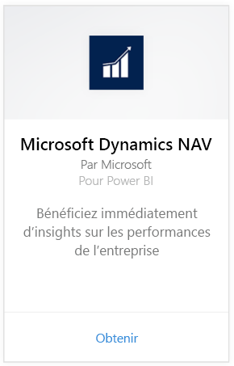
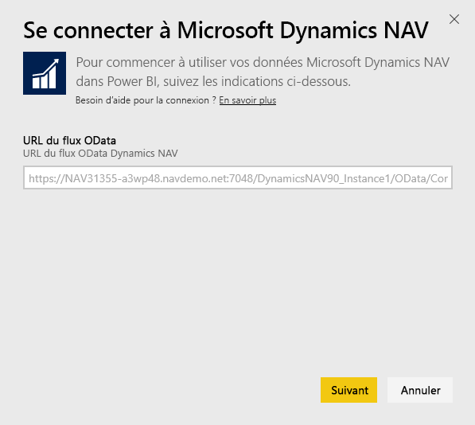
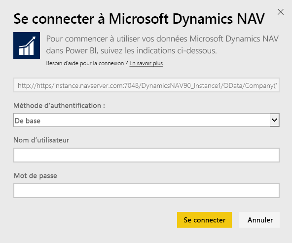
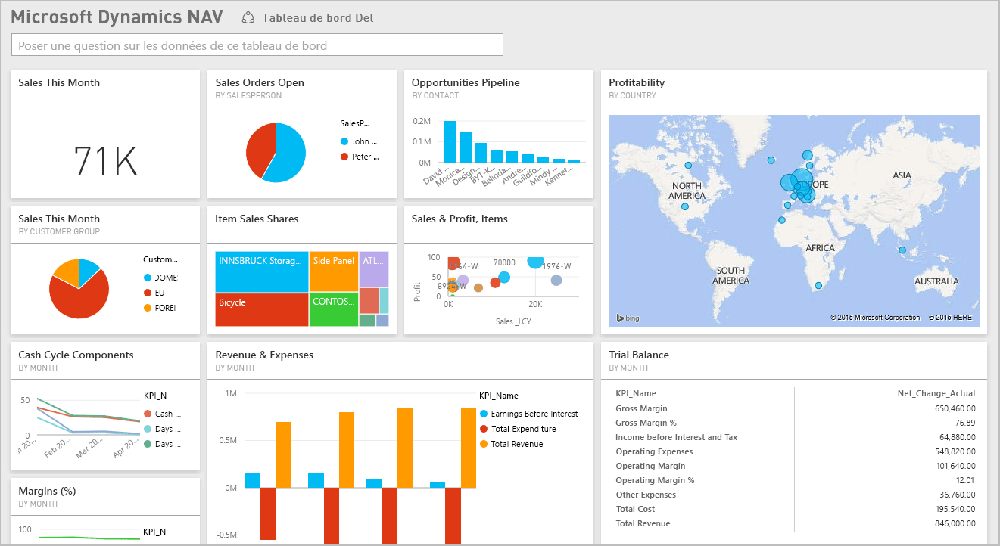

# Se connecter à Microsoft Dynamics NAV avec Power BI
Power BI vous permet d’extraire facilement des informations de vos données Microsoft Dynamics NAV. Power BI récupère vos données relatives aux ventes et aux aspects financiers, puis crée une application comprenant un tableau de bord et des rapports basés sur ces données. Power BI a besoin de vos autorisations d’accès aux tables à partir desquelles les données sont extraites, en l’occurrence, les données relatives aux ventes et aux aspects financiers. Vous trouverez plus d’informations sur la configuration requise ci-dessous. Une fois l’application installée, vous pouvez voir le tableau de bord et les rapports dans le service Power BI ([https://powerbi.com](https://powerbi.com)) et dans les applications mobiles Power BI. 

[Connectez-vous à Microsoft Dynamics NAV pour Power BI](https://app.powerbi.com/getdata/services/microsoft-dynamics-nav) ou consultez des informations supplémentaires sur l’[intégration de Dynamics NAV](https://powerbi.microsoft.com/integrations/microsoft-dynamics-nav) à Power BI.

## Comment se connecter
[!INCLUDE [powerbi-service-apps-get-more-apps](./includes/powerbi-service-apps-get-more-apps.md)]

3. Sélectionnez **Microsoft Dynamics NAV**, puis cliquez sur **Obtenir**.  
   
4. Lorsque vous y êtes invité, entrez votre URL OData de Microsoft Dynamics NAV. L’URL doit correspondre au modèle suivant :
   
    `https//instance.navserver.com:7048/DynamicsNAV90_Instance1/OData/Company('CRONUS%20International%20Ltd.')`
   
   * « instance.navserver.com » remplacé par le nom de votre NAV Server ;
   * « DynamicsNAV90\_Instance1 » remplacé par le nom de votre instance NAV Server ;
   * « Company(’CRONUS%20International%20Ltd.’) » remplacé par le nom de votre société NAV.
     
     Dans Dynamics NAV, un moyen facile d’obtenir cette URL consiste à accéder à Services web, à rechercher le service web powerbifinance et à copier l’URL Odata, mais en omettant la partie « /powerbifinance » de la chaîne d’URL.  
     
5. Sélectionnez **De base** et entrez vos informations d'identification Microsoft Dynamics NAV.
   
    Vous avez besoin d’informations d’identification d’administrateur (ou au moins d’autorisations d’accès aux données de ventes et financières) pour votre compte Microsoft Dynamics NAV.  Seule l’authentification de base (nom d'utilisateur et mot de passe) est actuellement prise en charge.
   
    
6. Power BI récupère vos données Microsoft Dynamics NAV, crée un tableau de bord prêt à l’emploi et génère un rapport pour vous.   
   

## Afficher le tableau de bord et les rapports
[!INCLUDE [powerbi-service-apps-open-app](./includes/powerbi-service-apps-open-app.md)]

[!INCLUDE [powerbi-service-apps-open-app](./includes/powerbi-service-apps-what-now.md)]

## Ce qui est inclus
Le tableau de bord et les rapports contiennent des données des tables suivantes (respect de la casse) :  

* ItemSalesAndProfit  
* ItemSalesByCustomer  
* powerbifinance  
* SalesDashboard  
* SalesOpportunities  
* SalesOrdersBySalesPerson  
* TopCustomerOverview  

## Configuration requise
Pour importer vos données Microsoft Dynamics NAV dans Power BI, vous devez disposer d’autorisations d’accès aux tables à partir desquelles les données sont récupérées. Ici, il s’agit des données de ventes et financières (voir ci-dessus). Les tables doivent également contenir des données, les tables vides ne pouvant être importées.

## Résolution des problèmes
Power BI utilise les services web de Microsoft Dynamics NAV pour extraire vos données. Si vous avez une grande quantité de données dans votre instance Microsoft Dynamics NAV, une suggestion pour minimiser l’impact sur votre utilisation du service web consiste à modifier la fréquence d’actualisation en fonction de vos besoins. Une autre suggestion est qu’un administrateur crée l’application et la partage au lieu que chaque administrateur doive créer sa propre application.

**« Échec de la validation des paramètres. Vérifiez que tous les paramètres sont valides »**  
Si vous voyez cette erreur après avoir tapé votre URL Microsoft Dynamics NAV. Assurez-vous que les conditions suivantes sont remplies :

* L’URL suit exactement le modèle suivant :
  
    `https//instance.navserver.com:7048/DynamicsNAV90_Instance1/OData/Company('CRONUS%20International%20Ltd.')`
  
  * « instance.navserver.com » remplacé par le nom de votre NAV Server ;
  * « DynamicsNAV90\_Instance1 » remplacé par le nom de votre instance NAV Server ;
  * « Company(’CRONUS%20International%20Ltd.’) » remplacé par le nom de votre société NAV.
* Assurez-vous que toutes les lettres sont en minuscules.  
* Assurez-vous que l’URL utilise « https ».  
* Assurez-vous qu’il n’existe aucune barre oblique finale à la fin de l’URL.

**« Échec de la connexion »**  
Si vous obtenez une erreur « Échec de la connexion » après avoir utilisé vos informations d’identification Microsoft Dynamics NAV pour vous connecter, vous rencontrez peut-être l’un des problèmes suivants :

* Le compte que vous utilisez ne dispose pas des autorisations nécessaires pour récupérer les données de Microsoft Dynamics NAV à partir de votre compte. Vérifiez qu’il s’agit d’un compte d’administrateur et réessayez.
* L’instance Dynamics NAV à laquelle vous tentez de vous connecter ne possède pas de certificat SSL valide. Dans ce cas, vous verrez un message d’erreur plus détaillé (similaire à « Impossible d’établir une relation de confiance SSL »). Notez que les certificats auto-signés ne sont pas pris en charge.

**« Désolé »**  
Si ce message d’erreur s’affiche après que vous êtes passé par la boîte de dialogue d’authentification, cela signifie que Power BI rencontre un problème de chargement des données.

* Vérifiez que l’URL est conforme au modèle spécifié ci-dessus. Une erreur courante consiste à spécifier ceci :
  
    `https//instance.navserver.com:7048/DynamicsNAV90\_Instance1/OData`
  
    Toutefois, vous devez inclure la section « Company(’CRONUS%20International%20Ltd.’) » avec votre nom de société NAV :
  
    `https//instance.navserver.com:7048/DynamicsNAV90\_Instance1/OData/Company('CRONUS%20International%20Ltd.')`

## Étapes suivantes
* [Que sont les applications dans Power BI ?](service-create-distribute-apps.md)
* [Obtenir des données dans Power BI](service-get-data.md)
* D’autres questions ? [Essayez d’interroger la communauté Power BI](http://community.powerbi.com/)

