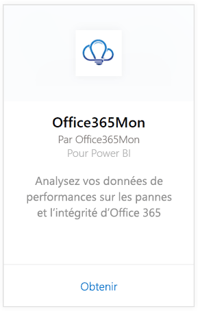

# Se connecter à Office365Mon avec Power BI
Grâce à Power BI et au pack de contenu Office365Mon, vous pouvez facilement analyser les pannes d’Office 365 et les données de performances d’intégrité. Power BI récupère vos données, notamment celles des pannes et des sondes d’intégrité, puis établit un tableau de bord prêt à l’emploi et des rapports basés sur ces données.

Connectez-vous au [pack de contenu Office365Mon](https://app.powerbi.com/groups/me/getdata/services/office365mon) pour Power BI.

>[!NOTE]
>Vous devez disposer d’un compte d’administrateur Office365Mon pour vous connecter au pack de contenu Power BI et le charger.

## Comment se connecter
1. Sélectionnez **Obtenir des données** en bas du volet de navigation gauche.
   
   
2. Dans la zone **Services** , sélectionnez **Obtenir**.
   
    
3. Sélectionnez **Office365Mon** \> **Obtenir**.
   
   
4. Pour la méthode d’authentification, sélectionnez **oAuth2** \> **Se connecter**.
   
   Quand vous y êtes invité, entrez vos informations d’identification d’administrateur Office365Mon et suivez le processus d’authentification.
   
   
   
   
5. Une fois les données importées dans Power BI, vous verrez un nouveau tableau de bord, un nouveau rapport et un nouveau jeu de données dans le volet de navigation gauche. Les nouveaux éléments sont signalés par un astérisque jaune (\*). Sélectionnez l’entrée Office365Mon.
   
   

**Et maintenant ?**

* Essayez de [poser une question dans la zone Q&R](power-bi-q-and-a.md) en haut du tableau de bord.
* [Modifiez les vignettes](service-dashboard-edit-tile.md) dans le tableau de bord.
* [Sélectionnez une vignette](service-dashboard-tiles.md) pour ouvrir le rapport sous-jacent.
* Même si une actualisation quotidienne de votre jeu de données est planifiée, vous pouvez modifier la planification de l’actualisation ou essayer d’actualiser le jeu de données sur demande à l’aide de l’option **Actualiser maintenant**.

## Résolution des problèmes
Si vous obtenez une erreur **« Échec de l’ouverture de session »** après avoir utilisé vos informations d’identification Office365Mon pour vous connecter, cela signifie que le compte que vous utilisez ne dispose pas des autorisations requises pour récupérer les données Office365Mon à partir de votre compte. Vérifiez qu’il s’agit d’un compte d’administrateur et réessayez.

## Étapes suivantes
[Prise en main de Power BI](service-get-started.md)

[Obtenir des données pour Power BI](service-get-data.md)

