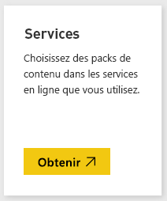
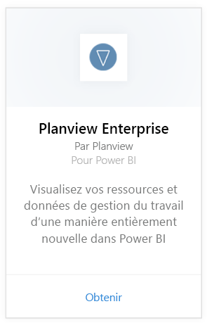
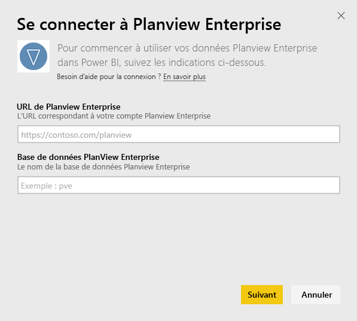
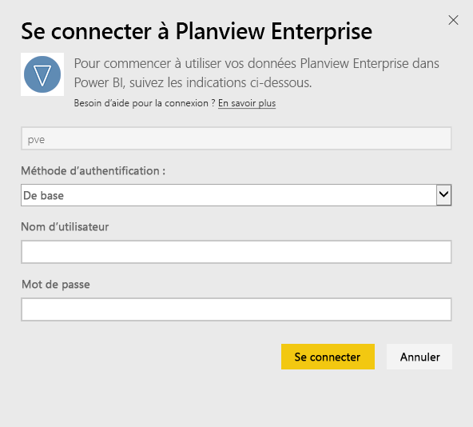
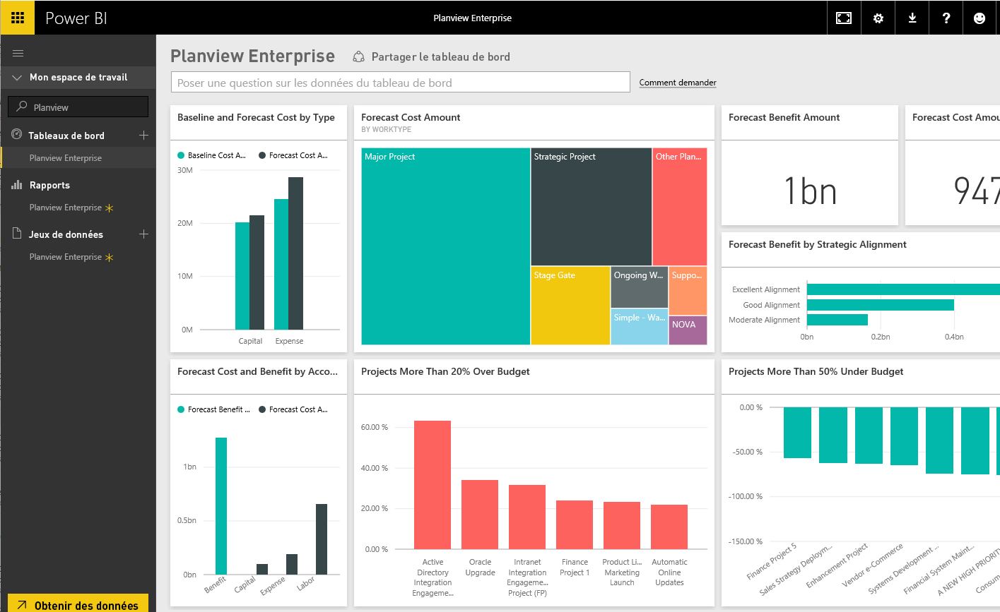

# Se connecter à Planview Enterprise avec Power BI
Le pack de contenu Planview Enterprise vous permet de visualiser vos ressources et données de gestion du travail d’une manière entièrement nouvelle dans Power BI. Utilisez vos informations d’identification de connexion Planview Enterprise pour consulter de façon interactive les dépenses d’investissement de votre portefeuille, comprendre où vous vous situez par rapport au budget, et savoir comment vos projets s’alignent sur vos priorités stratégiques d’entreprise. Vous pouvez également étendre le tableau de bord et les rapports prêts à l’emploi pour obtenir les informations les plus importantes pour vous.

Connexion au [pack de contenu Planview Enterprise dans Power BI](https://app.powerbi.com/getdata/services/planview-enterprise)

>[!NOTE]
>Pour importer vos données Planview Enterprise dans Power BI, vous devez être un utilisateur de Planview Enterprise sur le rôle duquel la fonctionnalité de visionneuse de portail de génération de rapports est activée. Consultez les conditions supplémentaires ci-dessous.

## Comment se connecter
1. Sélectionnez **Obtenir des données** en bas du volet de navigation gauche.
   
    
2. Dans la zone **Services** , sélectionnez **Obtenir**.
   
    
3. Dans la page Power BI, sélectionnez **Planview Enterprise**, puis sélectionnez **Obtenir** :  
    
4. Dans la zone de texte URL de Planview Enterprise, entrez l’URL du serveur Planview Enterprise que vous souhaitez utiliser. Dans la zone de texte Base de données Planview Enterprise, entrez le nom de la base de données Planview Enterprise, puis cliquez sur Suivant.  
    
5. Dans la liste Méthode d’authentification, sélectionnez l’option **De base** si elle n’est pas déjà sélectionnée. Entrez le **Nom d’utilisateur** et le **Mot de passe** de votre compte, puis sélectionnez **Se connecter**.  
   
6. Dans le volet gauche, dans la liste des tableaux de bord, sélectionnez Planview Enterprise.  
     Power BI importe des données de Planview Enterprise dans le tableau de bord. Notez que le chargement des données peut prendre un certain temps.  
    

**Et maintenant ?**

* Essayez de [poser une question dans la zone Q&R](consumer/end-user-q-and-a.md) en haut du tableau de bord.
* [Modifiez les vignettes](service-dashboard-edit-tile.md) dans le tableau de bord.
* [Sélectionnez une vignette](consumer/end-user-tiles.md) pour ouvrir le rapport sous-jacent.
* Même si une actualisation quotidienne de votre jeu de données est planifiée, vous pouvez modifier la planification de l’actualisation ou essayer d’actualiser le jeu de données sur demande à l’aide de l’option **Actualiser maintenant**.

## Configuration requise
Pour importer vos données Planview Enterprise dans Power BI, vous devez être un utilisateur de Planview Enterprise sur le rôle duquel la fonctionnalité de visionneuse de portail de génération de rapports est activée. Consultez les conditions supplémentaires ci-dessous.

Cette procédure suppose que vous vous êtes déjà connecté à la page d’accueil Microsoft Power BI avec un compte Power BI. Si vous n’avez pas de compte Power BI, accédez à [powerbi.com](https://powerbi.microsoft.com/get-started/) et sous **Power BI - Collaboration et partage cloud**, sélectionnez **Essai gratuit**. Ensuite, cliquez sur **Obtenir des données**.

## Étapes suivantes :

[Qu’est-ce que Power BI ?](power-bi-overview.md)

[Obtenir des données pour Power BI](service-get-data.md)