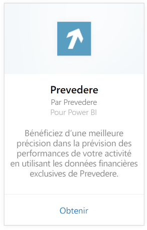
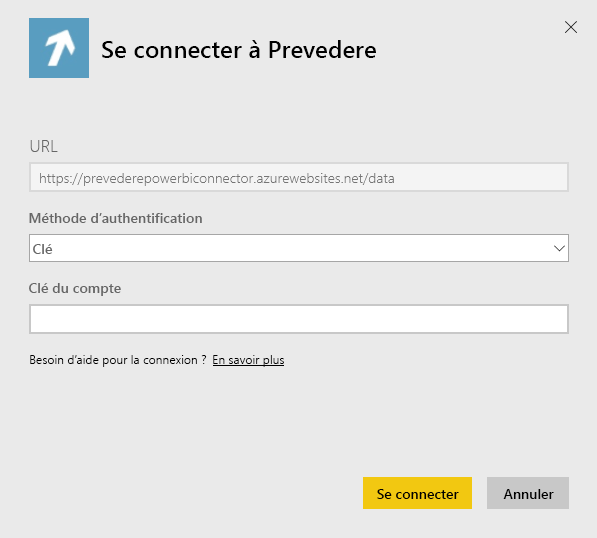
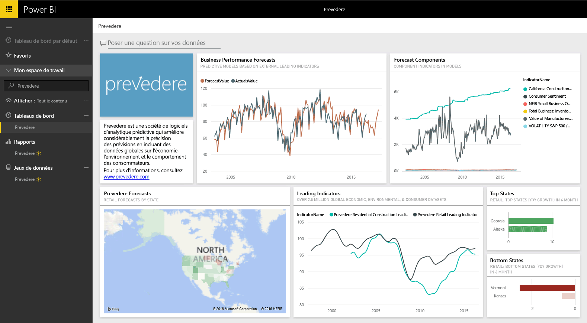

# Se connecter à Prevedere avec Power BI
Accédez aux informations financières critiques et exclusives afin de développer l’activité de votre entreprise en toute confiance et de manière proactive.

Connectez-vous au [pack de contenu Prevedere](https://app.powerbi.com/getdata/services/prevedere) pour Power BI.

>[!NOTE]
>Si vous n’êtes pas un utilisateur Prevedere existant, utilisez l’[exemple de clé](https://prevederepowerbiconnector.azurewebsites.net/static/learnmore.html) à des fins de test.

## Comment se connecter
1. Sélectionnez **Obtenir des données** en bas du volet de navigation gauche.
   
   
2. Dans la zone **Services** , sélectionnez **Obtenir**.
   
   
3. Sélectionnez **Prevedere**, puis **Obtenir**.
   
   
4. Pour **Méthode d’authentification**, sélectionnez **Clé** , puis indiquez votre clé API Prevedere.
   
    
5. Sélectionnez **Se connecter** pour commencer le processus d’importation. Une fois terminé, de nouveaux tableau de bord, rapport et modèle apparaîtront dans le volet de navigation. Sélectionnez le tableau de bord pour afficher vos données importées.
   
     

**Et maintenant ?**

* Essayez de [poser une question dans la zone Q&R](power-bi-q-and-a.md) en haut du tableau de bord.
* [Modifiez les vignettes](service-dashboard-edit-tile.md) dans le tableau de bord.
* [Sélectionnez une vignette](service-dashboard-tiles.md) pour ouvrir le rapport sous-jacent.
* Même si une actualisation quotidienne de votre jeu de données est planifiée, vous pouvez modifier la planification de l’actualisation ou essayer d’actualiser le jeu de données sur demande à l’aide de l’option **Actualiser maintenant**.

## Ce qui est inclus
Le pack de contenu obtient des données sur les prévisions de vente au détail, les modèles de prévision, les indicateurs clés et bien plus encore.

## Configuration requise
Ce pack de contenu requiert l’accès à une clé API Prevedere ou à l’exemple de clé (voir ci-dessous).

## Recherche de paramètres

Les clients existants peuvent accéder à leurs données à l’aide de leur clé API. Si vous n’êtes pas encore client, vous pouvez voir un exemple des données et des analyses à l’aide de l’[exemple de clé](https://prevederepowerbiconnector.azurewebsites.net/static/learnmore.html).

## Résolution des problèmes
Les données peuvent prendre un certain temps à charger, selon la taille de votre instance.

## Étapes suivantes
[Prise en main de Power BI](service-get-started.md)

[Obtenir des données dans Power BI](service-get-data.md)

