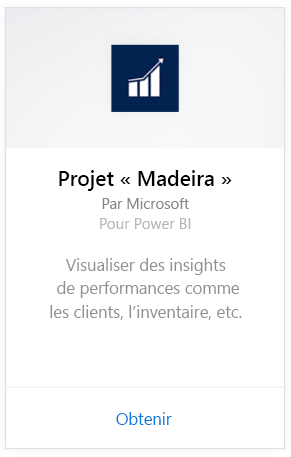
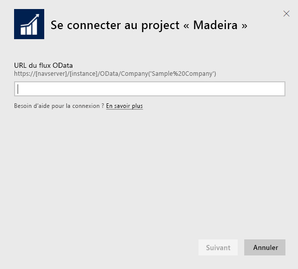
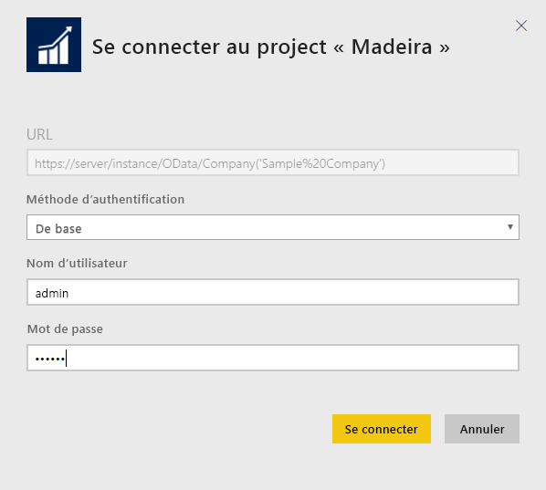
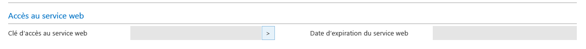
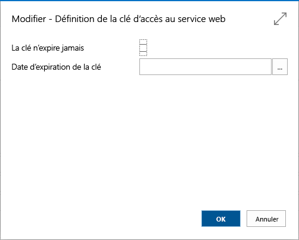
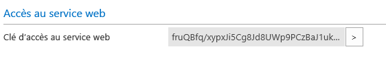

# Se connecter à Project Madeira avec Power BI
Power BI et le pack de contenu Project « Madeira » facilitent l’analyse des données Project « Madeira ». Power BI récupère vos données, à la fois les données de ventes et les données financières, puis crée un tableau de bord par défaut et des rapports basés sur ces données.
Connectez-vous au pack de contenu Project « Madeira » pour Power BI ou consultez des informations supplémentaires sur l’intégration de Project « Madeira » à Power BI.

>[!NOTE]
>Ce pack de contenu nécessite des autorisations d’accès aux tables à partir desquelles les données sont récupérées. Ici, il s’agit des données de ventes et financières. Vous trouverez plus d’informations sur la configuration requise [ci-dessous](#Requirements).

Connectez-vous au [pack de contenu Project « Madeira » Analytics](https://app.powerbi.com/getdata/services/project-madeira) pour Power BI.

## Comment se connecter
1. Sélectionnez **Obtenir des données** en bas du volet de navigation gauche.  
    
2. Dans la zone **Services**, sélectionnez **Obtenir**.  
    
3. Sélectionnez **Project « Madeira »**, puis sélectionnez **Obtenir**.  
    
4. Quand vous y êtes invité, entrez l’URL de Project « Madeira ». L’URL doit suivre exactement le modèle https://mycronusus.projectmadeira.com:7048/NAV/OData/Company('CRONUS%20US'), avec le nom d’entreprise de Project « Madeira ». Notez l’absence de la barre oblique finale et notez également qu’il s’agit d’une connexion « https ». Pour savoir comment trouver cette URL, voir [ci-dessous](#FindingParams).  
   
    
5. Quand vous y êtes invité, sélectionnez la méthode d’authentification de base, entrez l’adresse de messagerie de Project « Madeira » comme nom d’utilisateur, puis entrez la clé d’accès de service web du compte Project « Madeira » comme mot de passe. Si vous êtes déjà connecté à Project « Madeira » dans votre navigateur, vous ne serez peut-être pas invité à entrer vos informations d’identification. Pour savoir comment générer cette clé d’accès, voir [ci-dessous](#FindingParams).  
   
    >[!NOTE]
    >Vous devez être un superutilisateur de Project « Madeira ».
   
    
6. Après connexion, un tableau de bord, un rapport et un ensemble de données sont chargés automatiquement. Les vignettes sont ensuite mises à jour avec les données de votre compte.  
   
    

**Et maintenant ?**

* Essayez de [poser une question dans la zone Q&R](power-bi-q-and-a.md) en haut du tableau de bord.
* [Modifiez les vignettes](service-dashboard-edit-tile.md) dans le tableau de bord.
* [Sélectionnez une vignette](service-dashboard-tiles.md) pour ouvrir le rapport sous-jacent.
* Même si une actualisation quotidienne de votre jeu de données est planifiée, vous pouvez modifier la planification de l’actualisation ou essayer d’actualiser le jeu de données sur demande à l’aide de l’option **Actualiser maintenant**.

## Configuration requise
Pour importer les données de Project « Madeira » dans Power BI, vous devez disposer d’autorisations d’accès aux tables à partir desquelles les données sont récupérées. Ici, il s’agit de données de ventes et de données financières. Les tables (sensibles à la casse) nécessaires pour le pack de contenu sont les suivantes :  
 
    ´´´ 
    - ItemSalesAndProfit  
    - ItemSalesByCustomer  
    - powerbifinance  
    - SalesDashboard  
    - SalesOpportunities  
    - SalesOrdersBySalesPerson  
    - TopCustomerOverview  
    ´´´ 

## Recherche de paramètres
**Obtenir la bonne URL** Un moyen facile d’obtenir cette URL consiste à accéder à Services web dans Project « Madeira », à rechercher le service web powerbifinance et à copier l’URL Odata (faites un clic droit pour utiliser l’option Copier du menu contextuel), en omettant la partie « /powerbifinance » de la chaîne d’URL.

**Clés d’accès de service web** Pour utiliser les données de Project « Madeira », vous devez créer une clé d’accès de service web pour votre compte utilisateur. Dans Project « Madeira », recherchez la page Utilisateurs, puis ouvrez la carte de votre compte utilisateur. Vous pouvez y générer une nouvelle clé d’accès de services web et la copier dans le champ Mot de passe de la page de connexion Power BI.

Une fois que vous commencez à utiliser des clés d’accès de service web, vous devez continuer de les utiliser. Par conséquent, cliquez sur OK dans le message qui s’affiche.
Lors de la création de la clé, vous pouvez choisir de la faire expirer à une date spécifique.

Quand vous cliquez sur OK, une clé est créée. Vous pouvez ensuite la copier dans le champ Mot de passe de la page de connexion Power BI.

## Résolution des problèmes
Le tableau de bord Power BI s’appuie sur les services web publiés qui sont répertoriés ci-dessus. Il affiche des données provenant de l’exemple d’entreprise ou celles de votre propre entreprise si vous avez importé les données de votre solution comptable. Toutefois, si une erreur survient, cette section fournit une solution de contournement pour les problèmes les plus courants.

**« Échec de la validation des paramètres. Vérifiez que tous les paramètres sont valides. » ** Si vous voyez cette erreur après avoir entré l’URL de Project « Madeira », assurez-vous que les conditions suivantes sont remplies :  

    - L’URL respecte exactement le modèle suivant : https://*mycronusus*.projectmadeira.com:7048/NAV/OData/Company('*CRONUS%20US*')  
    - Supprimez le texte situé après le nom de la société entre parenthèses.  
    - Assurez-vous qu’il n’existe aucune barre oblique finale à la fin de l’URL.  
    - Vérifiez que l’URL utilise une connexion sécurisée (elle doit commencer par « https »).  

**« Échec de l’ouverture de session »** Si vous obtenez cette erreur quand vous vous connectez au tableau de bord à l’aide des informations identification de Project « Madeira », vous avez peut-être l’un des problèmes suivants :  

    - Le compte que vous utilisez ne dispose pas des autorisations nécessaires pour lire les données Project « Madeira » de votre compte. Accédez à votre compte utilisateur dans Project « Madeira », assurez-vous que vous avez utilisé la bonne clé d’accès de service web comme mot de passe, puis réessayez.  
    - L’instance de Project « Madeira » à laquelle vous essayez de vous connecter ne dispose pas d’un certificat SSL valide. Dans ce cas, vous verrez un message d’erreur plus détaillé (similaire à « Impossible d’établir une relation de confiance SSL »). Notez que les certificats auto-signés ne sont pas pris en charge.  

**« Oups »** Si vous voyez ce message d’erreur après vous être authentifié, il est très probable que cela soit dû à un problème de connexion aux données du pack de contenu. Vérifiez que l’URL respecte le modèle suivant :  
    https://*mycronusus*.projectmadeira.com:7048/NAV/OData/Company('*CRONUS%20US*')

L’erreur la plus courante consiste à spécifier l’URL complète d’un service web :  
    https://*mycronusus*.projectmadeira.com:7048/NAV/OData/Company('*CRONUS%20US*')/powerbifinance

Il est possible, également, que vous ayez oublié de spécifier le nom de la société :   
    https://*mycronusus*.projectmadeira.com:7048/NAV/OData/

## Étapes suivantes
[Prise en main de Power BI](service-get-started.md)

[Power BI – Concepts de base](service-basic-concepts.md)

