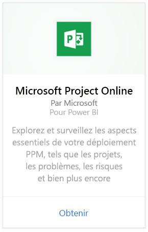
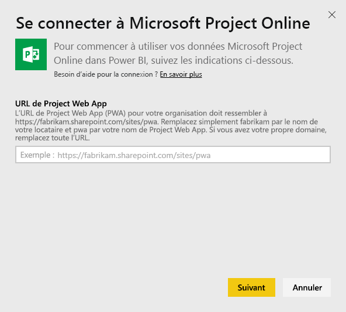
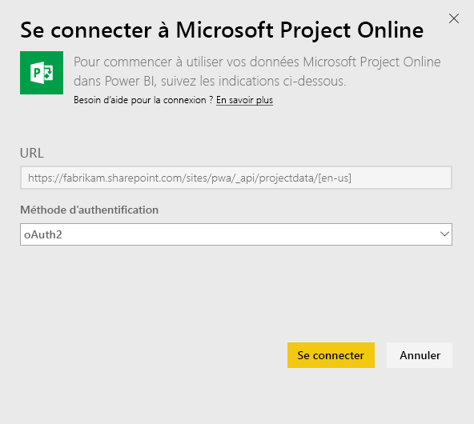
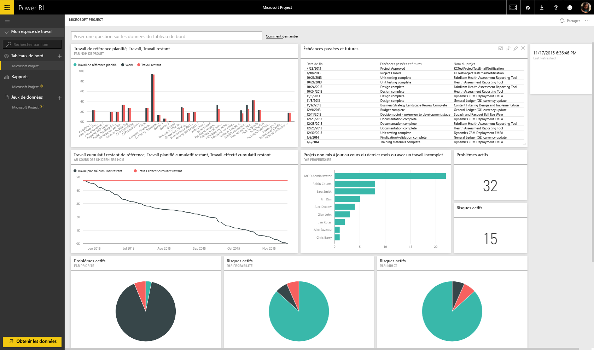
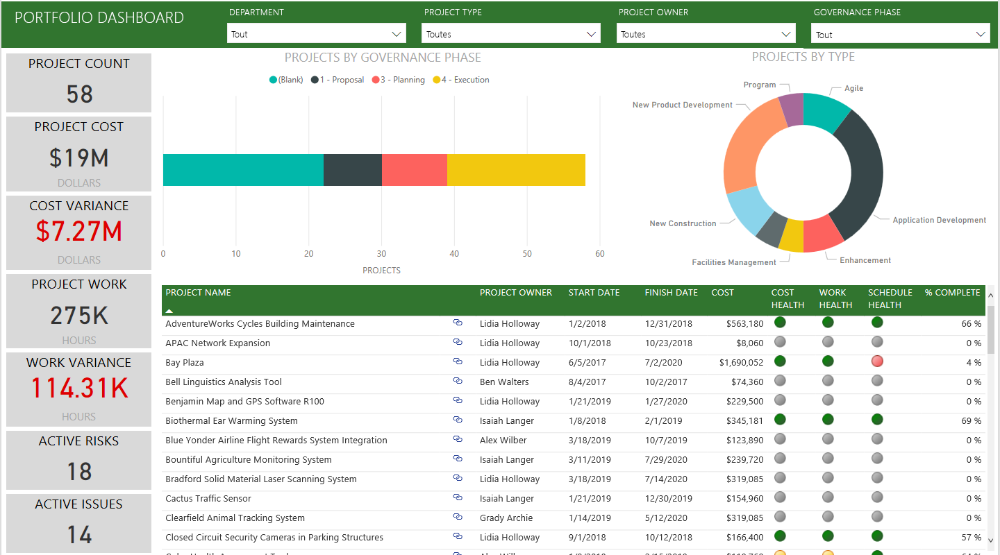

# Se connecter à Project Online avec Power BI
Microsoft Project Online est une solution en ligne flexible pour la gestion de portefeuille de projets (PPM) et les tâches quotidiennes. Project Online permet aux organisations de prendre en main et de hiérarchiser les investissements de portefeuille de projet, ainsi que de produire la valeur commerciale souhaitée. Le pack de contenu Project Online pour Power BI vous permet d’exploiter les insights de Project Online pour mieux gérer les projets, les portefeuilles et les ressources.

Connectez-vous au [pack de contenu Project Online](https://app.powerbi.com/getdata/services/project-online) pour Power BI.

## Comment se connecter
1. Sélectionnez **Obtenir des données** en bas du volet de navigation gauche.
   
    
2. Dans la zone **Services** , sélectionnez **Obtenir**.
   
   
3. Sélectionnez **Microsoft Project Online** \> **Obtenir**.
   
   
4. Dans la zone de texte **URL Project Web App** , entrez l’URL du projet Web App (PWA) auquel vous souhaitez vous connecter, puis appuyez sur **Suivant**. Notez que cela peut différer de l’exemple si vous avez un domaine personnalisé. Dans la zone de texte **Langue du site PWA**, tapez le numéro qui correspond à la langue de votre site PWA. Tapez le chiffre « 1 » pour l’anglais, « 2 » pour le Français, « 3 » pour l’allemand, « 4 » pour le portugais (Brésil), « 5 » pour le portugais (Portugal) et « 6 » pour l’espagnol. 
   
    
5. Pour la méthode d’authentification, sélectionnez **oAuth2** \> **Se connecter**. Quand vous y êtes invité, entrez vos informations d’identification Project Online et suivez le processus d’authentification.
   
    
    
Notez que vous devez disposer de la Visionneuse de portefeuilles, du Gestionnaire de portefeuilles ou d’autorisations Administrateur pour l’application Project Web App à laquelle vous vous connectez.

6. Une notification indiquant que vos données sont en cours de chargement s’affiche. Selon la taille de votre compte, cela peut prendre un certain temps. Une fois les données importées dans Power BI, le volet de navigation de gauche contient un nouveau tableau de bord, 13 rapports et un jeu de données. Il s’agit du tableau de bord par défaut créé par Power BI pour afficher vos données. Vous pouvez modifier ce tableau de bord pour afficher vos données comme vous le souhaitez.

   

7. Une fois que votre tableau de bord et que vos rapports sont prêts, vous pouvez commencer à explorer vos données Project Online. Le pack de contenu intègre 13 rapports riches et détaillés : 6 pages de rapport pour la vue d’ensemble du portefeuille, 5 pages de rapport pour la vue d’ensemble des ressources et 2 pages de rapport pour l’état du projet. 

   
   
   
   
   

**Et maintenant ?**

* Essayez de [poser une question dans la zone Q&R](consumer/end-user-q-and-a.md) en haut du tableau de bord.
* [Modifiez les vignettes](service-dashboard-edit-tile.md) dans le tableau de bord.
* [Sélectionnez une vignette](consumer/end-user-tiles.md) pour ouvrir le rapport sous-jacent.
* Même si une actualisation quotidienne de votre jeu de données est planifiée, vous pouvez modifier la planification de l’actualisation ou essayer d’actualiser le jeu de données sur demande à l’aide de l’option **Actualiser maintenant**.

**Développer le pack de contenu**

Téléchargez le [fichier PBIT GitHub](https://github.com/OfficeDev/Project-Power-BI-Content-Packs) pour personnaliser et mettre à jour le Pack de contenu.

## Étapes suivantes
[Prise en main de Power BI](service-get-started.md)

[Obtenir des données dans Power BI](service-get-data.md)

