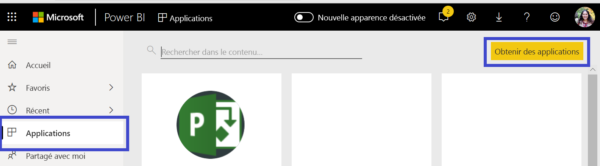
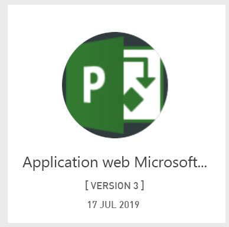
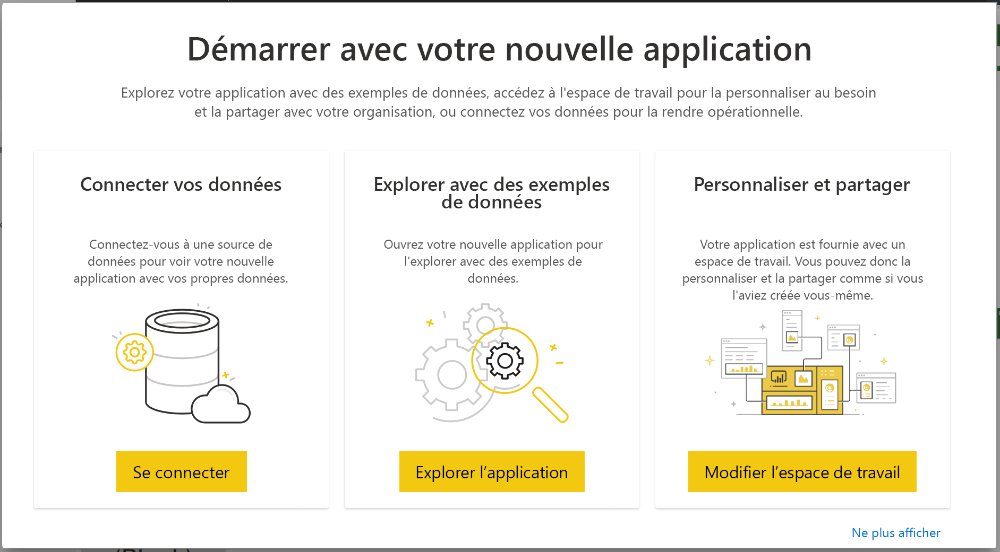

# Se connecter à Project Web App avec Power BI
Microsoft Project Web App est une solution en ligne flexible pour la gestion de portefeuilles de projets et les tâches quotidiennes. Project Web App permet aux organisations de prendre en main et de hiérarchiser les investissements de portefeuilles de projets ainsi que de produire la valeur commerciale souhaitée. L’application modèle Project Web App pour Power BI vous permet d’exploiter les insights de Project Web App pour mieux gérer les projets, les portefeuilles et les ressources.

Connectez-vous à l’[application modèle Project Web App](https://appsource.microsoft.com/product/power-bi/pbi_msprojectonline.pbi-microsoftprojectwebapp) pour Power BI.

## Comment se connecter

1. Sélectionnez **Applications** dans le volet de navigation de gauche, puis **Obtenir des applications** en haut à droite.

    

2. Dans la zone **Services**, sélectionnez **Obtenir**.
   
   
3. Dans AppSource, sélectionnez l’onglet **Applications**, puis recherchez/sélectionnez **Microsoft Project Web App**.
   
4. Vous recevrez un message indiquant **Installer cette application Power BI ?** . Sélectionnez **Installer**. 

   
5. Dans le volet **Applications**, sélectionnez la vignette **Microsoft Project Web App**. 
   
   
6. Dans **Démarrer avec votre nouvelle application**, sélectionnez **Connecter des données**.
   
   
7. Dans la zone de texte **URL Project Web App**, entrez l’URL de l’application PWA (Project Web App) à laquelle vous souhaitez vous connecter.  Notez que cela peut différer de l’exemple si vous avez un domaine personnalisé. Dans la zone de texte **Langue du site PWA**, tapez le numéro qui correspond à la langue de votre site PWA. Tapez le chiffre « 1 » pour l’anglais, « 2 » pour le Français, « 3 » pour l’allemand, « 4 » pour le portugais (Brésil), « 5 » pour le portugais (Portugal) et « 6 » pour l’espagnol. 
   
   
8. Pour la méthode d’authentification, sélectionnez **oAuth2** \> **Se connecter**. Quand vous y êtes invité, entrez vos informations d’identification Project Web App et suivez le processus d’authentification.

    > [!NOTE]
    > Vous devez disposer d’autorisations d’Examinateur de portefeuilles, de Responsable de portefeuilles ou d’Administrateur pour l’instance Project Web App à laquelle vous vous connectez.

9. Une notification indiquant que vos données sont en cours de chargement s’affiche. Selon la taille de votre compte, cela peut prendre un certain temps. Une fois les données importées dans Power BI, le contenu de votre nouvel espace de travail s’affiche. Vous devrez peut-être actualiser le jeu de données pour récupérer les dernières mises à jour. 

    Une fois les données importées dans Power BI, le rapport de 13 pages et le jeu de données apparaissent dans le volet de navigation de gauche. 

10. Une fois que vos rapports sont prêts, vous pouvez commencer à explorer vos données Project Web App. L’application modèle intègre 13 rapports riches et détaillés : 6 pages de rapport pour la vue d’ensemble du portefeuille, 5 pages de rapport pour la vue d’ensemble des ressources et 2 pages de rapport pour l’état du projet. 

    
   
    
   
    

**Et maintenant ?**

* Même si une actualisation quotidienne de votre jeu de données est planifiée, vous pouvez changer la planification de l’actualisation ou essayer d’actualiser le jeu de données à la demande à l’aide de l’option **Actualiser maintenant**.

**Développer l’application modèle**

Téléchargez le [fichier PBIT GitHub](https://github.com/OfficeDev/Project-Power-BI-Content-Packs) pour personnaliser et mettre à jour le pack de contenu.

## Étapes suivantes
[Prise en main de Power BI](service-get-started.md)

[Obtenir des données dans Power BI](service-get-data.md)

