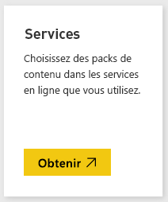
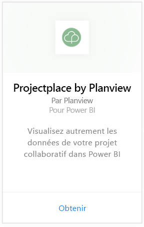
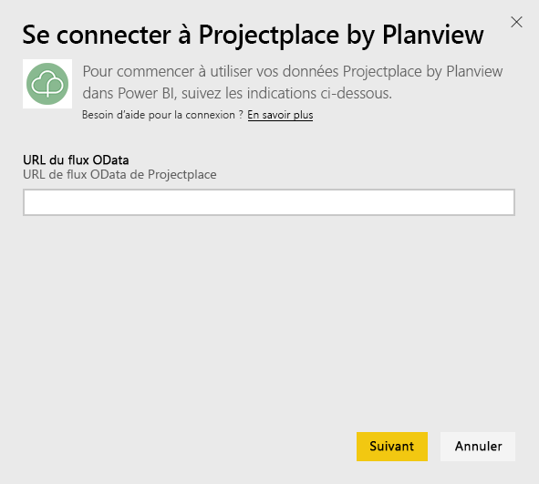
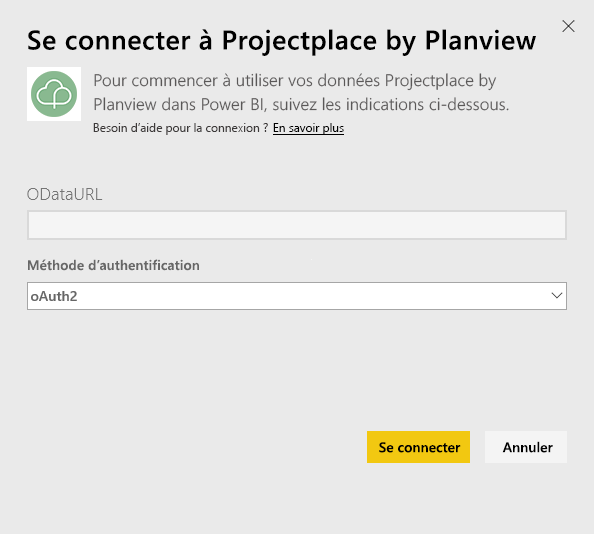
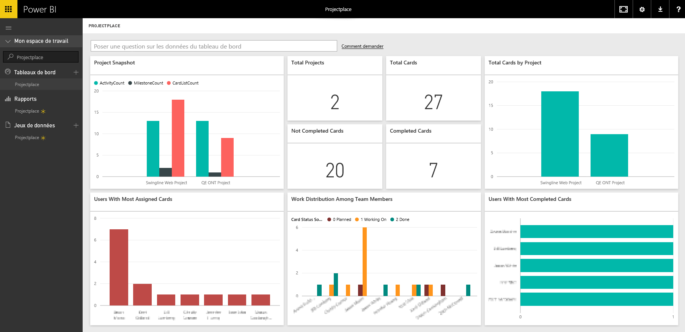

# Se connecter à Projectplace by Planview avec Power BI
Le pack de contenu Projectplace by Planview vous permet de visualiser les données de votre projet collaboratif de manière entièrement nouvelle dans Power BI. Utilisez vos informations de connexion Projectplace pour afficher de façon interactive les statistiques clés du projet, découvrir qui sont les membres de votre équipe les plus productifs et actifs, et identifier des cartes et activités à risque dans des projets de votre compte Projectplace. Vous pouvez également étendre le tableau de bord et les rapports prêts à l’emploi pour obtenir les informations les plus importantes pour vous.

[Se connecter au pack de contenu Projectplace dans Power BI](https://app.powerbi.com/getdata/services/projectplace)

>[!NOTE]
>Pour importer vos données Projectplace dans Power BI, vous devez être un utilisateur de Projectplace. Consultez les conditions supplémentaires ci-dessous.

## Comment se connecter
1. Sélectionnez **Obtenir des données** en bas du volet de navigation gauche.
   
    
2. Dans la zone **Services** , sélectionnez **Obtenir**.
   
    
3. Dans la page Power BI, sélectionnez **Projectplace by Planview**, puis sélectionnez **Obtenir** :  
   
    
4. Dans la zone de texte URL du flux OData, entrez l’URL du flux OData de Projectplace que vous souhaitez utiliser, comme illustré dans l’image suivante :
   
    
5. Dans la liste Méthode d’authentification, sélectionnez **OAuth** si cette option n’est pas sélectionnée. Appuyez sur **Se connecter** , puis suivez le flux de connexion.  
   
   
6. Dans le volet gauche, sélectionnez **Projectplace** dans la liste des tableaux de bord. Power BI importe les données de Projectplace dans le tableau de bord. Notez que le chargement des données peut prendre un certain temps.  
   
    Le tableau de bord contient des vignettes qui affichent des données de votre base de données Projectplace. L’image suivante présente un exemple du tableau de bord Projectplace par défaut dans Power BI.
   
    

**Et maintenant ?**

* Essayez de [poser une question dans la zone Q&R](consumer/end-user-q-and-a.md) en haut du tableau de bord.
* [Modifiez les vignettes](service-dashboard-edit-tile.md) dans le tableau de bord.
* [Sélectionnez une vignette](consumer/end-user-tiles.md) pour ouvrir le rapport sous-jacent.
* Même si une actualisation quotidienne de votre jeu de données est planifiée, vous pouvez modifier la planification de l’actualisation ou essayer d’actualiser le jeu de données sur demande à l’aide de l’option **Actualiser maintenant**.

## Configuration requise
Pour importer vos données Projectplace dans Power BI, vous devez être un utilisateur de Projectplace. Cette procédure suppose que vous vous êtes déjà connecté à la page d’accueil Microsoft Power BI avec un compte Power BI. Si vous n’avez pas de compte Power BI, accédez à [powerbi.com](https://powerbi.microsoft.com/get-started/) et sous **Power BI - Collaboration et partage cloud**, sélectionnez **Essai gratuit**. Ensuite, cliquez sur **Obtenir des données**.

## Étapes suivantes
[Qu’est-ce que Power BI ?](power-bi-overview.md)

[Power BI – Concepts de base](consumer/end-user-basic-concepts.md)

