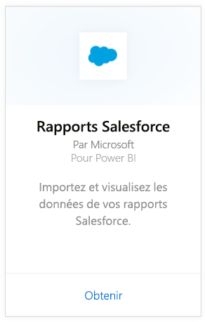
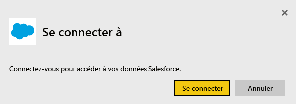
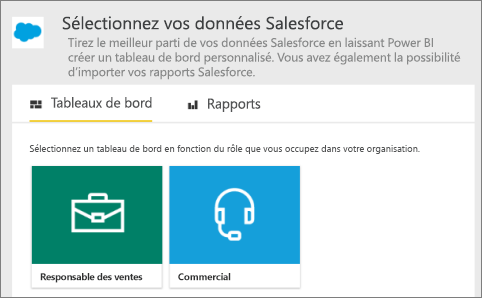
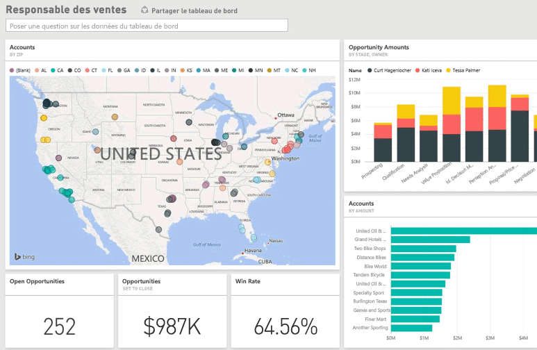

# Se connecter à Salesforce avec Power BI
Avec Power BI, vous pouvez facilement vous connecter à votre compte Salesforce.com. Créez cette connexion pour récupérer vos données et disposer automatiquement d’un tableau de bord et de rapports connexes basés sur vos données.

Connectez-vous au [pack de contenu Salesforce](https://app.powerbi.com/getdata/services/salesforce) pour Power BI ou consultez des informations supplémentaires sur l’[intégration de Salesforce](https://powerbi.microsoft.com/integrations/salesforce) à Power BI.

## Comment se connecter
1. Sélectionnez **Obtenir des données** en bas du volet de navigation gauche.
   
    
2. Dans la zone **Services** , sélectionnez **Obtenir**.
   
    
3. Cliquez sur **Salesforce**, puis sélectionnez **Obtenir**.  
   
   
4. Sélectionnez **Connexion** pour lancer le processus de connexion.
   
    
5. Quand vous y êtes invité, entrez vos informations d’identification Salesforce. Cliquez sur **Autoriser** pour que Power BI ait accès à vos informations et données Salesforce de base.
   
   
6. Configurez ce que vous souhaitez importer dans Power BI à l’aide de l’option de liste déroulante :
   
   * **Tableau de bord**
     
     Sélectionnez un tableau de bord prédéfini basé sur un rôle (tel que **Responsable des ventes**). Ces tableaux de bord récupèrent un ensemble spécifique de données standard de Salesforce et n’incluent pas de champs personnalisés.
     
     
   * **Rapports**
     
     Sélectionnez un ou plusieurs rapports personnalisés à partir de votre compte Salesforce. Ces rapports correspondent à vos vues dans Salesforce et peuvent inclure des données de champs personnalisés ou d’objets.
     
     
     
     Si vous ne voyez aucun rapport, ajoutez-en ou créez-en dans votre compte Salesforce, puis reconnectez-vous.
7. Cliquez sur **Se connecter** pour commencer le processus d’importation. Pendant l’importation, une notification vous indique que l’importation est en cours. Une fois l’importation terminée, un tableau de bord, un rapport et un jeu de données pour vos données Salesforce sont répertoriés dans le volet de navigation de gauche.
   
   

Vous pouvez modifier ce tableau de bord pour afficher vos données comme vous le souhaitez. Vous pouvez poser des questions dans la zone Q&R, ou bien cliquer sur une vignette pour [ouvrir le rapport sous-jacent](consumer/end-user-tiles.md) et [modifier les vignettes](service-dashboard-edit-tile.md) du tableau de bord.

**Et maintenant ?**

* Essayez de [poser une question dans la zone Q&R](consumer/end-user-q-and-a.md) en haut du tableau de bord.
* [Changez les vignettes](service-dashboard-edit-tile.md) dans le tableau de bord.
* [Sélectionnez une vignette](consumer/end-user-tiles.md) pour ouvrir le rapport sous-jacent.
* [Sélectionnez une vignette](service-dashboard-tiles.md) pour ouvrir le rapport sous-jacent.
>>>>>>> 66fe62d8f200efd9cfeb465eeb5f370dbbaa63be
* Même si une actualisation quotidienne de votre jeu de données est planifiée, vous pouvez modifier la planification de l’actualisation ou essayer d’actualiser le jeu de données sur demande à l’aide de l’option **Actualiser maintenant**.

## Configuration requise et considérations
- Être connecté avec un compte Salesforce de production qui autorise l’accès des API.
- Autorisation accordée à l’application Power BI pendant la connexion.
- Compte disposant de suffisamment d’appels d’API pour extraire et actualiser les données.
- Un jeton d’authentification valide est nécessaire pour l’actualisation. Salesforce imposant une limite de 5 jetons d’authentification par application, vérifiez qu’au maximum 5 jeux de données Salesforce sont importés.
- L’API des Rapports Salesforce possède une restriction qui prend en charge jusqu'à 2 000 lignes de données.

## Résolution des problèmes
Si vous rencontrez des erreurs, reportez-vous à la configuration requise ci-dessus. Notez également que la connexion à un domaine personnalisé ou bas à sable (sandbox) n’est actuellement pas prise en charge.

### Message « Impossible de se connecter au serveur distant »

Si vous recevez un message « Impossible de se connecter au serveur distant » lorsque vous tentez de vous connecter à votre compte Salesforce, consultez cette solution sur le forum Outsystems : [Salesforce Connector Log In Error Message: Unable to connect to the remote server](https://www.outsystems.com/forums/Forum_TopicView.aspx?TopicId=17674&TopicName=log-in-error-message-unable-to-connect-to-the-remote-server&)

## Étapes suivantes
[Qu’est-ce que Power BI ?](power-bi-overview.md)

[Obtenir des données](service-get-data.md)

