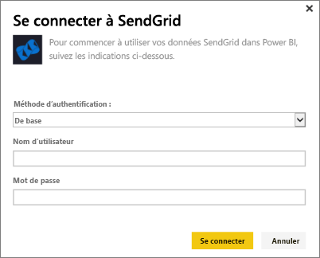

# Se connecter à SendGrid avec Power BI
Le pack de contenu SendGrid pour Power BI vous permet d’extraire des données et des statistiques de votre compte SendGrid. À l’aide du pack de contenu SendGrid, vous pouvez visualiser vos statistiques SendGrid dans un tableau de bord.

Connectez-vous au [pack de contenu SendGrid](https://app.powerbi.com/getdata/services/sendgrid) pour Power BI.

## Comment se connecter
1. Sélectionnez **Obtenir des données** en bas du volet de navigation gauche.
   
    
2. Dans la zone **Services** , sélectionnez **Obtenir**.
   
    
3. Sélectionnez le pack de contenu **SendGrid**, puis cliquez sur **Obtenir**.
   
    
4. Quand vous y êtes invité, indiquez votre nom d’utilisateur et votre mot de passe SendGrid. Sélectionnez **Se connecter**.
   
   
5. Une fois les données importées dans Power BI, un nouveau tableau de bord, un nouveau rapport et un nouveau jeu de données apparaissent dans le volet de navigation gauche, avec les statistiques de votre messagerie couvrant les 90 derniers jours. Les nouveaux éléments sont signalés par un astérisque jaune \*.
   
   

**Et maintenant ?**

* Essayez de [poser une question dans la zone Q&R](power-bi-q-and-a.md) en haut du tableau de bord.
* [Modifiez les vignettes](service-dashboard-edit-tile.md) dans le tableau de bord.
* [Sélectionnez une vignette](service-dashboard-tiles.md) pour ouvrir le rapport sous-jacent.
* Même si une actualisation quotidienne de votre jeu de données est planifiée, vous pouvez modifier la planification de l’actualisation ou essayer d’actualiser le jeu de données sur demande à l’aide de l’option **Actualiser maintenant**.

## Ce qui est inclus
Les métriques suivantes sont disponibles dans le tableau de bord SendGrid :

* Statistiques globales de la messagerie : demandes, messages remis, messages retournés, courrier indésirable bloqué, rapport sur le courrier indésirable , etc.
* Statistiques de la messagerie par catégorie
* Statistiques de la messagerie par secteur géographique
* Statistiques de la messagerie par fournisseur de services Internet
* Statistiques de la messagerie par appareil, client et navigateur

## Étapes suivantes
[Prise en main de Power BI](service-get-started.md)

[Obtenir des données](service-get-data.md)

