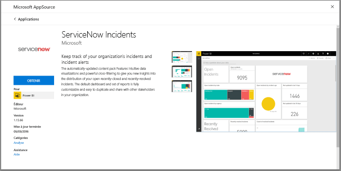
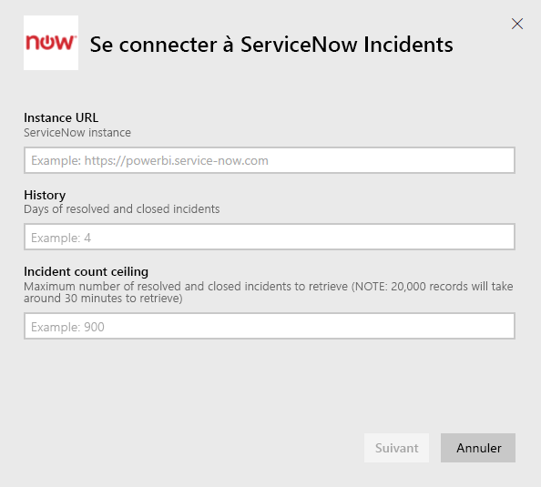
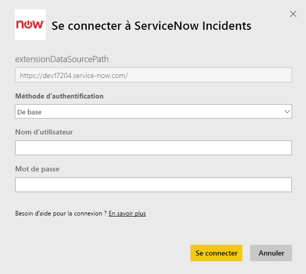
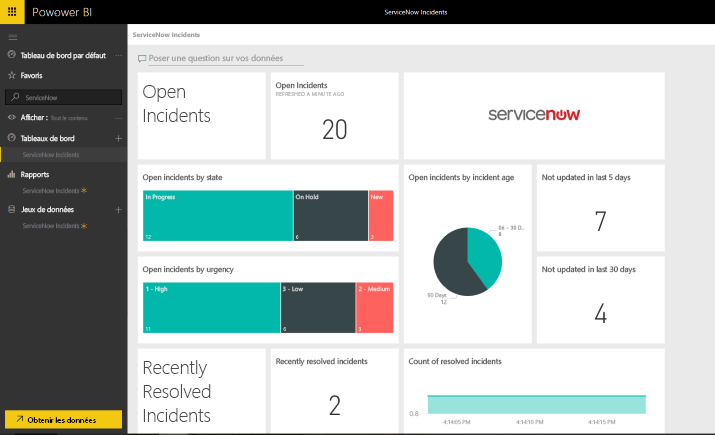

# Se connecter à ServiceNow avec Power BI pour la génération de rapports sur les incidents
ServiceNow propose plusieurs produits et solutions de gestion informatique, des activités et des opérations pour améliorer votre entreprise. Ce pack de contenu inclut plusieurs rapports et informations sur vos incidents ouverts, récemment résolus et récemment fermés.  

Connectez-vous au pack de contenu Power BI pour les [incidents ServiceNow](https://app.powerbi.com/getdata/services/servicenow).

## Comment se connecter
1. Sélectionnez **Obtenir des données** en bas du volet de navigation gauche.
   
    
2. Dans la zone **Services**, sélectionnez **Obtenir**.
   
    
3. Sélectionnez **Incidents ServiceNow** \> **Obtenir**.
   
   
4. Indiquez l’URL de votre instance ServiceNow et la plage de jours/d’enregistrements à importer. Notez que dès qu’une limite est atteinte, l’importation s’arrête.
   
   
5. Quand vous y êtes invité, entrez vos informations d’identification **De base** ServiceNow. Notez que l’authentification unique n’est pas prise en charge actuellement. Des informations supplémentaires sur la configuration système requise sont disponibles ci-dessous.
   
   
6. Une fois le flux de connexion terminé, le processus d’importation commence. Une fois terminé, de nouveaux tableau de bord, rapport et modèle apparaîtront dans le volet de navigation. Sélectionnez le tableau de bord pour afficher vos données importées.
   
    

**Et maintenant ?**

* Essayez de [poser une question dans la zone Q&R](power-bi-q-and-a.md) en haut du tableau de bord.
* [Modifiez les vignettes](service-dashboard-edit-tile.md) dans le tableau de bord.
* [Sélectionnez une vignette](service-dashboard-tiles.md) pour ouvrir le rapport sous-jacent.
* Même si une actualisation quotidienne de votre jeu de données est planifiée, vous pouvez modifier la planification de l’actualisation ou essayer d’actualiser le jeu de données sur demande à l’aide de l’option **Actualiser maintenant**.

## Configuration requise
Pour vous connecter :  

* Vous avez besoin d’un compte pouvant accéder à votre_organisation.service-now.com avec l’authentification de base (l’authentification unique n’est pas prise en charge dans cette version).  
* Le compte doit avoir le rôle rest_service et l’accès en lecture à la table des incidents.  

## Résolution des problèmes
Si vous rencontrez une erreur d’informations d’identification au cours du chargement, consultez les conditions d’accès ci-dessus. Si vous disposez des autorisations appropriées et que vous rencontrez toujours des problèmes, contactez votre administrateur ServiceNow et vérifiez que vous disposez des autorisations supplémentaires éventuellement requises pour votre instance personnalisée.

Si le temps de chargement est trop long, vérifiez le nombre d’incidents et le nombre de jours que vous avez spécifiés lors de la connexion et envisagez de les réduire.

## Étapes suivantes
[Prise en main de Power BI](service-get-started.md)

[Power BI – Concepts de base](service-basic-concepts.md)

