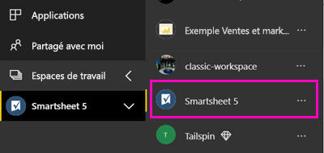

# Se connecter à Smartsheet avec Power BI
Cet article vous guide tout au long de l’extraction de vos données à partir de votre compte Smartsheet avec une application de modèle Power BI. Smartsheet offre une plateforme simple de collaboration et de partage de fichiers. Le modèle d’application Smartsheet pour Power BI fournit un tableau de bord, rapports et jeu de données qui affiche une vue d’ensemble de votre compte Smartsheet. Vous pouvez également utiliser [Power BI Desktop](desktop-connect-to-data.md) pour vous connecter directement à des feuilles individuelles dans votre compte. 

Une fois que vous avez installé le modèle d’application, vous pouvez modifier le tableau de bord et rapports. Vous pouvez distribuer en tant qu’application à vos collègues dans votre organisation.

Se connecter à la [Smartsheet d’application du modèle](https://app.powerbi.com/groups/me/getdata/services/smartsheet) pour Power BI.

>[!NOTE]
>Un compte d’administrateur Smartsheet est préférable pour la connexion et le chargement de l’application de modèle Power BI qu’il dispose des droits d’accès supplémentaires.

## Comment se connecter

[!INCLUDE [powerbi-service-apps-get-more-apps](./includes/powerbi-service-apps-get-more-apps.md)]

3. Sélectionnez **Smartsheet** \> **obtenez-le maintenant**.
4. Dans **installer cette application Power BI ?** sélectionnez **installer**.
4. Dans le **applications** volet, sélectionnez le **Smartsheet** vignette.

    

6. Dans **prise en main votre nouvelle application**, sélectionnez **se connecter aux données**.

    

4. Pour la Méthode d’authentification, sélectionnez **oAuth2 \> Se connecter**.
   
   Quand vous y êtes invité, entrez vos informations d’identification Smartsheet et suivez le processus d’authentification.
   
   
   
   

5. Une fois que Power BI importe les données, le tableau de bord Smartsheet s’ouvre.
   
   

## Modifier et distribuer votre application

Vous avez installé le modèle d’application Smartsheet. Cela signifie que vous avez également créé l’espace de travail Smartsheet. Dans l’espace de travail, vous pouvez modifier le rapport et un tableau de bord et distribuez-la comme un *application* à vos collègues de votre organisation. 

1. Pour afficher tout le contenu de votre nouvel espace de travail Smartsheet, dans la barre de navigation gauche, sélectionnez **espaces de travail** > **Smartsheet**. 

    

    Cette vue est la liste de contenu pour l’espace de travail. Dans le coin supérieur droit, vous voyez **mise à jour application**. Lorsque vous êtes prêt à distribuer votre application à vos collègues, c’est là que vous allez commencer. 

    

2. Sélectionnez **rapports** et **jeux de données** pour voir les autres éléments dans l’espace de travail.

    En savoir plus sur [distribution d’applications](service-create-distribute-apps.md) à vos collègues.

## Ce qui est inclus
Le Smartsheet d’application du modèle pour Power BI comprend une vue d’ensemble de votre compte Smartsheet, comme le nombre d’espaces de travail, rapports et de feuilles vous avez, quand elles sont modifiées etc. Les utilisateurs administrateurs pour obtenir des informations sur les utilisateurs de leur système, telles que les créateurs de feuilles principaux.  

Pour vous connecter directement à des feuilles individuelles dans votre compte, vous pouvez utiliser le connecteur Smartsheet dans [Power BI Desktop](desktop-connect-to-data.md).  

## Étapes suivantes

* [Créer de nouveaux espaces de travail dans Power BI](service-create-the-new-workspaces.md)
* [Installer et utiliser des applications dans Power BI](consumer/end-user-apps.md)
* [Se connecter à des applications Power BI pour les services externes](service-connect-to-services.md)
* Vous avez des questions ? [Essayez d’interroger la communauté Power BI](http://community.powerbi.com/)