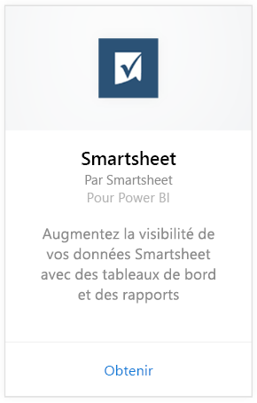
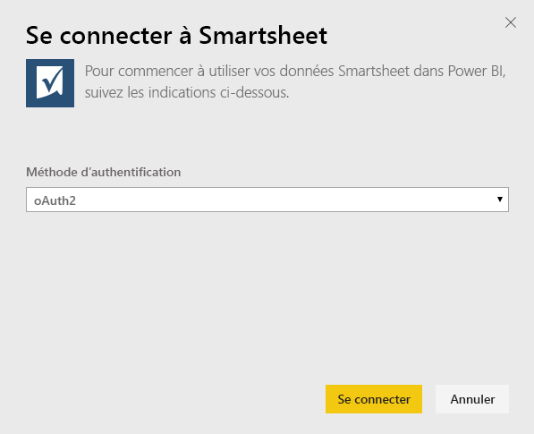

# Se connecter à Smartsheet avec Power BI
Smartsheet offre une plateforme simple de collaboration et de partage de fichiers. Le pack de contenu Smartsheet pour Power BI fournit un tableau de bord, des rapports, ainsi qu’un jeu de données offrant une vue d’ensemble de votre compte Smartsheet. Vous pouvez également utiliser [Power BI Desktop](desktop-connect-to-data.md) pour vous connecter directement à des feuilles individuelles dans votre compte. 

Connectez-vous au [pack de contenu Smartsheet](https://app.powerbi.com/groups/me/getdata/services/smartsheet) pour Power BI.

>[!NOTE]
>Pour charger le pack de contenu Power BI, il est recommandé de se connecter avec un compte d’administrateur Smartsheet, car celui-ci dispose de droits d’accès supplémentaires.

## Comment se connecter
1. Sélectionnez **Obtenir des données** en bas du volet de navigation gauche.
   
   
2. Dans la zone **Services** , sélectionnez **Obtenir**.
   
    
3. Sélectionnez **Smartsheet \> Obtenir**.
   
   
4. Pour la Méthode d’authentification, sélectionnez **oAuth2 \> Se connecter**.
   
   Quand vous y êtes invité, entrez vos informations d’identification Smartsheet et suivez le processus d’authentification.
   
   
   
   
5. Une fois les données importées dans Power BI, vous verrez un nouveau tableau de bord, un nouveau rapport et un nouveau jeu de données dans le volet de navigation gauche. Les nouveaux éléments sont signalés par un astérisque jaune \*. Sélectionnez l’entrée Smartsheet.
   
   

**Et maintenant ?**

* Essayez de [poser une question dans la zone Q&R](consumer/end-user-q-and-a.md) en haut du tableau de bord.
* [Modifiez les vignettes](service-dashboard-edit-tile.md) dans le tableau de bord.
* [Sélectionnez une vignette](consumer/end-user-tiles.md) pour ouvrir le rapport sous-jacent.
* Même si une actualisation quotidienne de votre jeu de données est planifiée, vous pouvez modifier la planification de l’actualisation ou essayer d’actualiser le jeu de données sur demande à l’aide de l’option **Actualiser maintenant**.

## Ce qui est inclus
Le pack de contenu Smartsheet pour Power BI comprend une vue d’ensemble de votre compte Smartsheet, comme le nombre d’espaces de travail, de rapports et de feuilles dont vous disposez, la date de leur mise à jour, etc. Les administrateurs ont également accès à des informations sur les utilisateurs dans leur système, comme les créateurs de feuilles principaux.  

Pour vous connecter directement à des feuilles individuelles dans votre compte, vous pouvez utiliser le connecteur Smartsheet dans [Power BI Desktop](desktop-connect-to-data.md).  

## Étapes suivantes :

[Qu’est-ce que Power BI ?](power-bi-overview.md)

[Obtenir des données pour Power BI](service-get-data.md)