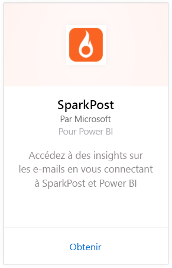
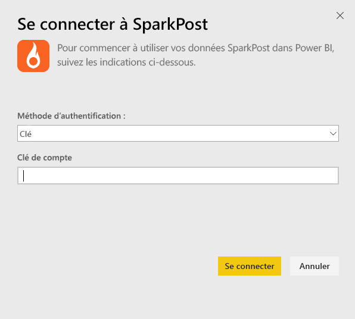
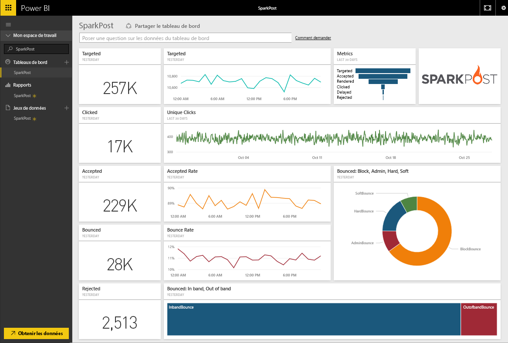
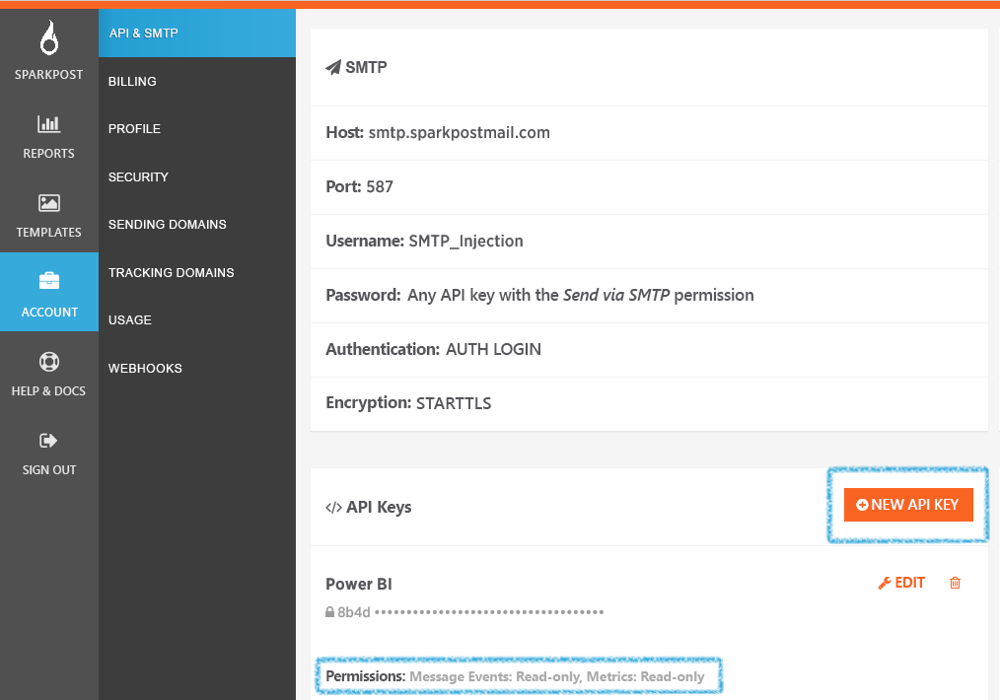

# Se connecter à SparkPost avec Power BI
Le pack de contenu Power BI pour SparkPost permet d’extraire des jeux de données à partir de votre compte SparkPost dans un tableau de bord instructif. Le pack de contenu SparkPost vous permet de visualiser vos statistiques globales en matière de courrier électronique, dont les domaines, les campagnes et l’engagement par le fournisseur de services Internet.

Connectez-vous au [pack de contenu SparkPost pour Power BI](https://app.powerbi.com/getdata/services/spark-post).

## Comment se connecter
1. Sélectionnez **Obtenir des données** en bas du volet de navigation gauche.
   
   
2. Dans la zone **Services** , sélectionnez **Obtenir**.
   
   
3. Sélectionnez le pack de contenu **SparkPost** , puis cliquez sur **Obtenir**. 
   
   
4. Lorsque vous y êtes invité, fournissez votre clé API SparkPost, puis sélectionnez Se connecter. Voir les détails sur la [recherche du paramètre](#FindingParams) ci-dessous.
   
   
5. Le chargement de vos données commence. Selon la taille de votre compte, cette opération peut prendre un certain temps. Une fois les données importées dans Power BI, le tableau de bord, le rapport et le jeu de données par défaut apparaissent dans le volet de navigation gauche, avec les statistiques relatives à votre messagerie couvrant les 90 derniers jours. Les nouveaux éléments sont signalés par un astérisque jaune \*.
   
   

**Et maintenant ?**

* Essayez de [poser une question dans la zone Q&R](power-bi-q-and-a.md) en haut du tableau de bord.
* [Modifiez les vignettes](service-dashboard-edit-tile.md) dans le tableau de bord.
* [Sélectionnez une vignette](service-dashboard-tiles.md) pour ouvrir le rapport sous-jacent.
* Même si une actualisation quotidienne de votre jeu de données est planifiée, vous pouvez modifier la planification de l’actualisation ou essayer d’actualiser le jeu de données sur demande à l’aide de l’option **Actualiser maintenant**.

## Ce qui est inclus
Le pack de contenu SparkPost pour Power BI inclut des informations uniques, notamment les clics uniques, les taux d’acceptations, les taux de rebond, les taux différés, les taux de rejet et bien plus encore.

## Recherche de paramètres
Le pack de contenu utilise une clé API pour connecter votre compte SparkPost à Power BI. Vous pouvez trouver votre clé API dans votre compte, sous Compte \> API et SMTP (plus de détails [ici](https://support.sparkpost.com/customer/portal/articles/1933377-create-api-keys)). Nous vous suggérons d’utiliser une clé API associée à des autorisations pour `Message Events: Read-only ` et `Metrics: Read-only`

