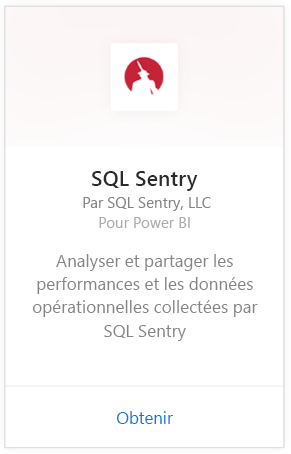
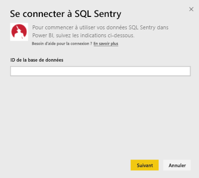
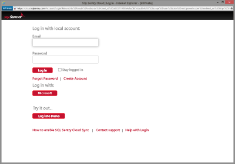
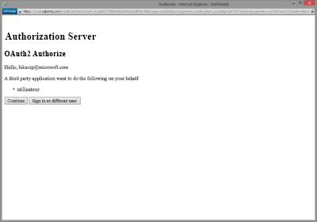
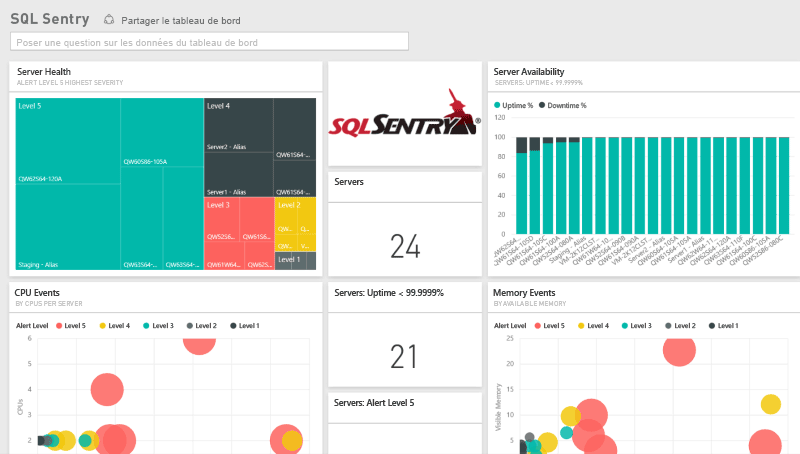
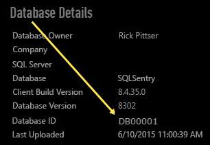

# Se connecter à SQL Sentry avec Power BI
L’analyse de vos données de performances collectées par SQL Sentry est facile avec Power BI. Power BI récupère vos données, puis génère un tableau de bord par défaut et des rapports associés à partir de ces données.

Connectez-vous au [pack de contenu SQL Sentry](https://app.powerbi.com/groups/me/getdata/services/sql-sentry) pour Power BI.

>[!NOTE]
>Pour vous connecter, vous devez disposer d’un compte SQL Sentry que vous utilisez pour la connexion à http://cloud.sqlsentry.com et d’un ID de base de données à surveiller.  Des instructions permettant de savoir où trouver l’ID de base de données figurent ci-dessous.

## Comment se connecter
1. Sélectionnez **Obtenir des données** en bas du volet de navigation gauche.
   
   
2. Dans la zone **Services** , sélectionnez **Obtenir**.
   
    
3. Sélectionnez **SQL Sentry  \> Obtenir**.
   
   
4. Indiquez l’ **ID de base de données** de la base de données que vous souhaitez surveiller dans Power BI. Vous trouverez ci-après des informations complémentaires pour savoir comment [le trouver](#FindingParams).
   
   
5. Pour la Méthode d’authentification, sélectionnez **oAuth2 \> Se connecter**.
   
   Quand vous y êtes invité, entrez vos informations d’identification cloud.sqlsentry.com et suivez le processus d’authentification SQL Sentry.
   
   
   
   Lors de votre première connexion, Power BI vous invite à autoriser l’accès en lecture seule à votre compte. Sélectionnez Octroyer pour commencer le processus d’importation.  Celui-ci peut prendre quelques minutes selon le volume de données présentes dans votre compte.
   
   
6. Une fois les données importées dans Power BI, vous verrez un nouveau tableau de bord, un nouveau rapport et un nouveau jeu de données dans le volet de navigation gauche. Les nouveaux éléments sont signalés par un astérisque jaune \* :
   
   
7. Sélectionnez le tableau de bord SQL Sentry.
   
   Il s’agit du tableau de bord par défaut créé par Power BI pour afficher vos données. Vous pouvez modifier ce tableau de bord pour afficher vos données comme vous le souhaitez.
   
   

**Et maintenant ?**

* Essayez de [poser une question dans la zone Q&R](service-q-and-a.md) en haut du tableau de bord.
* [Modifiez les vignettes](service-dashboard-edit-tile.md) dans le tableau de bord.
* [Sélectionnez une vignette](service-dashboard-tiles.md) pour ouvrir le rapport sous-jacent.
* Même si une actualisation quotidienne de votre jeu de données est planifiée, vous pouvez modifier la planification de l’actualisation ou essayer d’actualiser le jeu de données sur demande à l’aide de l’option **Actualiser maintenant**.

## Ce qui est inclus
Les données suivantes sont disponibles à partir de SQL Sentry dans Power BI :

| Nom du tableau | Description |
| --- | --- |
| Connexion |Ce tableau fournit des informations sur les connexions SQL Sentry définies. |
| Date  |Cette table contient des dates à partir d’aujourd’hui jusqu’à la date la plus ancienne auxquelles les données de performances ont été recueillies et conservées. |
| Temps d’arrêt  |Cette table contient des informations relatives aux temps d’arrêt et d’activité pour chaque serveur surveillé dans votre environnement. |
| Utilisation de la mémoire  |Cette table contient des données relatives à la quantité de mémoire disponible ou libre dans chacun de vos serveurs.  |
| Serveur  |Cette table contient des enregistrements pour chaque serveur dans votre environnement. |
| Intégrité du serveur  |Cette table contient des données pour tous les événements générés par des conditions personnalisées dans votre environnement, notamment la gravité et le nombre. |

## Recherche de paramètres
Vous pouvez trouver l’**ID de base de données** en vous connectant à <https://cloud.sqlsentry.com> dans une nouvelle fenêtre de navigateur web.  L’ **ID de base de données** est répertorié dans la page de présentation principale :

    

L’ **ID de base de données** s’affiche également dans l’écran Détails de la base de données :

    

## Résolution des problèmes
Si les données de certaines de vos applications ne s’affichent pas dans Power BI, assurez-vous que vous utilisez l’ID de base de données correct et que vous êtes en mesure d’afficher les données. 

Si vous n’êtes pas le propriétaire de la base de données SQL Sentry synchronisée avec <https://cloud.sqlsentry.com>, contactez votre administrateur pour vérifier que vous disposez des droits nécessaires pour consulter les données collectées.

## Étapes suivantes
[Prise en main de Power BI](service-get-started.md)

[Obtenir des données pour Power BI](service-get-data.md)

