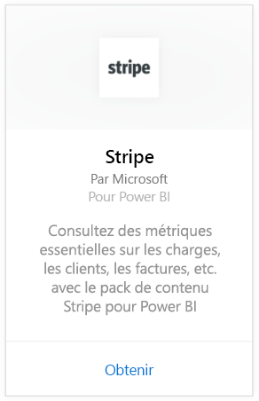
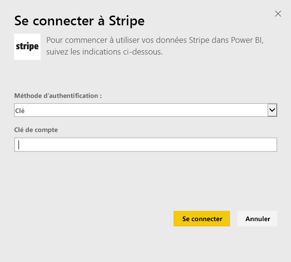
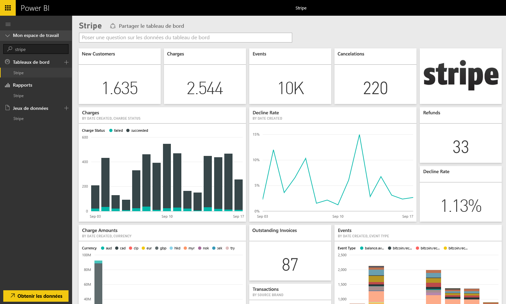

# Se connecter à Stripe avec Power BI
Visualisez et explorez vos données Stripe dans Power BI avec le pack de contenu Power BI. Le pack de contenu Power BI Stripe extrait des données sur vos clients, frais, événements et factures. Les données incluent les dix mille événements et les cinq mille frais les plus récents au cours des 30 derniers jours. Le contenu est actualisé automatiquement une fois par jour selon un planning que vous contrôlez. 

Connectez-vous au [pack de contenu Stripe pour Power BI](https://app.powerbi.com/getdata/services/stripe).

## Comment se connecter
1. Sélectionnez Obtenir des données en bas du volet de navigation gauche.  
   
    
2. Dans la zone **Services** , sélectionnez **Obtenir**.  
   
      
3. Sélectionnez **Stripe** &gt; **Obtenir**.  
   
      
4. Fournissez votre [clé d’API](https://dashboard.stripe.com/account/apikeys) Stripe pour vous connecter.  
   
    
5. Le processus d’importation démarre automatiquement. Une fois terminé, un nouveau tableau de bord, rapport et modèle apparaîtront dans le volet de navigation, marqués d’une astérisque. Sélectionnez le tableau de bord pour afficher vos données importées.
   
    

**Et maintenant ?**

* Essayez de [poser une question dans la zone Q&R](power-bi-q-and-a.md) en haut du tableau de bord.
* [Modifiez les vignettes](service-dashboard-edit-tile.md) dans le tableau de bord.
* [Sélectionnez une vignette](service-dashboard-tiles.md) pour ouvrir le rapport sous-jacent.
* Même si une actualisation quotidienne de votre jeu de données est planifiée, vous pouvez modifier la planification de l’actualisation ou essayer d’actualiser le jeu de données sur demande à l’aide de l’option **Actualiser maintenant**.

## Étapes suivantes
[Qu’est-ce que Power BI ?](power-bi-overview.md)

[Obtenir des données pour Power BI](service-get-data.md)

