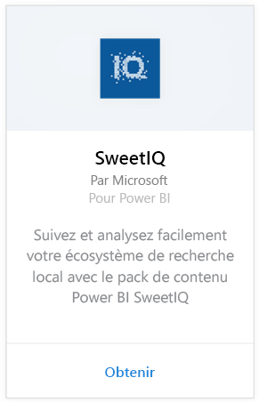
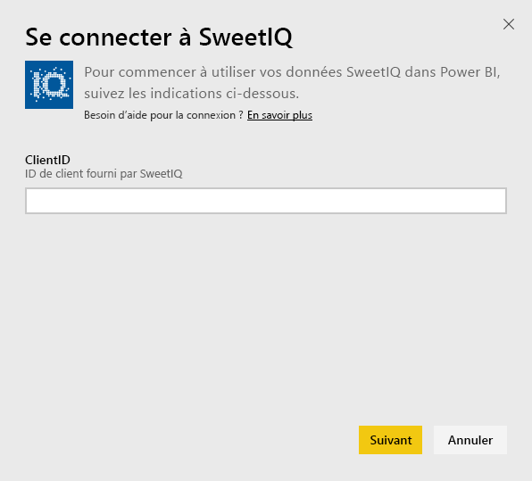
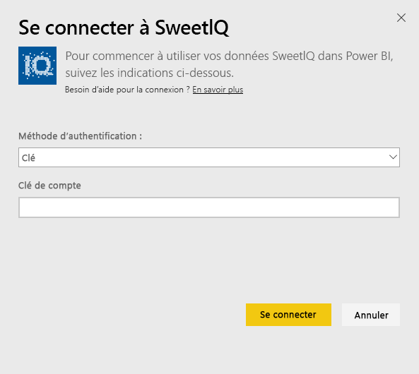
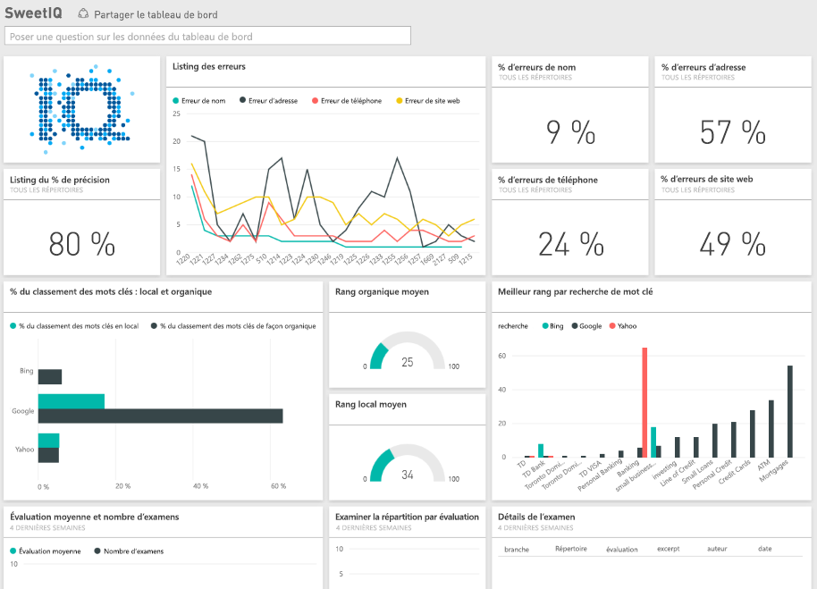

# Se connecter à SweetIQ avec Power BI
Le pack de contenu Power BI extrait des données de votre compte SweetIQ et génère l’ensemble de contenu prêt à l’emploi, ce qui vous permet d’explorer facilement vos données. Le pack de contenu SweetIQ permet d’analyser les données sur vos emplacements, listes, indices et avis. Les données sont actualisées tous les jours. Ainsi, vous êtes sûr que les données que vous utilisez sont à jour.

Connectez-vous au [pack de contenu SweetIQ](https://app.powerbi.com/groups/me/getdata/services/sweetiq) pour Power BI.

## Comment se connecter
1. Dans le volet de navigation de gauche, cliquez sur **Obtenir des données**.
   
    
2. Sélectionnez **SweetIQ**, puis cliquez sur **Obtenir.**
   
    
3. Indiquez votre ID client SweetIQ. Il s’agit généralement d’une valeur alphanumérique. Pour plus de détails sur la recherche de cette valeur, voir ci-dessous.
   
    
4. Sélectionnez le type d’authentification **Clé** et indiquez votre clé API SweetIQ. Il s’agit généralement d’une valeur alphanumérique. Pour plus de détails sur la recherche de cette valeur, voir ci-dessous.
   
    
5. Power BI commence à charger vos données, ce qui peut prendre un certain temps selon la taille des données dans votre compte. Une fois le chargement terminé, vous verrez un nouveau tableau de bord, un nouveau rapport et un nouveau jeu de données dans le volet de navigation gauche.
   
    

**Et maintenant ?**

* Essayez de [poser une question dans la zone Q&R](power-bi-q-and-a.md) en haut du tableau de bord.
* [Modifiez les vignettes](service-dashboard-edit-tile.md) dans le tableau de bord.
* [Sélectionnez une vignette](service-dashboard-tiles.md) pour ouvrir le rapport sous-jacent.
* Même si une actualisation quotidienne de votre jeu de données est planifiée, vous pouvez modifier la planification de l’actualisation ou essayer d’actualiser le jeu de données sur demande à l’aide de l’option **Actualiser maintenant**.

## Recherche de paramètres
L’ID client et la clé API pour ce pack de contenu sont différents des nom d’utilisateur et mot de passe SweetIQ.

Sélectionnez un ID client pour l’un des clients auxquels votre compte a accès. Vous pouvez trouver la liste des clients sous « Gestion des clients » dans votre compte SweetIQ.

Contactez l’administrateur pour votre clé API, afin d’accéder aux données d’un client spécifique.

## Étapes suivantes
[Prise en main de Power BI](service-get-started.md)

[Obtenir des données pour Power BI](service-get-data.md)

