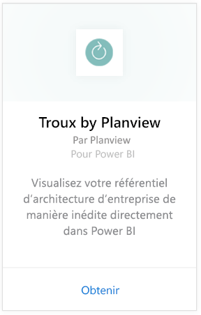
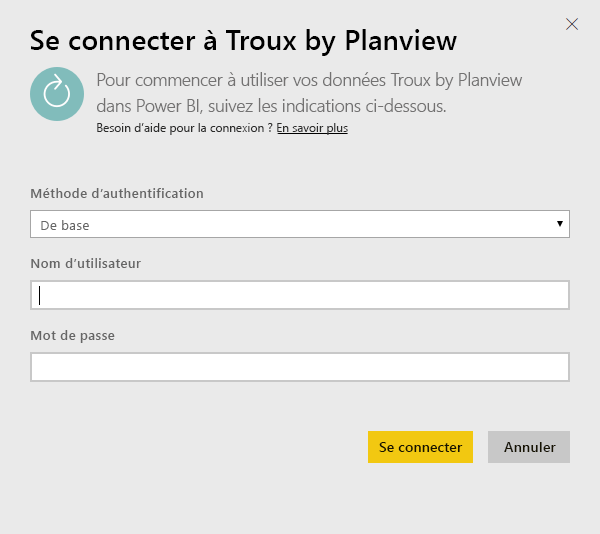
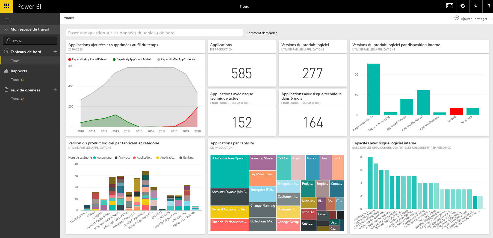

# Se connecter à Troux pour Power BI
Avec le pack de contenu Troux, vous pouvez visualiser votre référentiel d’architecture d’entreprise de manière inédite directement dans Power BI. Le pack de contenu offre un ensemble d’informations sur vos fonctionnalités d’entreprise, les applications qui offrent ces fonctionnalités et les technologies qui prennent en charge ces applications que vous pouvez entièrement personnaliser à l’aide de Power BI.

Connectez-vous au [pack de contenu Troux](https://app.powerbi.com/getdata/services/troux) pour Power BI.

## Comment se connecter
1. Sélectionnez **Obtenir des données** en bas du volet de navigation gauche.
   
   
2. Dans la zone **Services** , sélectionnez **Obtenir**.
   
   
3. Sélectionnez **Troux** \>  **Obtenir**.
   
   
4. Spécifiez votre URL OData Troux. Voir les détails sur la [recherche de ces paramètres](#FindingParams) ci-dessous.
   
   
5. Pour **Méthode d’authentification**, sélectionnez **Basic** et indiquez vos nom d’utilisateur et mot de passe (en respectant la casse), puis sélectionnez **Se connecter**.
   
    
6. Après l’approbation, le processus d’importation démarre automatiquement. Une fois terminé, de nouveaux tableau de bord, rapport et modèle apparaîtront dans le volet de navigation. Sélectionnez le tableau de bord pour afficher vos données importées.
   
     

**Et maintenant ?**

* Essayez de [poser une question dans la zone Q&R](power-bi-q-and-a.md) en haut du tableau de bord.
* [Modifiez les vignettes](service-dashboard-edit-tile.md) dans le tableau de bord.
* [Sélectionnez une vignette](service-dashboard-tiles.md) pour ouvrir le rapport sous-jacent.
* Même si une actualisation quotidienne de votre jeu de données est planifiée, vous pouvez modifier la planification de l’actualisation ou essayer d’actualiser le jeu de données sur demande à l’aide de l’option **Actualiser maintenant**.

## Configuration requise
L’accès au flux OData Troux et à Troux 9.5.1 ou version ultérieure est obligatoire.

## Recherche de paramètres
Votre équipe du service clientèle peut vous fournir l’URL de votre flux OData Troux unique.

## Résolution des problèmes
Si une erreur liée à l’expiration du délai d’attente après la saisie de vos informations d’identification se produit, réessayez de vous connecter.

## Étapes suivantes
[Prise en main de Power BI](service-get-started.md)

[Obtenir des données dans Power BI](service-get-data.md)

