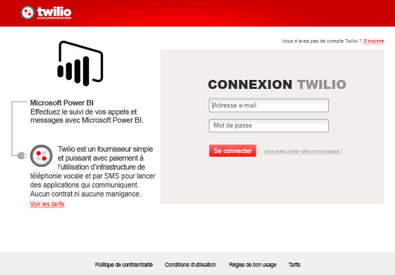
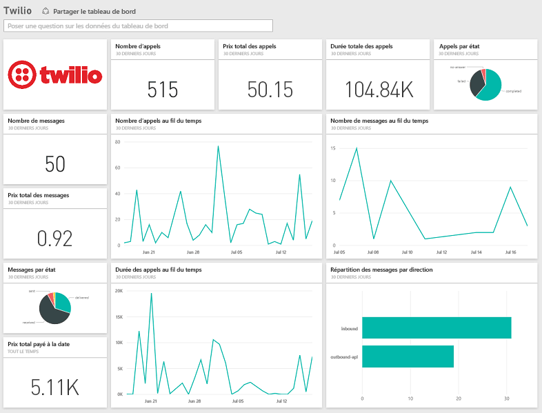

# Se connecter à Twilio avec Power BI
Avec le pack de contenu Microsoft Twilio pour Power BI, vous pouvez récupérer vos données dans Power BI et créer un [tableau de bord Twilio](https://powerbi.microsoft.com/integrations/twilio) prêt à l’emploi et un rapport qui révèle des informations sur vos données. Vous pouvez également créer vos rapports et tableau de bord personnalisés à partir du jeu de données créé par Power BI. Les données sont actualisées quotidiennement. Ainsi, vous êtes sûr de toujours avoir les données les plus récentes.

Connectez-vous au [pack de contenu Twilio](https://app.powerbi.com/getdata/services/twilio) pour Power BI.

## Comment se connecter
1. Sélectionnez **Obtenir des données** en bas du volet de navigation gauche.
   
    
2. Dans la zone **Services** , sélectionnez **Obtenir**.
   
    
3. Sélectionnez **Twilio** \> **Obtenir**.
   
   
4. Pour la **Méthode d’authentification**, sélectionnez **oAuth2** \> Se connecter. Quand vous y êtes invité, fournissez vos informations d’identification Twilio et autorisez l’application Power BI à accéder à vos données.
   
   
5. Cette opération lance l’importation des données à partir de votre compte Twilio. Votre tableau de bord reçoit alors vos appels et vos messages des 30 derniers jours. 
   
   

**Et maintenant ?**

* Essayez de [poser une question dans la zone Q&R](power-bi-q-and-a.md) en haut du tableau de bord.
* [Modifiez les vignettes](service-dashboard-edit-tile.md) dans le tableau de bord.
* [Sélectionnez une vignette](service-dashboard-tiles.md) pour ouvrir le rapport sous-jacent.
* Même si une actualisation quotidienne de votre jeu de données est planifiée, vous pouvez modifier la planification de l’actualisation ou essayer d’actualiser le jeu de données sur demande à l’aide de l’option **Actualiser maintenant**.

## Ce qui est inclus
Les détails concernant l’ensemble des appels et des messages des 30 derniers jours. Vous pouvez effectuer toutes sortes d’analyses et d’agrégations avec ces données.

Ensemble de statistiques déjà agrégées sur lesquelles vous voulez peut-être garder un œil. Cet ensemble inclut :

        All Time Calls Count  
        All Time Calls Duration  
        All Time Calls Price  
        All Time Messages Price  
        All Time Messages Count  
        All Time Count of Phone Numbers  
        All Time Price of Phone Numbers  
        All Time Twilio Client Calls Price  
        All Time Twilio Client Calls Duration  
        All Time Twilio Client Calls Count  
        All Time Total Price  
        All Time Inbound Calls Price  
        All Time Inbound Calls Duration  
        All Time Inbound Calls Count  
        All Time Outbound Calls Price  
        All Time Outbound Calls Duration  
        All Time Outbound Calls Count  
        This Month Calls Price  
        This Month Calls Duration  
        This Month Calls Count  
        This Month Messages Count  
        This Month Messages Price  
        This Month Count of Phone Numbers  
        This Month Price of Phone Numbers  
        This Month Twilio Client Calls Price  
        This Month Twilio Client Calls Duration  
        This Month Twilio Client Calls Count  
        This Month Total Price  
        This Month Inbound Calls Price  
        This Month Inbound Calls Duration  
        This Month Inbound Calls Count  
        This Month Outbound Calls Price  
        This Month Outbound Calls Duration  
        This Month Outbound Calls Count  
        This Month Inbound Messages Price  
        This Month Inbound Messages Count  
        This Month Outbound Messages Price  
        This Month Outbound Messages Count

## Résolution des problèmes
Si vous avez accumulé une très grande quantité de données au cours des 30 derniers jours (des centaines de milliers de transactions), l’étape de récupération des données risque d’échouer. Nous sommes conscients de ce problème et nous travaillons actuellement à sa résolution. En attendant, si vous rencontrez ce problème, utilisez le lien de support en haut de la page Power BI pour nous en informer. Nous vous recontacterons pour une étude approfondie.

## Étapes suivantes
[Prise en main de Power BI](service-get-started.md)

[Obtenir des données dans Power BI](service-get-data.md)

