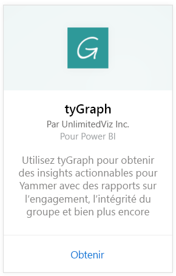
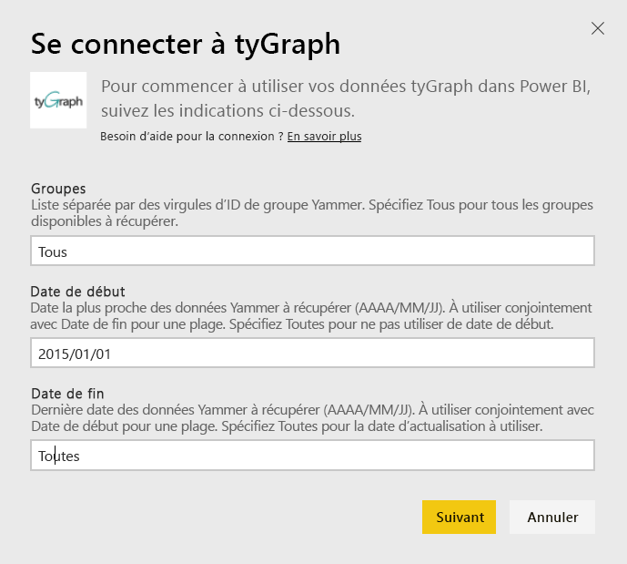
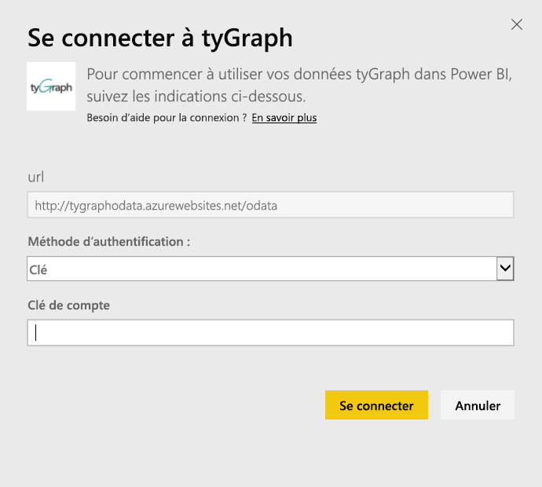
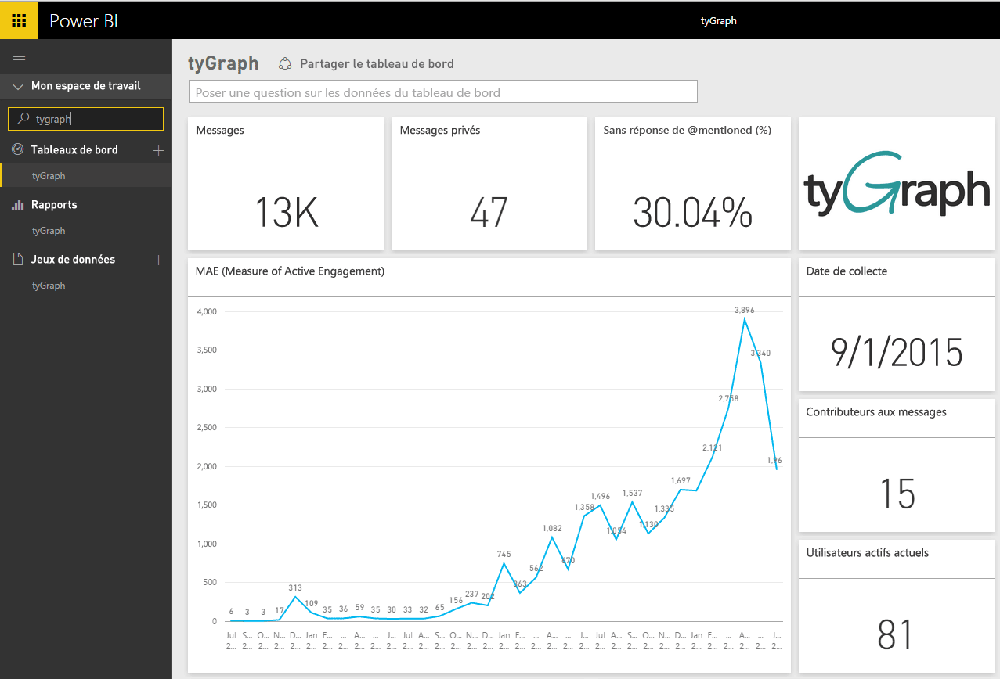
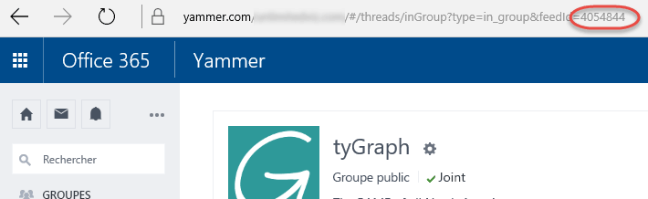

# Se connecter à tyGraph avec Power BI
Visualisez et explorez vos données tyGraph dans Power BI avec le pack de contenu Power BI. Commencez par vous connecter à votre compte tyGraph et à charger le tableau de bord, les rapports et le jeu de données. Le contenu prêt à l’emploi inclut des données, telles que le score MAE (Measure of Active Engagement) et les principaux contributeurs. Personnalisez-le davantage pour mettre en évidence les informations qui vous intéressent le plus.  Les données sont actualisées automatiquement selon une planification que vous définissez.

Connectez-vous à [tyGraph pour Power BI](https://app.powerbi.com/getdata/services/tygraph).

## Comment se connecter
1. Sélectionnez **Obtenir des données** en bas du volet de navigation gauche.
   
   
2. Dans la zone **Services** , sélectionnez **Obtenir**.
   
   
3. Sélectionnez **tyGraph** \> **Obtenir**.
   
   
4. Spécifiez les groupes et la plage de temps auxquels vous souhaitez vous connecter ; sinon, spécifiez « Tout » pour importer toutes les données. Notez le format de date qui est attendu (AAAA/MM/JJ). Vous trouverez ci-après des informations pour savoir comment [trouver les paramètres](#FindingParams).
   
   
5. Indiquez votre clé tyGraph pour vous connecter. Voir les détails sur la recherche de cette valeur ci-dessous.
   
    **Si vous avez le statut d’administrateur vérifié Yammer**  
    Votre clé API vous est envoyée dans un e-mail dès que votre compte tyGraph est créé. Si vous ne trouvez plus votre clé, vous pouvez en demander une nouvelle en envoyant un message électronique à l’adresse support@unlimitedviz.com. Si vous ne disposez pas encore d’un compte tyGraph, vous pouvez commencer une version d’essai sur [http://www.tygraph.com/](http://www.tygraph.com/). 
   
    **Si vous n’avez pas le statut d’administrateur vérifié Yammer**
   
    Le pack de contenu tyGraph nécessite un compte tyGraph créé par un utilisateur ayant le statut d’administrateur vérifié Yammer. Une fois le compte créé, des clés supplémentaires peuvent être émises à l’intention d’utilisateurs au sein de la même organisation. Si l’utilisateur ayant le statut d’administrateur vérifié n’a pas encore créé de compte tyGraph, contactez-le pour lui demander de le faire. Si le compte est créé, vous pouvez demander une clé en envoyant un message électronique à l’adresse <support@unlimitedviz.com>.
   
    
6. Après une authentification réussie, le processus d’importation démarre automatiquement. Une fois terminé, de nouveaux tableau de bord, rapport et modèle apparaîtront dans le volet de navigation. Sélectionnez le tableau de bord pour afficher vos données importées.
   
    

**Et maintenant ?**

* Essayez de [poser une question dans la zone Q&R](consumer/end-user-q-and-a.md) en haut du tableau de bord.
* [Modifiez les vignettes](service-dashboard-edit-tile.md) dans le tableau de bord.
* [Sélectionnez une vignette](consumer/end-user-tiles.md) pour ouvrir le rapport sous-jacent.
* Même si une actualisation quotidienne de votre jeu de données est planifiée, vous pouvez modifier la planification de l’actualisation ou essayer d’actualiser le jeu de données sur demande à l’aide de l’option **Actualiser maintenant**.

## Recherche de paramètres
Vous pouvez importer des données sur tous les groupes auxquels vous avez accès ou vous pouvez choisir de spécifier un sous-ensemble. Vous pouvez également créer un sous-ensemble de données par date. Vous pouvez créer plusieurs tableaux de bord tyGraph pour surveiller des ensembles de groupes et/ou de dates spécifiques. Des détails sur ces paramètres figurent ci-dessous.

**Groupes**

L’API tyGraph peut filtrer les données par ID de groupe spécifique. Ceux-ci sont fournis au pack de contenu dans une liste où ils sont séparés par des virgules. 

    Example: 2427647,946595,1154464

Vous pouvez identifier l’ID de groupe pour un groupe particulier dans Yammer en accédant au flux pour le groupe et en examinant l’URL.

Dans l’exemple ci-dessus, l’ID de groupe Yammer est 4054844

**Date de début**

La date de début vous permet de restreindre la valeur la plus ancienne pour les données retournées. Seules les données créées à cette date ou après celle-ci sont chargées dans le pack de contenu. Le format de la date de début est AAAA/MM/JJ. 

    Example: 2013/10/29

Dans l’exemple ci-dessus, toutes les données créées le 29 octobre 2013 ou après cette date sont chargées dans le pack de contenu. 

**Date de fin** La date de fin vous permet de restreindre la valeur la plus récente pour les données retournées. Elle peut être utilisée avec la date de début pour charger des données à partir d’une plage de dates. Seules les données créées à cette date ou avant celle-ci sont chargées dans le pack de contenu. Le format de la date de fin est AAAA/MM/JJ. 

    Example: 2014/10/20

Dans l’exemple ci-dessus, toutes les données créées le 20 octobre 2014 ou avant cette date sont chargées dans le pack de contenu. 

## Étapes suivantes
[Prise en main de Power BI](service-get-started.md)

[Obtenir des données dans Power BI](service-get-data.md)

