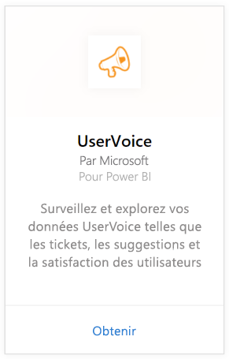
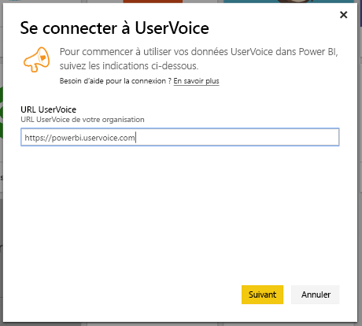
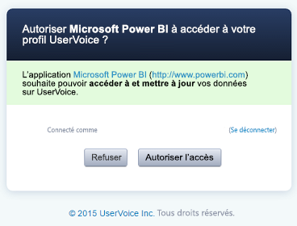
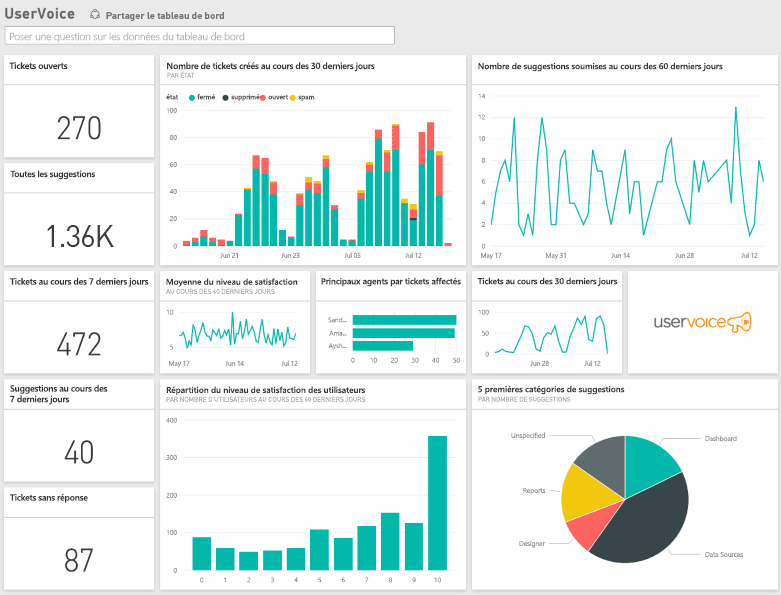

# Se connecter à UserVoice avec Power BI
Le suivi et l’exploration de vos données UserVoice sont faciles avec Power BI et le pack de contenu UserVoice. Power BI récupère vos données, y compris les tickets, les suggestions et les indices de satisfaction, puis génère un tableau de bord prêt à l’emploi et des rapports basés sur ces données.

Connectez-vous au [pack de contenu UserVoice](https://app.powerbi.com/getdata/services/uservoice) pour Power BI.

>[!NOTE]
>Vous devez disposer d’un compte d’administrateur pour vous connecter au pack de contenu Power BI. Le pack de contenu exploite aussi l’API UserVoice et entre en compte dans le calcul des limites d’utilisation de UserVoice. Vous trouverez plus de détails ci-dessous.

## Comment se connecter
1. Sélectionnez **Obtenir des données** en bas du volet de navigation gauche.
   
   
2. Dans la zone **Services** , sélectionnez **Obtenir**.
   
    
3. Sélectionnez **UserVoice**, puis **Obtenir**.
   
   
4. Quand vous y êtes invité, entrez votre URL UserVoice. L’URL doit être exactement conforme au modèle suivant `https://fabrikam.uservoice.com` en remplaçant « fabrikam » par le nom de votre produit ou service.
   
   >[!NOTE]
   >Il n’existe aucune barre oblique finale et la connexion utilise http**s**.
   
   
5. Quand vous y êtes invité, entrez vos informations d’identification UserVoice et suivez le processus d’authentification UserVoice. Si vous êtes déjà connecté à UserVoice dans votre navigateur, vous ne serez peut-être pas invité à entrer vos informations d’identification. Accordez l’accès à vos données à l’application Power BI en cliquant sur « Autoriser l’accès ».
   
   >[!NOTE]
   >Le compte UserVoice nécessite des informations d’identification d’administrateur.
   
   
6. Power BI récupère vos données UserVoice et crée un tableau de bord prêt à l’emploi et un rapport pour vous. Power BI récupère les données suivantes : toutes vos suggestions, tous vos tickets ouverts, tous les tickets créés dans les 30 derniers jours, y compris ceux qui sont fermés, et tous les indices de satisfaction des utilisateurs.
   
   

**Et maintenant ?**

* Essayez de [poser une question dans la zone Q&R](power-bi-q-and-a.md) en haut du tableau de bord.
* [Modifiez les vignettes](service-dashboard-edit-tile.md) dans le tableau de bord.
* [Sélectionnez une vignette](service-dashboard-tiles.md) pour ouvrir le rapport sous-jacent.
* Même si une actualisation quotidienne de votre jeu de données est planifiée, vous pouvez modifier la planification de l’actualisation ou essayer d’actualiser le jeu de données sur demande à l’aide de l’option **Actualiser maintenant**.

## Résolution des problèmes
**« Échec de la validation des paramètres. Vérifiez que tous les paramètres sont valides »**

Si vous voyez cette erreur après avoir tapé votre URL UserVoice Assurez-vous que les conditions suivantes sont remplies :

* L’URL est exactement conforme au modèle `https://fabrikam.uservoice.com` en remplaçant « fabrikam » par le préfixe correct de votre URL UserVoice.
* Assurez-vous que toutes les lettres sont en minuscules.
* Vérifiez que l’URL utilise « http**s** ».
* Assurez-vous qu’il n’existe aucune barre oblique finale à la fin de l’URL.

**« Échec de la connexion »**

Si vous obtenez une erreur « Échec de l’ouverture de session » après avoir utilisé vos informations d’identification UserVoice pour vous connecter, le compte que vous utilisez ne dispose pas des autorisations requises pour récupérer les données UserVoice à partir de votre compte. Vérifiez qu’il s’agit d’un compte d’administrateur et réessayez.

«**Désolé. Une erreur s’est produite.**»

Si vous obtenez ce message d’erreur lors du chargement des données, assurez-vous que votre compte UserVoice n’a pas dépassé son quota d’utilisation des API mensuel. Si tout semble correct, essayez de vous reconnecter. Si le problème persiste, contactez le support Power BI sur [https://community.powerbi.com](https://community.powerbi.com/).

**Autre**  

Le pack de contenu UserVoice pour Power BI utilise des API UserVoice pour récupérer vos données. Assurez-vous de surveiller l’utilisation des API afin de ne pas dépasser la limite. Si vous avez une grande quantité de données dans votre compte UserVoice, une suggestion pour minimiser l’impact sur votre utilisation des API consiste à modifier la fréquence d’actualisation par défaut actuelle, qui est d’une fois par jour, pour qu’elle ne se produise que les jours de semaine ou un jour sur deux en fonction de vos besoins. Une autre suggestion consiste à demander à un administrateur de créer le pack de contenu et de le partager avec le reste de l’équipe au lieu de demander à chaque administrateur de votre organisation de créer le leur, ce qui place une charge inutile supplémentaire sur les API.

## Étapes suivantes
[Prise en main de Power BI](service-get-started.md)

[Obtenir des données dans Power BI](service-get-data.md)

