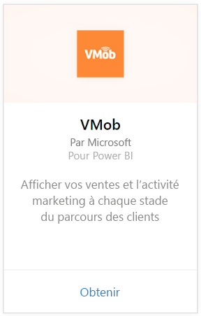
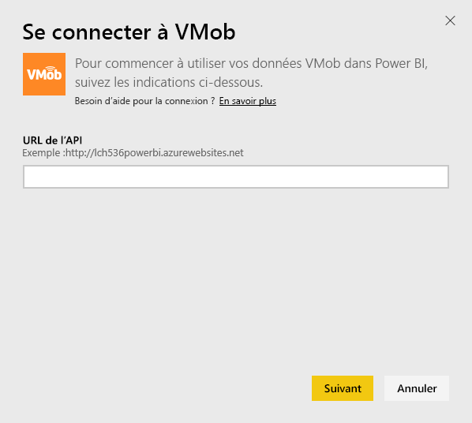
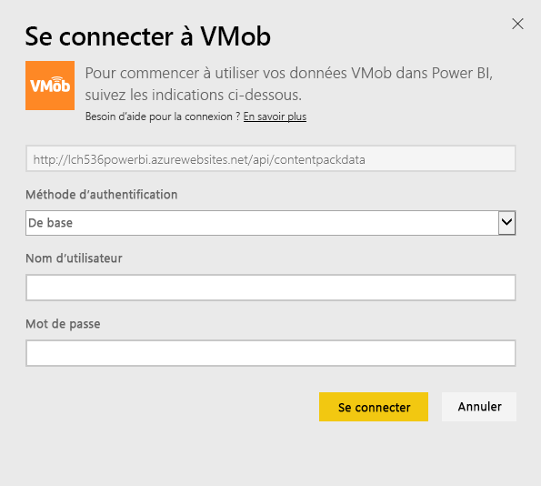

# Se connecter à VMob avec Power BI
Le suivi et l’exploration de vos données VMob sont faciles avec Power BI et le pack de contenu VMob. Power BI récupère les données suivantes : statistiques utilisateur pour toutes les périodes au cours des 30 derniers jours, indicateurs de performance clés de vente au détail pour les 30 derniers jours et performances de campagne pour les 30 derniers jours.

Connectez-vous au [pack de contenu VMob](https://app.powerbi.com/getdata/services/vmob) pour Power BI.

## Comment se connecter
1. Sélectionnez **Obtenir des données** en bas du volet de navigation gauche.
   
    
2. Dans la zone **Services** , sélectionnez **Obtenir**.
   
   
3. Sélectionnez **VMob** \> **Obtenir**.
   
   
4. Quand vous y êtes invité, entrez votre URL VMob et cliquez sur le bouton Suivant. Cette URL est fournie par VMob séparément.
   
    
5. Choisissez l’option **De base** dans la liste déroulante de la méthode d’authentification, entrez votre nom d’utilisateur VMob et votre mot de passe et cliquez sur le bouton **Se connecter** .
   
    
6. Le processus d’importation commence automatiquement et Power BI récupère vos données VMob pour créer un tableau de bord prêt à l’emploi et un rapport pour vous.
   
   

**Et maintenant ?**

* Essayez de [poser une question dans la zone Q&R](service-q-and-a.md) en haut du tableau de bord.
* [Modifiez les vignettes](service-dashboard-edit-tile.md) dans le tableau de bord.
* [Sélectionnez une vignette](service-dashboard-tiles.md) pour ouvrir le rapport sous-jacent.
* Même si une actualisation quotidienne de votre jeu de données est planifiée, vous pouvez modifier la planification de l’actualisation ou essayer d’actualiser le jeu de données sur demande à l’aide de l’option **Actualiser maintenant**.

## Étapes suivantes
[Prise en main de Power BI](service-get-started.md)

[Obtenir des données dans Power BI](service-get-data.md)

