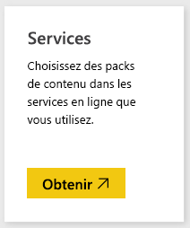
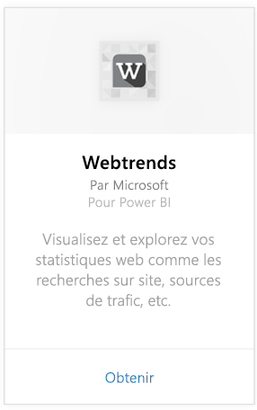
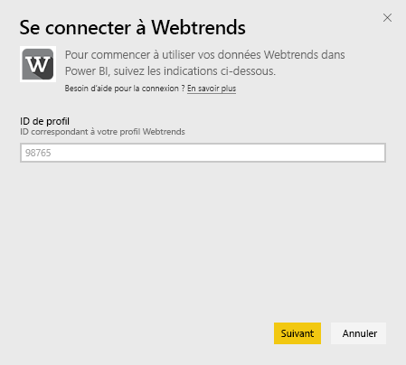
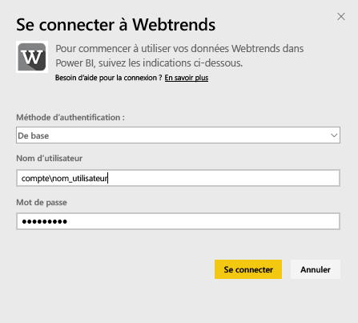
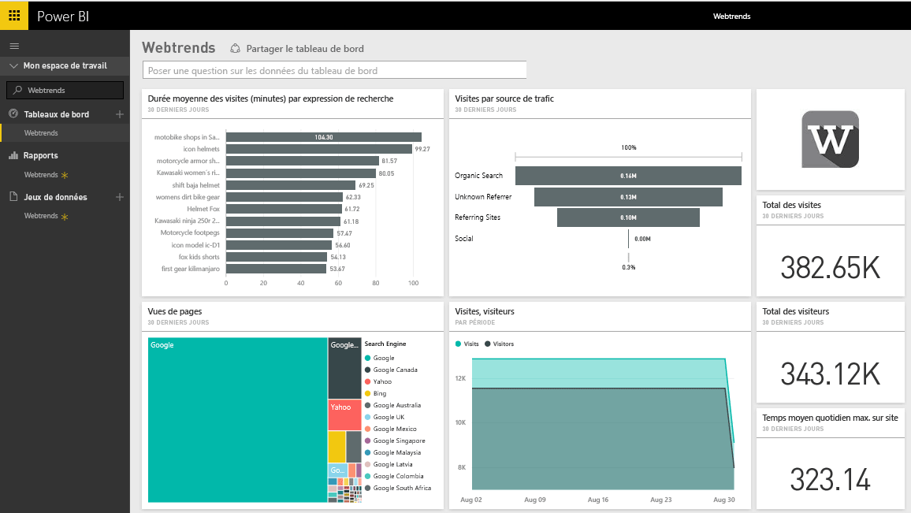
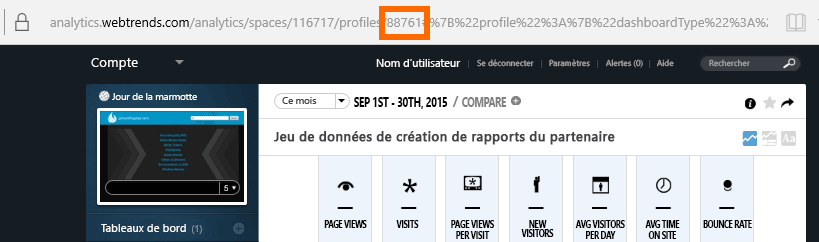
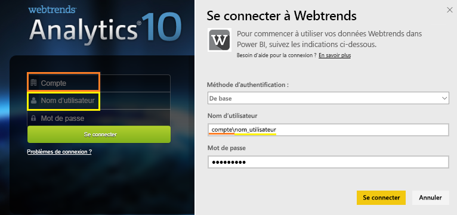

# Se connecter à Webtrends avec Power BI
Le pack de contenu Webtrends pour Power BI inclut diverses métriques prêtes à l’emploi telles que le nombre total des visites et des vues de page par source de trafic. La visualisation de vos données Webtrends dans Power BI démarre par la connexion à votre compte Webtrends. Vous pouvez utiliser le tableau de bord et les rapports fournis ou les personnaliser pour mettre en avant les informations qui vous intéressent le plus.  Les données sont actualisées automatiquement une fois par jour.

Connectez-vous au [pack de contenu Webtrends pour Power BI](https://app.powerbi.com/getdata/services/webtrends).

## Comment se connecter
1. Sélectionnez **Obtenir des données** en bas du volet de navigation gauche.
   
   
2. Dans la zone **Services** , sélectionnez **Obtenir**.
   
   
3. Sélectionnez **Webtrends** \> **Obtenir**.
   
   
4. Le pack de contenu se connecte à un ID de profil Webtrends spécifique. Voir les détails sur la [recherche du paramètre](#FindingParams) ci-dessous.
   
   
5. Indiquez vos informations d’identification Webtrends pour vous connecter. Notez que vous devez spécifier vos compte et nom d’utilisateur dans le champ du nom d’utilisateur. Passez en revue les [détails](#FindingParams) ci-dessous.
   
   
6. Après l’approbation, le processus d’importation démarre automatiquement. Une fois terminé, de nouveaux tableau de bord, rapport et modèle apparaîtront dans le volet de navigation. Sélectionnez le tableau de bord pour afficher vos données importées.
   
   

**Et maintenant ?**

* Essayez de [poser une question dans la zone Q&R](consumer/end-user-q-and-a.md) en haut du tableau de bord.
* [Modifiez les vignettes](service-dashboard-edit-tile.md) dans le tableau de bord.
* [Sélectionnez une vignette](consumer/end-user-tiles.md) pour ouvrir le rapport sous-jacent.
* Même si une actualisation quotidienne de votre jeu de données est planifiée, vous pouvez modifier la planification de l’actualisation ou essayer d’actualiser le jeu de données sur demande à l’aide de l’option **Actualiser maintenant**.

## Ce qui est inclus

Le pack de contenu Webtrends extrait les données des rapports suivants :  

| Nom du rapport | ID du rapport |
| --- | --- |
| Mesures clés | |
| Recherches sur site |34awBVEP0P6 |
| Pages de sortie |7FshY8eP0P6 |
| Pages suivantes |CTd5rpeP0P6 |
| Pages précédentes |aSdOeaUgnP6 |
| Pages de site |oOEWQj3sUo6 |
| Clics sur publicités sur site |41df19b6d9f |
| Villes |aUuHskcP0P6 |
| Pays |JHWXJNcP0P6 |
| Visiteurs |xPcmTDDP0P6 |
| Durée de la visite |U5KAyqdP0P6 |
| Expressions de recherche |IKYEDxIP0P6 |
| Sources de trafic |JmttAoIP0P6 |
| Moteurs de recherche |yGz3gAGP0P6 |
| Pages d’accès |i6LrkNVRUo6 |

>[!NOTE]
>Pour les profils de SharePoint, les noms des mesures peuvent être légèrement différents de ceux figurant dans l’IU Webtrends. Le mappage suivant est effectué pour assurer la cohérence entre les profils SharePoint et Web :   

    - Sessions = visites  
    - Nouveaux utilisateurs = nouveaux visiteurs  
    - Vues par session = affichages de pages par visite  
    - Durée moyenne utilisateur par jour = durée moyenne sur site par visiteur  

## Configuration requise
Le pack de contenu requiert l’accès à un profil Webtrends avec l’[ensemble de rapports correct](#Included) activé.

## Recherche de paramètres
Votre ID de profil Webtrends est accessible dans l’URL après avoir sélectionné un profil :

Vos informations d’identification sont identiques à celles que vous entrez quand vous vous connectez à Webtrends ; toutefois, vos compte et nom d’utilisateur doivent figurer sur la même ligne, séparés par une barre oblique inverse :

## Résolution des problèmes
Il se peut que vous rencontriez un problème pendant le chargement du pack de contenu, après avoir fourni vos informations d’identification. Si le message « Oops » s’affiche durant le chargement, veuillez consulter les suggestions de dépannage ci-dessous. Si vous continuez à rencontrer des problèmes, veuillez créer un ticket de support via la page https://support.powerbi.com

1. L’ID de profil correct est utilisé (voir la section [Recherche des paramètres](#FindingParams) pour plus de détails).
2. L’utilisateur a accès aux rapports figurant à la section [« Ce qui est inclus »](#Included).

## Étapes suivantes
[Qu’est-ce que Power BI ?](power-bi-overview.md)

[Power BI – Concepts de base](consumer/end-user-basic-concepts.md)

