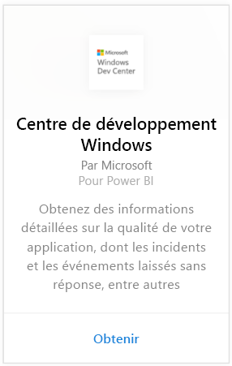
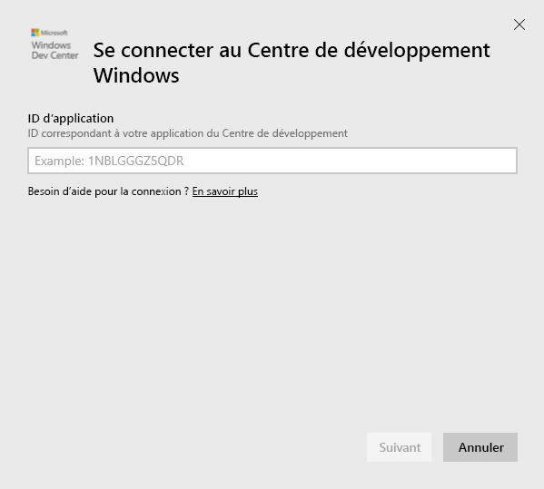
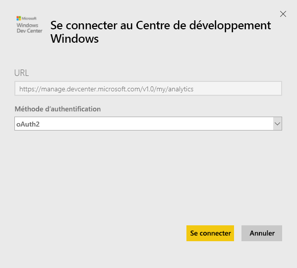
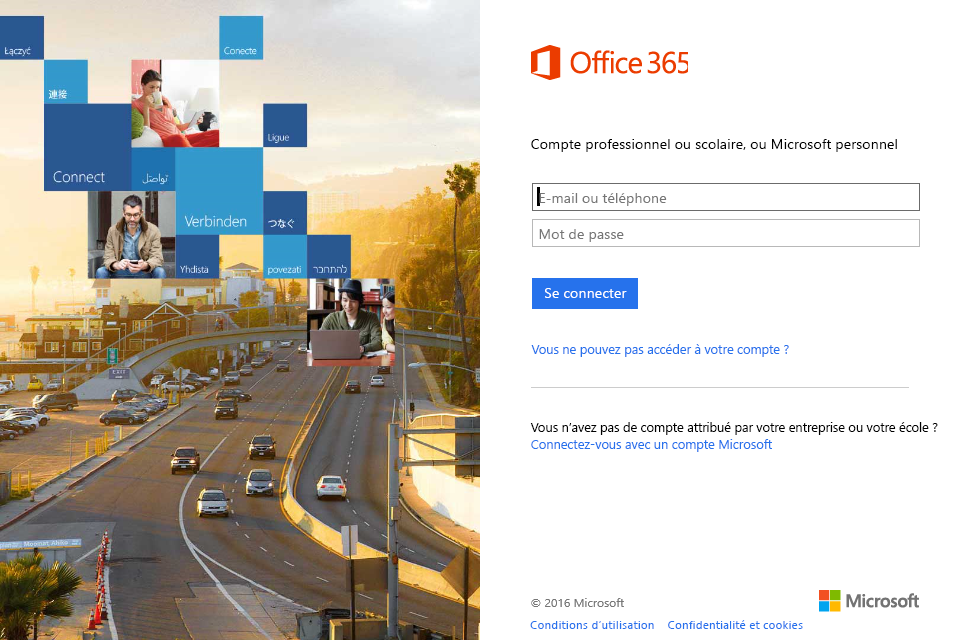
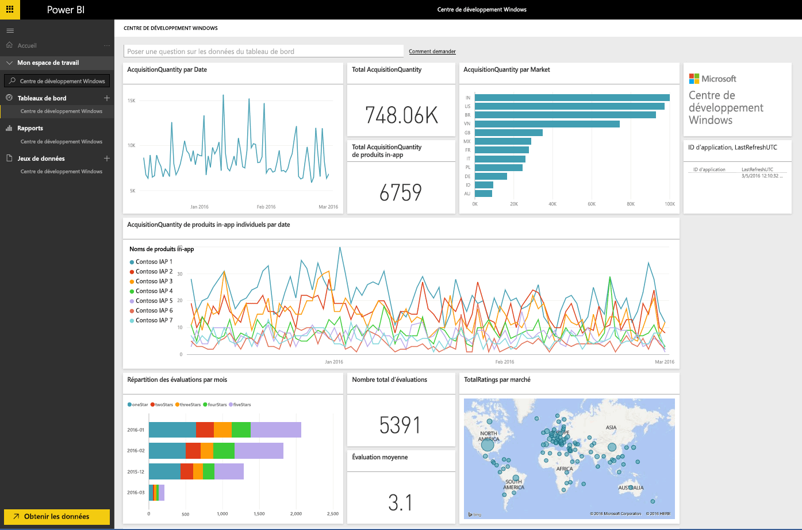
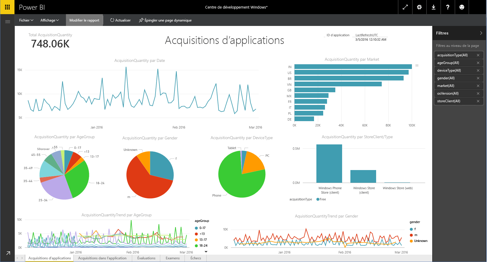

# Se connecter au Centre de développement Windows avec Power BI
Explorez et étudiez les données d’analyse d’application du Centre de développement Windows dans Power BI avec le pack de contenu Power BI. Les données sont actualisées automatiquement une fois par jour.

Connectez-vous au [pack de contenu du Centre de développement Windows](https://app.powerbi.com/getdata/services/devcenter) pour Power BI.

## Comment se connecter
1. Sélectionnez **Obtenir des données** en bas du volet de navigation gauche.
   
   
2. Dans la zone **Services** , sélectionnez **Obtenir**.
   
   
3. Sélectionnez **Centre de développement Windows** \>  **Obtenir**.
   
   
4. Entrez l’ID d’application d’une application que vous possédez et cliquez sur Suivant. Voir les détails sur la [recherche de ces paramètres](#FindingParams) ci-dessous.
   
   
5. Pour la **Méthode d’authentification**, sélectionnez **oAuth2** \> **Se connecter**. Quand vous y êtes invité, entrez les informations d’identification Azure Active Directory associées à votre compte du Centre de développement Windows (pour plus d’informations, consultez [Configuration requise](#Requirements)).
   
    
   
    
6. Après l’approbation, le processus d’importation démarre automatiquement. Une fois terminé, de nouveaux tableau de bord, rapport et modèle apparaîtront dans le volet de navigation. Sélectionnez le tableau de bord pour afficher vos données importées et choisissez une vignette pour accéder aux rapports sous-jacents.
   
    
   
    

**Et maintenant ?**

* Essayez de [poser une question dans la zone Q&R](power-bi-q-and-a.md) en haut du tableau de bord.
* [Modifiez les vignettes](service-dashboard-edit-tile.md) dans le tableau de bord.
* [Sélectionnez une vignette](service-dashboard-tiles.md) pour ouvrir le rapport sous-jacent.
* Même si une actualisation quotidienne de votre jeu de données est planifiée, vous pouvez modifier la planification de l’actualisation ou essayer d’actualiser le jeu de données sur demande à l’aide de l’option **Actualiser maintenant**.

## Ce qui est inclus
Le pack de contenu Power BI du Centre de développement inclut les données d’analyse de votre application et les acquisitions de produits in-app, les évaluations, les avis et l’intégrité de l’application. Les données sont limitées aux 3 derniers mois. et est une plage dynamique, ce qui signifie que les dates incluses sont mises à jour à mesure que le jeu de données est actualisé.

## Configuration requise
Ce pack de contenu nécessite la publication d’au moins une application dans le Windows Store, ainsi qu’un compte du Centre de développement Windows (plus de détails [ici](https://msdn.microsoft.com/windows/uwp/publish/manage-account-users)).

## Recherche de paramètres
L’ID de l’application est disponible sur la page Identité des applications, dans la section Gestion des applications.

L’ID de l’application se trouve à la fin de votre URL pour Windows 10 Store, https://www.microsoft.com/store/apps/ **{Id_application}**

## Étapes suivantes
[Prise en main de Power BI](service-get-started.md)

[Obtenir des données dans Power BI](service-get-data.md)

