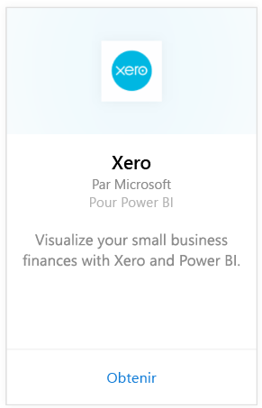
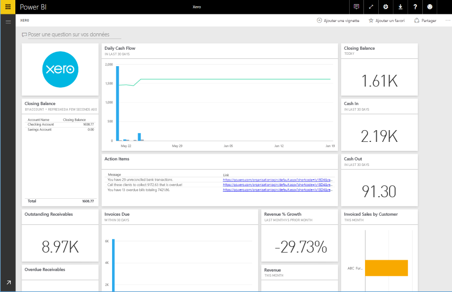

# Se connecter à Xero avec Power BI
Xero est un logiciel de comptabilité en ligne facile à utiliser, conçu spécifiquement pour les petites entreprises. Créez des visualisations attrayantes sur la base des informations financières de Xero avec ce pack de contenu Power BI. Votre tableau de bord par défaut comprend plusieurs mesures liées aux petites entreprises, comme l’état de la trésorerie, les recettes et les dépenses, les tendances liées aux bénéfices, les jours débiteur et le retour sur investissement.

Connectez-vous au [pack de contenu Xero](https://app.powerbi.com/getdata/services/xero) pour Power BI ou obtenez plus d’informations sur l’intégration de [Xero et Power BI](https://help.xero.com/Power-BI).

## Comment se connecter
1. Sélectionnez **Obtenir des données** en bas du volet de navigation gauche.
   
   
2. Dans la zone **Services**, sélectionnez **Obtenir**.
   
   
3. Sélectionnez **Xero** \>  **Obtenir**.
   
   
4. Entrez le surnom de l’organisation associée à votre compte Xero. Peu importe le surnom, il s’agit principalement d’aider les utilisateurs avec plusieurs entreprises Xero à rester organisés. Passez en revue les détails [ci-dessous](#FindingParams).
   
   
5. Dans **Méthode d’authentification**, sélectionnez **OAuth**. Lorsque vous y êtes invité, connectez-vous à votre compte Xero et sélectionnez l’organisation à laquelle vous souhaitez vous connecter. Une fois la connexion terminée, sélectionnez **Connexion** pour démarrer le processus de chargement.
   
    
   
    
6. Après l’approbation, le processus d’importation démarre automatiquement. Une fois terminé, de nouveaux tableau de bord, rapport et modèle apparaîtront dans le volet de navigation. Sélectionnez le tableau de bord pour afficher vos données importées.
   
     

**Et maintenant ?**

* Essayez de [poser une question dans la zone Q&R](consumer/end-user-q-and-a.md) en haut du tableau de bord.
* [Modifiez les vignettes](service-dashboard-edit-tile.md) dans le tableau de bord.
* [Sélectionnez une vignette](consumer/end-user-tiles.md) pour ouvrir le rapport sous-jacent.
* Même si une actualisation quotidienne de votre jeu de données est planifiée, vous pouvez modifier la planification de l’actualisation ou essayer d’actualiser le jeu de données sur demande à l’aide de l’option **Actualiser maintenant**.

## Ce qui est inclus
Le pack de contenu pour tableau de bord comprend des vignettes et des mesures qui couvrent différents domaines, avec les rapports correspondants pour en savoir plus :  

| Zone | Vignettes du tableau de bord | Rapport |
| --- | --- | --- |
| Trésorerie |Flux de trésorerie quotidienne  Trésorerie entrante  Trésorerie sortante  Solde de clôture par compte  Solde de clôture aujourd’hui |Comptes bancaires |
| Client |Ventes facturées  Ventes facturées par client  Tendance de croissance des ventes facturées  Factures échues  Comptes client en attente  Comptes client en retard |Client  Inventaire |
| Fournisseur |Facturation des achats  Facturation des achats par fournisseur  Tendance de facturation des achats   Factures échues  Comptes fournisseur en attente  Comptes fournisseur en retard |Fournisseurs  Inventaire |
| Inventaire |Montant des ventes mensuelles par produit |Inventaire |
| Résultat |Résultat mensuel  Bénéfice net pour cet exercice  Bénéfice net pour ce mois  Principaux comptes de frais |Résultat |
| Bilan |Total actif  Total passif  Capitaux propres |Bilan |
| Santé |Ratio actuel  Pourcentage de marge brute   Retour sur le total des actifs  Ration passif total/capitaux propres |Santé  Glossaire et notes techniques |

Le jeu de données comprend également les tableaux suivants pour personnaliser vos rapports et vos tableaux de bord :  

* Adresses  
* Alertes  
* Relevé de compte quotidien  
* Relevés bancaires  
* Contacts  
* Notes de frais  
* Lignes de facturation  
* Factures  
* Éléments  
* Fin de mois  
* Organisation  
* Bilan de vérification  
* Comptes Xero

## Configuration requise
Les rôles suivants sont nécessaires pour accéder au pack de contenu Xero : « Standard + Rapports » ou « Advisor ».

## Recherche de paramètres
Indiquez le nom de l’organisation à suivre dans Power BI. Cela vous permet de vous connecter à plusieurs organisations différentes. Notez que vous ne pouvez pas vous connecter à la même organisation plusieurs fois, car cela affecte l’actualisation planifiée.   

## Résolution des problèmes
* Les utilisateurs Xero ont besoin des rôles suivants pour accéder au pack de contenu Xero pour Power BI : « Standard + Rapports » ou « Advisor ». Le pack de contenu s’appuie sur les autorisations utilisateur pour accéder aux données de rapports via Power BI.  
* Si vous recevez une erreur après le chargement pendant un certain temps, vérifiez au bout de combien de temps ce message d’erreur s’est affiché. Notez que le jeton d’accès fourni par Xero est uniquement valide pendant 30 minutes. Par conséquent, les comptes échouent s’ils contiennent plus de données que le volume pouvant être chargé dans ce laps de temps. Nous travaillons activement pour améliorer cette situation.
* Lors du chargement, les vignettes du tableau de bord sont dans un état de chargement générique. Cet état ne change pas jusqu’à la fin du chargement. Si vous recevez une notification indiquant que le chargement est terminé alors que les vignettes sont toujours en cours de chargement, essayez d’actualiser les vignettes du tableau de bord en utilisant les points de suspension (...) en haut à droite de votre tableau de bord.
* Si votre pack de contenu ne parvient pas à s’actualiser, vérifiez si vous êtes connecté plusieurs fois à la même organisation dans Power BI. Xero autorise une seule connexion active à une organisation et vous risquez de voir une erreur indiquant que vos informations d’identification ne sont pas valides si vous vous connectez à la même organisation plusieurs fois.  
* En cas de problème de connexion du pack de contenu Xero pour Power BI, par exemple des messages d’erreur ou un temps de chargement prolongé, videz d’abord le cache et effacez les cookies et redémarrez le navigateur, puis reconnectez-vous à Power BI.  

Pour tout autre problème qui persiste, envoyez un ticket sur http://support.powerbi.com.

## Étapes suivantes
[Prise en main de Power BI](service-get-started.md)

[Obtenir des données dans Power BI](service-get-data.md)

