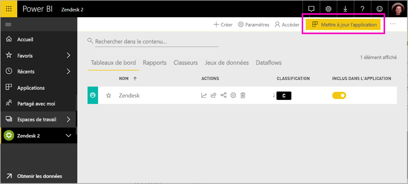

# Se connecter à Zendesk avec Power BI

Cet article vous guide tout au long de l’extraction de vos données à partir de votre compte Zendesk avec une application de modèle Power BI. L’application Zendesk propose un tableau de bord Power BI et un ensemble de rapports Power BI qui fournissent des informations sur vos volumes de tickets et les performances de l’agent. Les données sont actualisées automatiquement une fois par jour. 

Une fois que vous avez installé le modèle d’application, vous pouvez personnaliser le tableau de bord et rapports pour mettre en évidence les informations qui vous intéressent le plus. Vous pouvez distribuer en tant qu’application à vos collègues dans votre organisation.

Connectez-vous au [pack de contenu Zendesk](https://app.powerbi.com/getdata/services/zendesk) ou obtenez davantage d’informations sur l’[intégration de Zendesk](https://powerbi.microsoft.com/integrations/zendesk) à Power BI.

Une fois que vous avez installé le modèle d’application, vous pouvez modifier le tableau de bord et rapports. Vous pouvez distribuer en tant qu’application à vos collègues dans votre organisation.

>[!NOTE]
>Vous avez besoin d’un compte d’administrateur Zendesk pour vous connecter. Vous trouverez plus de détails sur la [configuration requise](#system-requirements) à la suite.

## Comment se connecter

[!INCLUDE [powerbi-service-apps-get-more-apps](./includes/powerbi-service-apps-get-more-apps.md)]

3. Sélectionnez **Zendesk** \> **obtenez-le maintenant**.
4. Dans **installer cette application Power BI ?** sélectionnez **installer**.
4. Dans le **applications** volet, sélectionnez le **Zendesk** vignette.

    

6. Dans **prise en main votre nouvelle application**, sélectionnez **se connecter aux données**.

    

4. Indiquez l’URL associée à votre compte. L’URL a la forme **https://company.zendesk.com** . Consultez les détails sur la [recherche de ces paramètres](#finding-parameters) ci-dessous.
   
   

5. Quand vous y êtes invité, entrez vos informations d’identification Zendesk.  Sélectionnez **oAuth2** comme mécanisme d’authentification et cliquez sur **Se connecter**. Suivez le flux d’authentification Zendesk. (Si vous êtes déjà connecté à Zendesk dans votre navigateur, vous ne pouvez pas être invité pour les informations d’identification.)
   
   > [!NOTE]
   > Ce pack de contenu requiert que vous vous connectez avec un compte d’administrateur Zendesk. 
   > 
   
   
6. Cliquez sur **Autoriser** pour autoriser Power BI à accéder à vos données Zendesk.
   
   
7. Cliquez sur **Se connecter** pour commencer le processus d’importation. 
8. Une fois que Power BI importe les données, vous voyez la liste de contenu pour votre application Zendesk : un nouveau tableau de bord, un rapport et un jeu de données.
9. Sélectionnez le tableau de bord pour démarrer le processus d’exploration.

    
   
## Modifier et distribuer votre application

Vous avez installé le modèle d’application Zendesk. Cela signifie que vous avez également créé l’espace de travail application Zendesk. Dans l’espace de travail, vous pouvez modifier le rapport et un tableau de bord et distribuez-la comme un *application* à vos collègues de votre organisation. 

1. Pour afficher tout le contenu de votre nouvel espace de travail Zendesk, dans la barre de navigation gauche, sélectionnez **espaces de travail** > **Zendesk**. 

    

    Cette vue est la liste de contenu pour l’espace de travail. Dans le coin supérieur droit, vous voyez **mise à jour application**. Lorsque vous êtes prêt à distribuer votre application à vos collègues, c’est là que vous allez commencer. 

    

2. Sélectionnez **rapports** et **jeux de données** pour voir les autres éléments dans l’espace de travail.

    En savoir plus sur [distribution d’applications](service-create-distribute-apps.md) à vos collègues.

## Configuration requise
Vous devez disposer d’un compte d’administrateur Zendesk pour accéder au pack de contenu Zendesk. Si vous êtes un agent ou d’un utilisateur final et que vous souhaitez afficher vos données Zendesk, ajoutez une suggestion et examinez le connecteur Zendesk dans la [Power BI Desktop](desktop-connect-to-data.md).

## Recherche de paramètres
Votre URL Zendesk est la même que celle que vous utilisez pour vous connecter à votre compte Zendesk. Si vous n’êtes pas certain de votre URL Zendesk, consultez [la page d’aide](https://www.zendesk.com/login/) expliquant comment se connecter à Zendesk.

## Résolution des problèmes
Si vous rencontrez des problèmes de connexion, vérifiez votre URL Zendesk et confirmez que vous utilisez un compte d’administrateur Zendesk.

## Étapes suivantes

* [Créer de nouveaux espaces de travail dans Power BI](service-create-the-new-workspaces.md)
* [Installer et utiliser des applications dans Power BI](consumer/end-user-apps.md)
* [Se connecter à des applications Power BI pour les services externes](service-connect-to-services.md)
* Vous avez des questions ? [Essayez d’interroger la communauté Power BI](http://community.powerbi.com/)

