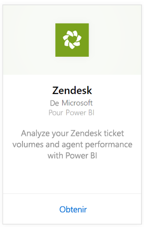
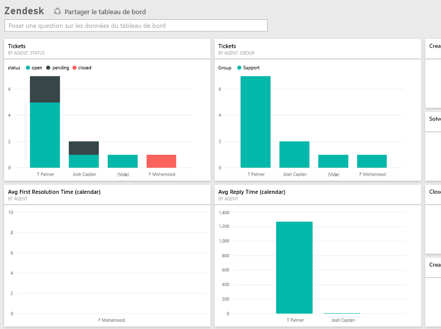

# Se connecter à Zendesk avec Power BI
Le pack de contenu Zendesk propose un tableau de bord Power BI et un ensemble de rapports Power BI qui fournissent des analyses relatives aux volumes de vos tickets et aux performances de vos agents. Vous pouvez utiliser le tableau de bord et les rapports fournis ou les personnaliser pour mettre en avant les informations qui vous intéressent le plus.  Les données sont actualisées automatiquement une fois par jour. 

Connectez-vous au [pack de contenu Zendesk](https://app.powerbi.com/getdata/services/zendesk) ou obtenez davantage d’informations sur l’[intégration de Zendesk](https://powerbi.microsoft.com/integrations/zendesk) à Power BI.

>[!NOTE]
>Vous devez disposer d’un compte d’administrateur Zendesk pour vous connecter. Vous trouverez plus de détails sur la [configuration requise](#Requirements) à la suite.

## Comment se connecter
1. Sélectionnez **Obtenir des données** en bas du volet de navigation gauche.
   
   
2. Dans la zone **Services** , sélectionnez **Obtenir**.
   
    
3. Sélectionnez **Zendesk** \> **Obtenir.**
   
   
4. Indiquez l’URL associée à votre compte. Celle-ci doit être au format **https://company.zendesk.com** consultez les détails sur la [recherche de ces paramètres](#FindingParams) ci-dessous.
   
   
5. Quand vous y êtes invité, entrez vos informations d’identification Zendesk.  Sélectionnez **oAuth2** comme mécanisme d’authentification et cliquez sur **Se connecter**. Suivez le flux d’authentification Zendesk. (Si vous êtes déjà connecté à Zendesk dans votre navigateur, vous ne serez peut-être pas invité à entrer vos informations d’identification.)
   
   > [!NOTE]
   > Ce pack de contenu exige que vous vous connectiez avec un compte Zendesk Admin. 
   > 
   > 
   
   
6. Cliquez sur **Autoriser** pour autoriser Power BI à accéder à vos données Zendesk.
   
   
7. Cliquez sur **Se connecter** pour commencer le processus d’importation. Une fois les données importées dans Power BI, vous verrez un nouveau tableau de bord, un nouveau rapport et un nouveau jeu de données dans le volet de navigation gauche. Les nouveaux éléments sont signalés par un astérisque jaune \*.
   
   

**Et maintenant ?**

* Essayez de [poser une question dans la zone Q&R](power-bi-q-and-a.md) en haut du tableau de bord.
* [Modifiez les vignettes](service-dashboard-edit-tile.md) dans le tableau de bord.
* [Sélectionnez une vignette](service-dashboard-tiles.md) pour ouvrir le rapport sous-jacent.
* Même si une actualisation quotidienne de votre jeu de données est planifiée, vous pouvez modifier la planification de l’actualisation ou essayer d’actualiser le jeu de données sur demande à l’aide de l’option **Actualiser maintenant**.

## Ce qui est inclus
Le pack de contenu Power BI inclut les données pour les éléments suivants :  

* Utilisateurs (utilisateurs finaux et agents)  
* Organisations  
* Groupes  
* Tickets  

Il comprend aussi un ensemble de mesures calculées, notamment Average Wait Time et Tickets Solved in the Last 7 days. La liste complète est disponible dans le pack de contenu.

## Configuration requise
Vous devez disposer d’un compte d’administrateur Zendesk pour accéder au pack de contenu Zendesk. Si vous êtes un agent ou un utilisateur final et que vous souhaitez afficher vos données Zendesk, ajoutez une suggestion et examinez le connecteur Zendesk dans [Power BI Desktop](desktop-connect-to-data.md).

## Recherche de paramètres
Votre URL Zendesk est la même que celle que vous utilisez pour vous connecter à votre compte Zendesk. Si vous n’êtes pas certain de votre URL Zendesk, consultez [la page d’aide](https://www.zendesk.com/login/) expliquant comment se connecter à Zendesk.

## Résolution des problèmes
Si vous rencontrez des problèmes de connexion, vérifiez votre URL Zendesk et confirmez que vous utilisez bien un compte d’administrateur Zendesk.

## Étapes suivantes
* [Prise en main de Power BI](service-get-started.md)
* [Obtenir des données](service-get-data.md)

