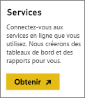
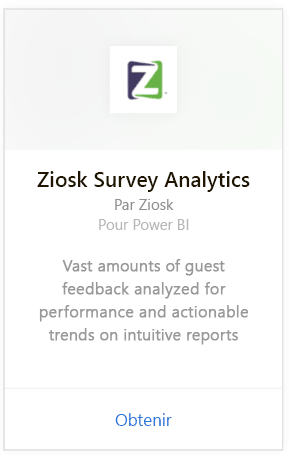
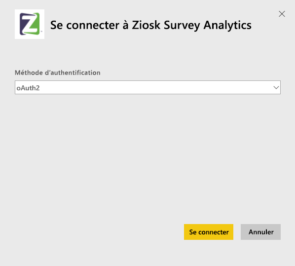
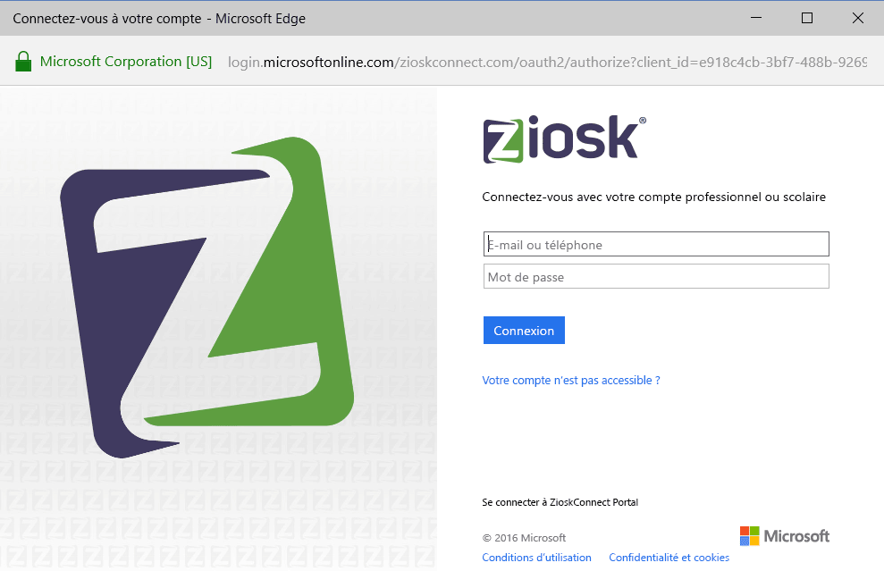
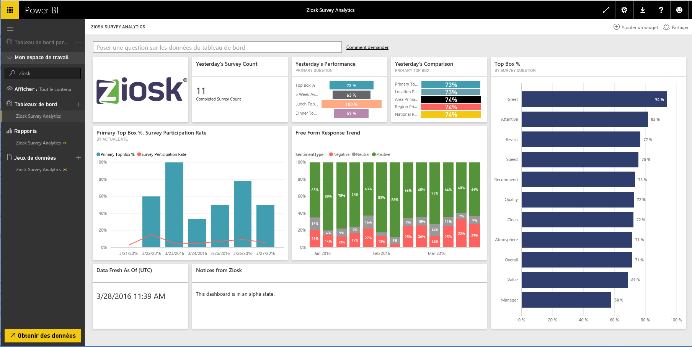

# Se connecter à Ziosk Survey Analytics avec Power BI
Le pack de contenu Ziosk Survey Analytics pour Power BI offre aux restaurants un accès sans égal aux tablettes Ziosk lors de l’analyse de données d’enquête Ziosk, notamment la segmentation par jour, lieu, employé et bien plus encore.

Connectez-vous au [pack de contenu Ziosk Survey Analytics](https://app.powerbi.com/getdata/services/ziosk-survey-analytics) pour Power BI.

## Comment se connecter
1. Sélectionnez **Obtenir des données** en bas du volet de navigation gauche.  
   
    
2. Dans la zone **Services** , sélectionnez **Obtenir**.  
   
    
3. Sélectionnez **Ziosk Survey Analytics**, puis **Obtenir**.  
   
    
4. Sélectionnez **OAuth 2**, puis **Se connecter**. Quand vous y êtes invité, indiquez vos informations d’identification Ziosk.
   
    
   
    
5. Après connexion, un tableau de bord, un rapport et un ensemble de données sont chargés automatiquement. Les vignettes sont ensuite mises à jour avec des données de votre compte Ziosk.
   
    

**Et maintenant ?**

* Essayez de [poser une question dans la zone Q&R](power-bi-q-and-a.md) en haut du tableau de bord.
* [Modifiez les vignettes](service-dashboard-edit-tile.md) dans le tableau de bord.
* [Sélectionnez une vignette](service-dashboard-tiles.md) pour ouvrir le rapport sous-jacent.
* Même si une actualisation quotidienne de votre jeu de données est planifiée, vous pouvez modifier la planification de l’actualisation ou essayer d’actualiser le jeu de données sur demande à l’aide de l’option **Actualiser maintenant**.

## Ce qui est inclus
Le pack de contenu inclut les tables suivantes :  

    - Alcohol Category  
    - Appetizer Category  
    - CommentKeywords  
    - Date  
    - Daypart  
    - Dessert Category  
    - FreeForm  
    - Kids Category  
    - Messages  
    - Premium Content Category  
    - Question  
    - Store  
    - Surveys  
    - Weekday  

## Configuration requise
Un compte Ziosk avec des autorisations sur les tables ci-dessus est nécessaire afin d'instancier ce pack de contenu.

## Étapes suivantes
[Prise en main de Power BI](service-get-started.md)

[Power BI – Concepts de base](service-basic-concepts.md)

