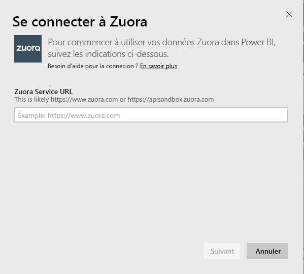
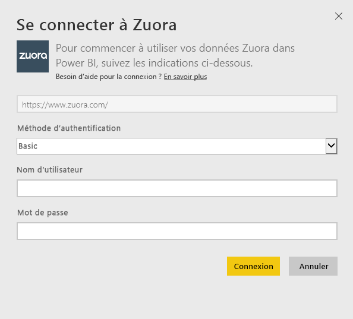
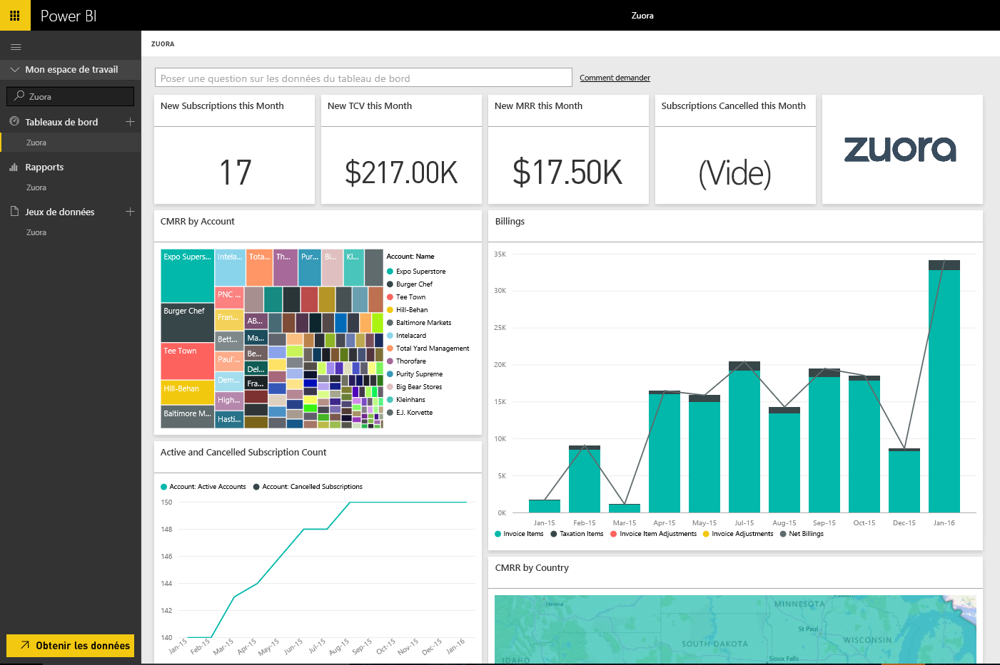

# Se connecter à Zuora avec Power BI
Zuora pour Power BI vous permet de visualiser des données importantes sur votre chiffre d’affaires, votre facturation et vos abonnements. Utilisez le tableau de bord et les rapports par défaut pour analyser les tendances d’utilisation, suivre la facturation et les paiements, et surveiller les revenus réguliers, ou personnalisez-les pour répondre à vos besoins uniques.

Connectez-vous à [Zuora](https://app.powerbi.com/getdata/services/Zuora) pour Power BI.

## Comment se connecter
1. Sélectionnez **Obtenir des données** en bas du volet de navigation gauche.

   
2. Dans la zone **Services** , sélectionnez **Obtenir**.

   
3. Sélectionnez **Zuora** \>  **Obtenir**.

   
4. Spécifiez l’URL de Zuora (en général, https://www.zuora.com). (en général, https://www.zuora.com). Consultez les détails sur la [recherche de ces paramètres](#FindingParams) ci-dessous.

   
5. Pour **Méthode d’authentification**, sélectionnez **Basic** et indiquez vos nom d’utilisateur et mot de passe (en respectant la casse), puis sélectionnez **Se connecter**.

    
6. Après l’approbation, le processus d’importation démarre automatiquement. Une fois terminé, de nouveaux tableau de bord, rapport et modèle apparaîtront dans le volet de navigation. Sélectionnez le tableau de bord pour afficher vos données importées.

     

**Et maintenant ?**

* Essayez de [poser une question dans la zone Q&R](power-bi-q-and-a.md) en haut du tableau de bord.
* [Modifiez les vignettes](service-dashboard-edit-tile.md) dans le tableau de bord.
* [Sélectionnez une vignette](service-dashboard-tiles.md) pour ouvrir le rapport sous-jacent.
* Même si une actualisation quotidienne de votre jeu de données est planifiée, vous pouvez modifier la planification de l’actualisation ou essayer d’actualiser le jeu de données sur demande à l’aide de l’option **Actualiser maintenant**.

## Ce qui est inclus
Le pack de contenu utilise l’API Zuora AQUA pour exploiter les tables suivantes :

| Tableaux |  |  |
| --- | --- | --- |
| Account |InvoiceItemAdjustment |Refund |
| AccountingCode |Payment |RevenueSchedule |
| AccountingPeriod |PaymentMethod |RevenueScheduleItem |
| BillTo |Product |Subscription |
| DateDim |ProductRatePlan |TaxationItem |
| Invoice |ProductRatePlanCharge |Utilisation |
| InvoiceAdjustment |RatePlan | |
| InvoiceItem |RatePlanCharge | |

Il inclut également ces mesures calculées :

| Mesure | Description | Pseudo-calcul |
| --- | --- | --- |
| Compte : Paiements |Totaux payés sur une période, en fonction de la date d’effet du paiement. |SUM (Payment.Amount)  WHERE Payment.EffectiveDate =< TimePeriod.EndDate AND    Payment.EffectiveDate >= TimePeriod.StartDate |
| Compte : Remboursements |Totaux de remboursement sur une période, en fonction de la date de remboursement. La quantité est signalée comme un nombre négatif. |-1*SUM(refund.amount) WHERE Refund.RefundDate =< TimePeriod.EndDate AND    Refund.RefundDate >= TimePeriod.StartDate |
| Compte : Paiements nets |Paiements de compte plus remboursements de compte sur une période. |Account.Payments + Account.Refunds |
| Compte : Comptes actifs |Nombre de comptes actifs sur une période. Les abonnements doivent avoir commencé avant ou à la date de début de période. |COUNT (Account.AccountNumber) WHERE     Subscription.Status != "Expiré" AND    Subscription.Status != "Brouillon" AND    Subscription.SubscriptionStartDate <= TimePeriod.StartDate AND    (Subscription.SubscriptionEndDate > TimePeriod.StartDate OR Subscription.SubscriptionEndDate = null) –evergreen subscription |
| Compte : Revenu récurrent moyen |Revenu récurrent mensuel (MRR) brut par compte actif sur une période. |MRR brut / Account.ActiveAccounts |
| Compte : Cancelled Subscriptions |Nombre de comptes qui ont annulé un abonnement sur une période donnée. |COUNT (Account.AccountNumber) WHERE Subscription.Status = "Annulé" AND    Subscription.SubscriptionStartDate <= TimePeriod.StartDate AND    Subscription.CancelledDate >= TimePeriod.StartDate |
| Compte : Erreurs de paiement |Valeur totale des erreurs de paiement. |SUM (Payment.Amount) WHERE Payment.Status = "Erreur" |
| Revenue Schedule Item: Recognized Revenue |Revenus totaux identifiés sur une période comptable. |SUM (RevenueScheduleItem.Amount) WHERE AccountingPeriod.StartDate = TimePeriod.StartDate |
| Abonnement : Nouveaux abonnements. |Nombre de nouveaux abonnements sur une période. |COUNT (Subscription.ID) WHERE Subscription.Version = "1" AND    Subscription.CreatedDate <= TimePeriod.EndDate AND    Subscription.CreatedDate >= TimePeriod.StartDate |
| Facture : Éléments de facturation |Montants totaux des éléments facturés sur une période. |SUM (InvoiceItem.ChargeAmount) WHERE     Invoice.Status = "Publié" AND    Invoice.InvoiceDate <= TimePeriod.EndDate AND    Invoice.InvoiceDate >= TimePeriod.StartDate |
| Facture : Éléments de taxation |Montants totaux de taxation sur une période. |SUM (TaxationItem.TaxAmount) WHERE Invoice.Status = "Publié" AND    Invoice.InvoiceDate <= TimePeriod.EndDate AND    Invoice.InvoiceDate >= TimePeriod.StartDate |
| Facture : Ajustements d’éléments de facturation |Montants totaux d’éléments de facturation sur une période. |SUM (InvoiceItemAdjustment.Amount)  WHERE     Invoice.Status = "Publié" AND    InvoiceItemAdjustment.AdjustmentDate <= TimePeriod.EndDate AND    InvoiceItemAdjustment.AdjustmentDate >= TimePeriod.StartDate |
| Facture : Ajustements de facturation |Montants totaux d’ajustements de facturation sur une période. |SUM (InvoiceAdjustment.Amount)  WHERE     Invoice.Status = "Publié" AND    InvoiceAdjustment.AdjustmentDate <= TimePeriod.EndDate AND    InvoiceAdjustment.AdjustmentDate >= TimePeriod.StartDate |
| Facture : facturation nette |Somme des éléments de facturation, de taxation, d’ajustements d’éléments facturation et d’ajustement de facturation sur une période. |Invoice.InvoiceItems + Invoice.TaxationItems + Invoice.InvoiceItemAdjustments + Invoice.InvoiceAdjustments |
| Facture : Soldes facture |Somme des soldes de facture publiés. |SUM (Invoice.Balance)  WHERE     Invoice.Status = "Publié" |
| Facture : facturation brute |Somme des montants bruts de facture sur une période. |SUM (InvoiceItem.ChargeAmount)  WHERE     Invoice.Status = "Publié" AND    Invoice.InvoiceDate <= TimePeriod.EndDate AND    Invoice.InvoiceDate >= TimePeriod.StartDate |
| Facture : Ajustements totaux |Somme des ajustements de facturation traité et des ajustements d’éléments de facturation associés à des factures publiées. |SUM (InvoiceAdjustment.Amount)  WHERE     Invoice.Status = "Publié" AND    InvoiceAdjustment.Status = "Processed" + SUM (InvoiceItemAdjustment.Amount)  WHERE     Invoice.Status = "Publié" AND    invoiceItemAdjustment.Status = "Processed" |
| Frais de plan de taux : MRR brut |Somme du revenu récurrent mensuel (MRR) à partir d’abonnement sur une période donnée. |SUM (RatePlanCharge.MRR)  WHERE     Subscription.Status != "Expiré" AND    Subscription.Status != "Brouillon" AND    RatePlanCharge.EffectiveStartDate <= TimePeriod.StartDate AND        RatePlanCharge.EffectiveEndDate > TimePeriod.StartDate     OR    RatePlanCharge.EffectiveEndDate = null --evergreen subscription |

## Configuration requise
Vous devez avoir accès à l’API Zuora.

## Recherche de paramètres
Indiquez l’URL que vous utilisez généralement pour vous connecter à vos données Zuora. Les options valides sont les suivantes :  

* https://www.zuora.com  
* https://www.apisandbox.zuora.com  
* URL correspondant à votre instance de service  

## Résolution des problèmes
Le pack de contenu Zuora extrait différents aspects de votre compte Zuora. Si vous n’utilisez pas certaines fonctionnalités, les vignettes/rapports correspondants peuvent être vides. Si vous vous heurtez à des problèmes lors du chargement, contactez le support technique dédié à Power BI.

## Étapes suivantes
[Prise en main de Power BI](service-get-started.md)

[Obtenir des données dans Power BI](service-get-data.md)
