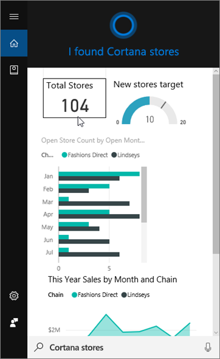
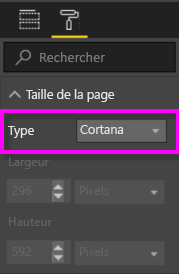
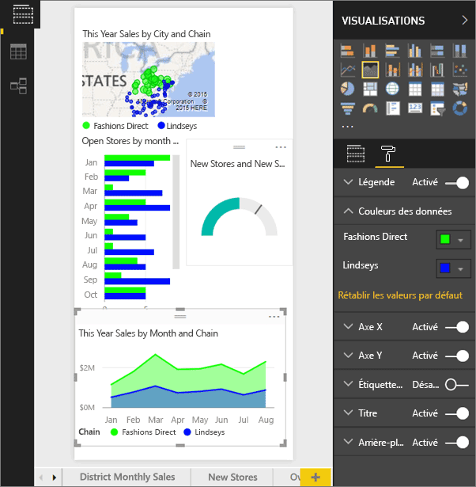
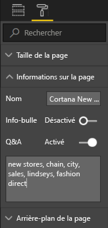
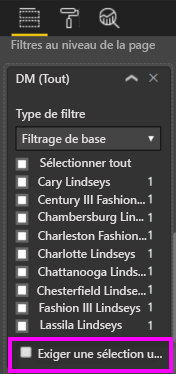

# Utiliser le service Power BI ou Power BI Desktop pour créer une page de réponse personnalisée pour Cortana
Utilisez les fonctionnalités complètes de Power BI pour créer des pages de rapport spéciales, nommées *pages de réponse Cortana* (ou parfois *cartes de réponse Cortana*), spécifiquement conçues pour répondre aux questions de Cortana.

> [!IMPORTANT]
> Si vous essayez la préversion de Cortana avec le **tableau de bord** Power BI, vous pouvez ignorer le reste de cet article. Aucune configuration n’est requise pour que Cortana soit en mesure d’effectuer des recherches dans vos tableaux de bord Power BI.
> 
> 

## Avant de commencer
Vous avez à votre disposition quatre documents qui vous guident dans la configuration et l’utilisation de Cortana pour Power BI. Si ce n’est déjà fait, commencez par lire le premier article. Le deuxième article est particulièrement important, parce qu’il décrit certaines mesures que vous devez prendre avant de commencer à utiliser des pages de réponse de Cortana.

**Article 1** : [Découvrir comment Cortana et Power BI fonctionnent ensemble](service-cortana-intro.md)

**Article 2** : [pour rechercher dans des rapports Power BI : activer l’intégration de Cortana - Power BI - Windows](service-cortana-enable.md)

**Article 3** : cet article

**Article 4** : [résoudre les problèmes](service-cortana-troubleshoot.md)

## Créer une page de réponse Cortana spécifiquement conçue pour Cortana
Une *page de réponse Cortana* dans un rapport est dimensionnée spécifiquement pour que Cortana puisse l’afficher à l’écran en tant que réponse à une question. Pour créer une page de réponse pour Cortana :

1. Nous vous recommandons de commencer par une [page de rapport vide](power-bi-report-add-page.md).
2. Dans le volet **Visualisations**, sélectionnez l’icône représentant un rouleau et choisissez **Taille de la page** > **Type** > **Cortana**.
   
    
3. Créez un élément visuel ou un ensemble d’éléments visuels que vous souhaitez voir apparaître dans Cortana en réponse à une question particulière (ou un ensemble de questions).
4. Vérifiez que tous les éléments visuels s’ajustent aux bordures de page. Si vous le souhaitez, vous pouvez modifier les paramètres d’affichage, les étiquettes de données, les couleurs et les arrière-plans.  
   
    
5. Nommez la page et ajoutez des noms secondaires. Cortana utilise ces noms lors de la recherche de résultats. Dans le volet **Visualisations**, sélectionnez l’icône représentant un pinceau et choisissez **Informations de la page**. Activez les Questions et réponses pour cet élément visuel en déplaçant le curseur sur **Activé**.
   
    
   
   > [!TIP]
   > Pour améliorer les résultats, évitez d’utiliser des mots qui sont également des noms de colonnes.
   > 
   > 
6. Éventuellement, si le rapport contient des filtres au niveau de la page, vous pouvez définir **Nécessitent une sélection unique**. Cortana affiche uniquement ce rapport en tant que réponse si un seul des éléments de filtre est spécifié dans la question. L’option **Nécessitent une sélection unique** est accessible au bas du volet **Filtres**.
   
   > [!NOTE]
   > Vous n’êtes pas obligé de sélectionner **Exiger une sélection unique** pour demander à Cortana d’afficher un rapport avec les filtres au niveau de la page. Par exemple « afficher les ventes de Charlotte Lindseys » affiche une page de réponse quelle que soit la configuration de l’option Exiger une sélection unique.
   > 
   > 
   
     
   
      Par exemple, si vous demandez à Cortana :
   
   * « afficher les ventes par nom de magasin » : cette page de réponse n’apparaît pas, car vous n’avez inclus aucun des éléments dans le filtre de niveau page requis.
   * « afficher les ventes pour Cary Lindseys et Charlotte Lindseys » : cette page de réponse n’apparaît pas, car vous avez spécifié plusieurs éléments dans le filtre de niveau page requis.
   * « afficher les ventes de Charlotte Lindseys » : cette page de réponse s’affiche.
     
     = « afficher les ventes » : cette page de réponse n’apparaît pas, car vous n’avez inclus aucun des éléments dans le filtre de niveau page requis.

> [!IMPORTANT]
> Avant que Cortana puisse accéder à votre page de réponse, vous devez [Activer le jeu de données pour Cortana](service-cortana-enable.md).
> 
> 

## Comment Cortana classe les résultats ?
Les réponses présentant une note élevée (par exemple, une correspondance complète d’un nom de page spécifié) sont affichées en premier en tant que *meilleure correspondance* dans Cortana. Plusieurs meilleures correspondances peuvent apparaître s’il existe plusieurs pages de réponse Cortana dans Power BI. Les réponses présentant une note moyenne ou faible (telles que les réponses qui ne sont pas basées sur le nom d’une page de réponse ou une question avec des mots non compris par Power BI) sont répertoriées comme liens sous les meilleures correspondances dans Cortana.

> [!NOTE]
> Quand un nouveau jeu de données ou une nouvelle page de réponse Cortana personnalisée sont ajoutés à Power BI et activés pour Cortana, l’affichage des résultats dans Cortana peut prendre jusqu’à 30 minutes. En cas de connexion et déconnexion de Windows 10 ou de redémarrage du processus Cortana dans Windows 10, un nouveau contenu apparaît immédiatement.
> 
> 

## Étapes suivantes
[Utilisation de Cortana avec Power BI](service-cortana-intro.md)

Vous ne parvenez pas à faire fonctionner Cortana avec Power BI ?  Essayez l’outil de [résolution des problèmes de Cortana](service-cortana-troubleshoot.md).

D’autres questions ? [Posez vos questions à la communauté Power BI](http://community.powerbi.com/)

