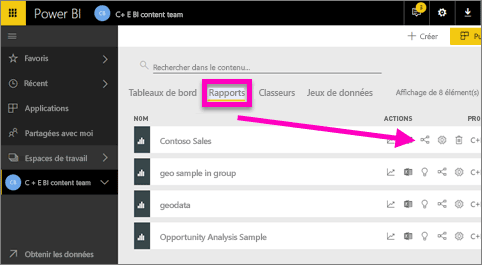
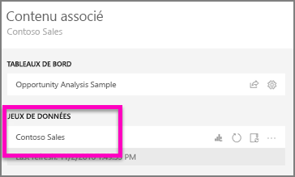
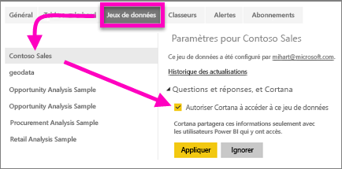
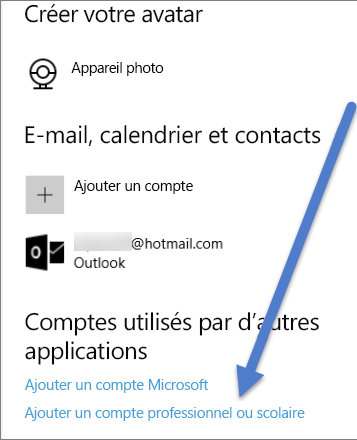

# Permettre à Cortana d’accéder aux rapports Power BI (et à leurs jeux de données sous-jacents)
Vous avez lu l’[Introduction à Cortana et Power BI](service-cortana-intro.md) (si ce n’est pas le cas, nous vous recommandons de la lire, puis de revenir sur cette page). Et maintenant, vous souhaitez essayer vous-même.  Avant de pouvoir poser des questions en langage naturel dans Cortana et trouver des réponses à partir des données stockées dans des ***rapports*** Power BI, vous devez respecter quelques conditions préalables. Plus précisément, vous devez effectuer les opérations suivantes.

> [!NOTE]
> Si vous essayez la préversion de Cortana avec le ***tableau de bord*** Power BI, vous pouvez ignorer le reste de cet article. Aucune configuration n’est requise pour que Cortana soit en mesure d’effectuer des recherches dans vos tableaux de bord Power BI.
> 
> 

Dans le service Power BI

* Activer un ou plusieurs jeux de données pour Cortana (les rapports reposant sur des jeux de données, Cortana doit pouvoir accéder à ceux-ci)

Dans Microsoft Windows

* Vérifiez que vous exécutez Windows 10 version 1511 ou ultérieure
* Vérifiez que Power BI et Windows peuvent « communiquer » entre eux. Cela signifie que vous devez connecter votre compte à Windows.

## Utiliser le service Power BI pour permettre à Cortana d’accéder aux pages de rapport dans Power BI
Activation des rapports dans Power BI pour que Cortana puisse y accéder via un processus simple.  En fait, vous n’avez qu’à activer le jeu de données sous-jacent du rapport en sélectionnant « Autoriser Cortana à accéder à ce jeu de données ». Après cela, tout utilisateur ayant accès au jeu de données dans Power BI, via un partage Power BI standard, des applications et de fonctionnalités de pack de contenu, peut obtenir des réponses à partir du rapport dans Cortana sous Windows 10.

Vous devez vous connecter au service Power BI (pas à Power BI Desktop), puis répéter cette procédure pour chaque jeu de données auquel Cortana doit avoir accès.

1. Déterminez les jeux de données à activer. Dans la liste des contenus de rapport, sélectionnez le rapport auquel vous voulez que Cortana puisse accéder, puis choisissez l’icône **Afficher les éléments associés** .
   
    
2. Le jeu de données associé à ce rapport est **Contoso Sales**.
   
    
3. À droite du nom du jeu de données, sélectionnez les **points de suspension (...) > Paramètres**.  
   
    
4. Sélectionnez **QR et Cortana** > **Autoriser Cortana à accéder à ce jeu de données** > **Appliquer**.
   
   
   
   Dans cet exemple, nous autorisons Cortana à accéder au jeu de données Contoso Sales.
   
   > [!NOTE]
   > Lorsqu’un nouveau jeu de données ou une nouvelle carte de réponse Cortana est ajouté à Power BI et activé pour Cortana, l’affichage des résultats peut prendre jusqu’à 30 minutes. En cas de connexion et déconnexion de Windows 10 ou de redémarrage du processus Cortana dans Windows 10, du nouveau contenu apparaît immédiatement.
   > 
   > Si vous activez un jeu de données pour Cortana et que celui-ci fait partie d’un pack de contenu ou d’une application qui vous appartiennent, vous devez le publier à nouveau pour que vos collègues puissent également l’utiliser avec Cortana.
   > 
   > 

## Ajouter vos informations d’identification Power BI à Windows
Vous devez exécuter Windows 10 version 1511 ou ultérieure.

1. Déterminez la version de Windows 10 que vous exécutez. Ouvrez **Paramètres**.
    .

    Puis sélectionnez **Système > À propos**. Au bas de l’écran, vous voyez **Spécifications Windows > Version**.

   * Si vous avez Windows 10 version 1511 (mise à jour du 10 novembre 2015) jusqu’à 1607, ajoutez votre compte professionnel ou scolaire et votre compte Microsoft (exécutez les étapes 2 et 3 ci-dessous).
   * Si vous avez Windows 10 version 1607 (mise à jour du 10 juillet 2016) ou ultérieure, ajoutez votre compte professionnel ou scolaire (exécutez uniquement l’étape 2 ci-dessous).
1. Ajoutez votre compte professionnel ou scolaire pour Cortana.
   
   * Ouvrez **Paramètres** > **Comptes**.
     
       
   * Faites défiler vers le bas, puis sélectionnez **Ajouter un compte professionnel ou scolaire**. Ou, à partir de la page **Comptes**, sélectionnez **Accès professionnel ou scolaire > Se connecter**.
     
     

Cortana utilise ce compte professionnel ou scolaire pour rechercher dans Power BI les réponses potentielles à vos questions sur Cortana.

## Étapes suivantes
[Créer des *cartes de réponse* Cortana dans Power BI](service-cortana-answer-cards.md)

[Résoudre les problèmes d’intégration de Cortana et Power BI](service-cortana-troubleshoot.md)

D’autres questions ? [Posez vos questions à la communauté Power BI](http://community.powerbi.com/)

