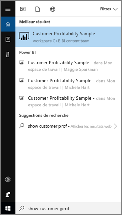
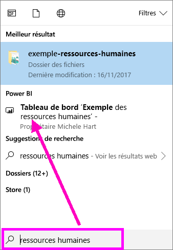
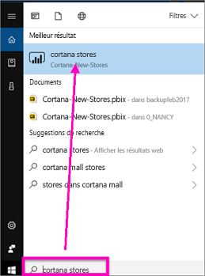
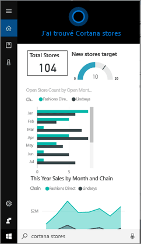
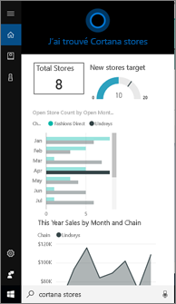
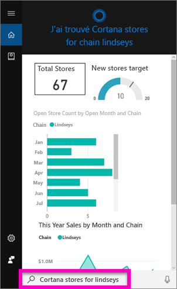
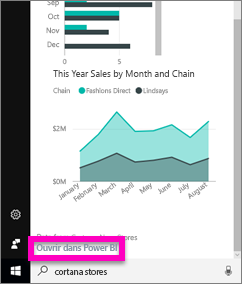
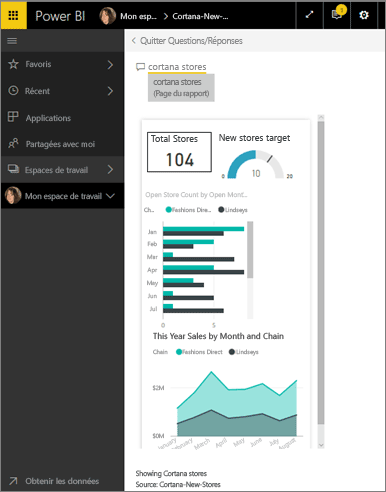

# Rechercher et afficher vos données Power BI avec Cortana pour Power BI
Utilisez Cortana sur vos appareils Windows 10 pour obtenir directement des réponses à vos questions métier importantes. En s’intégrant avec Power BI, Cortana peut extraire des informations clés directement à partir de tableaux de bord et de rapports Power BI. Pour cela, il vous suffit de disposer de la version de novembre 2015 ou ultérieure de Windows 10, de Cortana, de Power BI, et d’avoir accès à au moins un jeu de données.

> [!IMPORTANT]
> Intégration de Cortana est déconseillée dans Power BI. À compter du 11 juin, Cortana ne fonctionnera plus pour les tableaux de bord et les rapports.

## Préversion de la nouvelle expérience de recherche de *tableau de bord* de Cortana pour Windows 10
Depuis un certain temps déjà, vous pouvez [utiliser Cortana pour extraire certains types de pages de rapport](service-cortana-answer-cards.md). Désormais, nous avons ajouté une **nouvelle expérience** : la possibilité d’extraire également des tableaux de bord. Faites un essai et [nous envoyer vos commentaires à Power BI Ideas](https://ideas.powerbi.com/forums/265200-power-bi). Par la suite, la *nouvelle expérience* sera étendue pour inclure la recherche Cortana également pour les rapports.  L’un des principaux avantages de la nouvelle expérience est que vous n’avez rien à faire de particulier pour la configurer (aucune activation de Cortana ou configuration de Windows 10). Elle fonctionne tout simplement.

> [!NOTE]
> Si elle ne fonctionne pas « tout simplement », voir l’article [Résolution des problèmes](service-cortana-troubleshoot.md) pour obtenir de l’aide.
> 
> 

La technologie sous-jacente utilise le [service Recherche Microsoft Azure](https://docs.microsoft.com/azure/search/). Ce service offre des fonctionnalités supplémentaires, telles que le classement intelligent, la correction d’erreurs et la saisie semi-automatique.

Les deux expériences Cortana peuvent exister côte à côte.

## Documentation de Cortana pour Power BI
Quatre documents vous aider à configurer et à l’aide de Cortana pour Power BI.

**Article 1** (cet article) : comprendre comment Cortana et Power BI fonctionnent ensemble

**Article 2** : [Rechercher des rapports Power BI : Activer l’intégration Cortana - Power BI - Windows](service-cortana-enable.md)

**Article 3** : [Rechercher des rapports Power BI : créez spéciale *cartes de réponse Cortana*](service-cortana-answer-cards.md)

**Article 4** : [Résoudre les problèmes](service-cortana-troubleshoot.md)

## Comment Cortana et Power BI fonctionnent ensemble
Lorsque vous utilisez l’application Cortana pour poser une question, celle-ci peut notamment chercher des réponses dans Power BI. Dans Power BI, Cortana peut trouver des réponses pilotées par des données enrichies à partir de rapports Power BI (qui contiennent un type spécifique de page de rapport nommé *Carte de réponse Cortana*) et de tableaux de bord Power BI.

Si Cortana trouve une correspondance, il affiche le nom de la page de tableau de bord ou de rapport directement dans son écran. Vous pouvez ouvrir la page de tableau de bord ou de rapport dans Power BI. Vous pouvez également explorer les pages de rapport directement dans Cortana, car elles sont interactives.

### Cortana et Tableaux de bord (*nouvelle expérience*)
Cortana peut trouver des réponses dans des tableaux de bord qui vous appartiennent et des tableaux de bord partagés avec vous. Posez à Cortana des questions en utilisant des titres, mots clés, noms de propriétaire, noms d’espace de travail, noms d’application et bien plus encore.

Pour que Cortana puisse trouver une réponse, votre question doit comporter au moins deux mots. Par conséquent, si vous effectuez une recherche sur un tableau de bord dont le nom ne comprend qu’un seul mot (par exemple, Marketing), ajoutez à votre question le mot « afficher », « Power BI » ou le nom du propriétaire, comme dans « afficher Marketing » et « exemple michele hart ». 

Si le titre de votre tableau de bord comprend plusieurs mots, Cortana retourne ce tableau de bord uniquement si votre recherche correspond à au moins deux de ces mots, ou à l’un des mots plus le nom du propriétaire. Pour un tableau de bord nommé « Exemple Rentabilité des clients » : 

* énoncés « montrer client » *ne* retournent un résultat de tableau de bord Power BI.   
* « énoncés tels que « montrent rentabilité des clients », « client r », « client e », « exemple rentabilité », « exemple michele hart », « exemple rentabilité des clients show » et « montrer clients r » *faire* retournent un résultat de Power BI.
* Ajout du mot « powerbi » comptant comme l’un des deux mots obligatoires, « powerbi exemple » *est* retournent un résultat de Power BI. 
  
    

### Cortana et rapports
 Cortana peut trouver des réponses dans des rapports comportant des [pages conçues spécifiquement pour l’affichage par Cortana](service-cortana-answer-cards.md). Posez simplement des questions utilisant le titre ou des mots clés d’une de ces pages de rapport spéciales.  

La technologie sous-jacente pour les rapports utilisent [Power BI Q & r](power-bi-tutorial-q-and-a.md).

Lorsque vous posez une question dans Cortana, Power BI répond à partir de pages de rapport spécifiquement conçues pour Cortana. Les réponses possibles sont déterminées par Cortana à la volée directement à partir des *cartes de réponse* Cortana déjà créées dans Power BI.  Pour explorer plus en détail une réponse, ouvrez un résultat dans Power BI.

> [!NOTE]
> Avant que Cortana puisse rechercher des réponses dans vos rapports Power BI, vous avez besoin d’[activer cette fonctionnalité dans le service Power BI et de configurer Windows pour communiquer avec Power BI](service-cortana-enable.md).  
> 
> 

## Utiliser Cortana pour obtenir des réponses de Power BI
1. Démarrez dans Cortana. Il existe de nombreuses façons d’*ouvrir* Cortana  : en sélectionnant l’icône Cortana dans la barre des tâches (illustrée ci-dessous), en utilisant des commandes vocales ou en appuyant sur l’icône de recherche sur votre appareil mobile Windows.
   
     
2. Lorsque Cortana est prête, tapez ou prononcez votre question dans la barre de recherche de Cortana. Cortana affiche les résultats disponibles. S’il existe un tableau de bord Power BI correspondant à la question, il s’affiche sous **Meilleur résultat** ou **Power BI**.
   
     
   
   > [!NOTE]
   > Actuellement, seule la langue anglaise est prise en charge.
   > 
   > 
3. Sélectionnez le tableau de bord pour l’ouvrir dans Cortana.

    

    Vous pouvez modifier la disposition en [modifiant la *vue téléphone* du tableau de bord](service-create-dashboard-mobile-phone-view.md). 

1. À partir de Cortana, vous avez aussi la possibilité d’ouvrir le tableau de bord dans le service Power BI ou Power Bi Mobile. Ouvrez le tableau de bord dans le service Power BI en sélectionnant **Ouvrir sur le web**. 
   
      
4. Utilisons à présent Cortana pour rechercher un rapport. Nous devons être informés de l’existence d’un [rapport comprenant une page avec une carte de réponse Cortana ](service-cortana-answer-cards.md). Dans cet exemple, un rapport nommé « Cortana-New-Stores » comporte une page de carte de réponse Cortana nommée « cortana stores ».  
   
     Tapez ou prononcez votre question dans la barre de recherche de Cortana. Cortana affiche les résultats disponibles. S’il existe une page de rapport Power BI correspondant à la question, elle s’affiche sous **Meilleure correspondance** ou **Power BI**. Dans cet exemple, le fichier .pbix (et le fichier de sauvegarde) utilisé pour créer la carte de réponse s’affiche également sous **Documents**.
   
      
5. Sélectionnez la page de rapports **Cortana stores** pour l’afficher dans la fenêtre Cortana.
   
       
   
    N’oubliez pas, une *carte de réponse* est un type de page de rapport Power BI spécifique, créé par le propriétaire d’un jeu de données.  Pour plus d’informations, consultez [Créer une carte de réponse Cortana](service-cortana-answer-cards.md).
6. Mais ce n’est pas tout. Vous pouvez interagir avec les visualisations de la carte de réponse comme dans Power BI.
   
   * Par exemple, sélectionnez un élément sur une visualisation pour filtrer et mettre en évidence les autres visualisations de la carte de réponse.
     
     
   * Ou utilisez le langage naturel pour filtrer les résultats à la place.  Par exemple, demandez Magasins Cortana pour Lindseys. Remarquez que la carte est alors filtrée pour afficher uniquement les données de la chaîne Lindseys.
     
     
7. Poursuivez votre exploration. Faites défiler vers le bas de la fenêtre Cortana et sélectionnez **Ouvrir dans Power BI**.
   
     
8. La page de rapport s’ouvre dans Power BI.    
     

## Considérations et résolution des problèmes
* Cortana n’a pas accès aux cartes Cortana qui n’ont pas été [activées pour Power BI](service-cortana-enable.md).
* Vous ne parvenez pas à faire fonctionner Cortana avec Power BI ?  Essayez l’outil de [résolution des problèmes de Cortana](service-cortana-troubleshoot.md).
* Cortana pour Power BI est actuellement disponible uniquement en anglais.
* Cortana pour Power BI est disponible uniquement sur des appareils mobiles Windows.

D’autres questions ? [Posez vos questions à la Communauté Power BI](http://community.powerbi.com/).
Vous souhaitez formuler des commentaires ? [Envoyez-les sur Power BI Ideas](https://ideas.powerbi.com/forums/265200-power-bi).

## Étapes suivantes
[Activer l’intégration Cortana - Power BI - Windows pour les rapports](service-cortana-enable.md)

