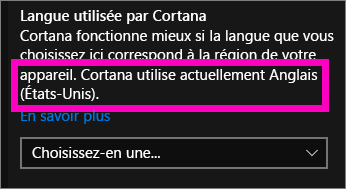
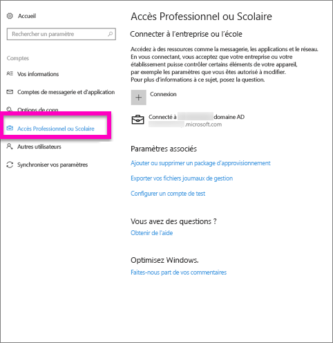
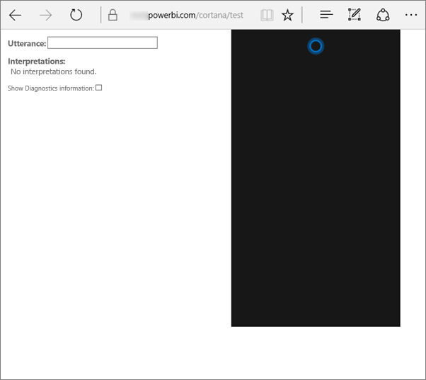
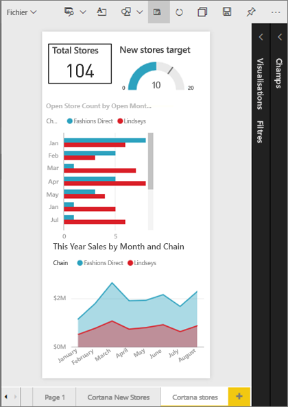
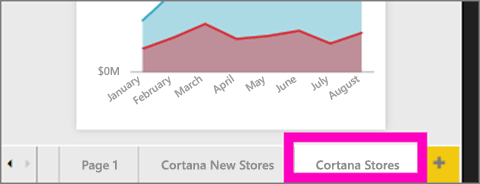
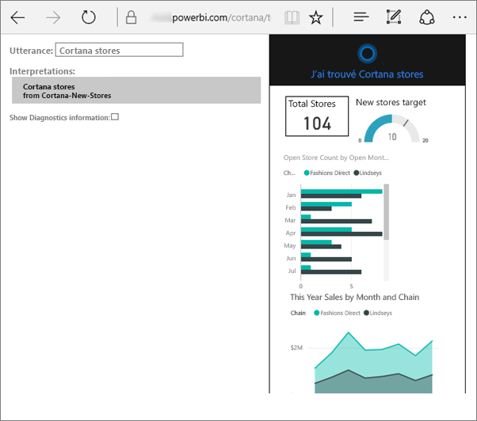
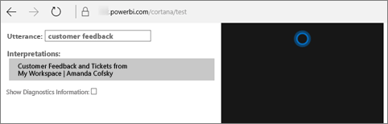

# Résoudre les problèmes de Cortana pour Power BI
Cet article fait partie d’une série. Si cela n’est pas déjà le cas, nous vous recommandons de lire les trois articles suivants.

**Article 1** : [comprendre comment Cortana et Power BI fonctionnent ensemble pour rechercher des rapports et tableaux de bord Power BI](service-cortana-intro.md)

**Article 2** : [pour rechercher dans des rapports : activer l’intégration de Cortana - Power BI - Windows](service-cortana-enable.md)

**L’article 3**: [pour rechercher dans des rapports : créer des *cartes de réponse Cortana spéciales*](service-cortana-answer-cards.md)

Si vous rencontrez des problèmes pour intégrer Cortana à Power BI, vous êtes sur la bonne page. Pour diagnostiquer et résoudre le problème que vous rencontrez, suivez les étapes ci-dessous.

## Pourquoi Cortana ne trouve pas de réponses dans mes jeux de données ou tableaux de bord Power BI ?
1. Avez-vous un compte Power BI ?  Si ce n’est pas le cas, [inscrivez-vous gratuitement](service-self-service-signup-for-power-bi.md).
2. Est-ce que Cortana est en cours d’exécution ?  L’icône Cortana s’affiche-t-elle dans votre barre des tâches ?

    

    Lorsque vous la sélectionnez, Cortana s’ouvre-t-elle avec un champ dans lequel vous pouvez taper ?
3. Avez-vous utilisé au moins 2 mots dans votre recherche ? Cortana a besoin d’expressions d’au moins 2 mots pour trouver des réponses dans Power BI. Essayez d’ajouter « montrer » au début de votre question.
4. Si votre tableau de bord comprend un titre de plusieurs mots, Cortana renvoie ce tableau de bord uniquement si votre recherche correspond à au moins deux de ces mots. Pour un tableau de bord nommé « Ventes exercice 16 » :

   * L’énoncé « montrer ventes » ne retourne *pas* de résultat de Power BI.   
   * Les énoncés « montrer ventes exercice 16 », « ventes exercice 16 », « montrer ventes » et « montrer ventes e » *retournent* un résultat de Power BI.    
   * « powerbi » comptant comme l’un des 2 mots obligatoires, « powerbi ventes » *retourne* un résultat de Power BI.
5. Disposez-vous d’un accès à des rapports ou à des tableaux de bord, ou d’autorisations de modifier ceux-ci ? Pour les rapports, vérifiez que le contenu dans lequel vous tentez d’effectuer une recherche dispose d’une [carte de réponse](service-cortana-answer-cards.md).  Pour les tableaux de bord, vérifiez que le contenu dans lequel vous tentez d’effectuer une recherche figure dans **Partagé avec moi**, un espace de travail d’application, ou dans **Mon espace de travail**. [Servez-vous de l’outil de dépannage](#try-the-cortana-troubleshooting-tool) pour identifier le problème.
6. Utilisez-vous un appareil mobile ?  Actuellement nous prenons en charge l’intégration de Power BI et Cortana uniquement sur les appareils mobiles Windows.
7. Est-ce que Cortana est configuré pour l’anglais ?  Pour l’instant, l’intégration Cortana - Power BI prend seulement en charge l’anglais. Ouvrez Cortana et sélectionnez l’icône représentant une roue dentée pour afficher les paramètres. Faites défiler les paramètres jusqu’à **Langue utilisée par Cortana** et vérifiez qu’il est défini sur l’une des options en anglais.

   
8. Vous avez plus de 100 rapports activés pour Cortana ?  Les recherches de Cortana sont limitées à un maximum de 100 éléments.  Pour vous assurer que votre rapport soit inclus dans, déplacez-le ou copiez-le vers votre dossier **Mon espace de travail**, car c’est là que Cortana commence ses recherches.
9. Vous devrez peut-être lui laisser un peu de temps. La première fois que vous saisissez une requête, le modèle peut être *froid*. Attendez quelques secondes, le temps du chargement des données en mémoire, puis réessayez.
10. Pour les tableaux de bord, jusqu’à 24 heures peuvent s’écouler avant qu’ils soient accessibles à Cortana.    
11. Pour les rapports, quand un nouveau jeu de données ou une nouvelle carte de réponse personnalisée est ajouté à Power BI et activé pour Cortana, l’affichage des résultats dans Cortana peut prendre jusqu’à 30 minutes. En cas de connexion et déconnexion de Windows 10, ou de redémarrage du processus de Cortana dans Windows 10, un nouveau contenu de rapport apparaît immédiatement.  
12. Votre administrateur Power BI peut « décliner ». Contactez votre administrateur pour voir si c’est le cas.

## Rapports uniquement : pourquoi Cortana ne trouve-t-il pas de réponses dans mes rapports Power BI ?
1. Si vous recherchez des réponses dans des rapports, disposez-vous de rapports comportant des **cartes de réponse** Cortana ? Les cartes de réponse sont le seul moyen dont dispose Cortana pour trouver des réponses dans vos rapports Power BI.  Pour savoir comment créer une carte de réponse, consultez l’article [Créer des cartes de réponse Cortana dans le service Power BI et Power BI Desktop](service-cortana-answer-cards.md).
2. Exécutez-vous Windows version 1511 ou ultérieure ?  Pour le savoir, ouvrez Paramètres Windows, puis sélectionnez **Système > À propos**. Si ce n’est pas le cas, mettez à jour votre version de Windows.
3. Vos comptes Windows et Power BI sont-ils connectés ? Ceci peut prêter à confusion. Suivez les instructions de l’article [Activer Cortana pour Power BI](service-cortana-enable.md#add-your-power-bi-credentials-to-windows).
4. Des jeux de données sous-jacents ont-ils été activés pour Cortana ? Peut-être qu’un de vos collègues a partagé un jeu de données activé pour Cortana. Dans le cas contraire, [découvrez comment activer des jeux de données pour Cortana](service-cortana-enable.md). Cela est facile et rapide.

## Tableaux de bord uniquement : pourquoi Cortana ne trouve-t-il pas de réponses dans mes tableaux de bord Power BI ?
1. Vérifiez que vous êtes connecté à votre compte professionnel. Power BI a besoin de cette connexion pour pouvoir authentifier vos autorisations d’accès aux données. Pour déterminer si vous êtes connecté ou non, connectez-vous à votre compte professionnel, puis utilisez la zone de recherche de Windows pour accéder à « Se connecter à l’entreprise ou à l’établissement ».  

    
2. Avez-vous accès à Cortana ? Sélectionnez la zone de recherche de Windows, puis accordez à Cortana les autorisations d’accès à vos informations.

## Essayer l’outil de résolution des problèmes de Cortana
Vous rencontrez toujours des problèmes ?  Le moment est venu d’exécuter l’outil de résolution des problèmes de Cortana et de réduire le champ des problèmes possibles.

### Vous éprouvez des difficultés à extraire des réponses à partir d’un rapport ?
1. Pour les rapports, avant d’exécuter l’outil de résolution des problèmes, veillez à définir les filtres **Niveau de la page** sur vos cartes de réponse Cortana sur **Exiger une sélection unique**. Pour obtenir de l’aide sur cette procédure, consultez [Créer des cartes de réponse Cortana](service-cortana-answer-cards.md).
2. Ouvrez l’outil de résolution des problèmes en ajoutant « / cortana/test » à la fin de l’URL de votre service Power BI. L’URL doit ressembler à ceci :

   app.powerbi.com/cortana/test

   
3. Dans le champ **Énoncé**, pour résoudre des problèmes de rapports, entrez le nom d’une carte de réponse Cortana ***exactement tel qu’il apparaît sous l’onglet Power BI***.

   

    

   
4. Parfois, lorsque vous entrez quelque chose dans le champ **Énoncé**, pour la première fois, rien ne se produit. Cette opération revient à préparer le système. Vous indiquez à l’outil de résolution des problèmes qu’il doit s’activer. Coupez-collez ou retapez votre texte dans le champ **Énoncé**. Dans cet exemple, le nom de la carte de réponse est **Cortana stores** (Magasins Cortana). Le fait de coller ou de taper **Cortana Stores** dans l’outil génère un seul résultat qui s’affiche dans le champ **Interprétations**. Cliquez pour afficher la carte de réponse dans la fenêtre Cortana, en l’occurrence, **Cortana stores**.

   

   Comme un résultat s’affiche, vous savez maintenant que Cortana **est** bien activé dans Power BI. Cela indique que le problème provient de Windows, du paramètre de langue de Cortana, ou du fait que vous avez plus de 100 jeux de données activés pour Cortana.

### Vous éprouvez des difficultés à extraire des réponses à partir d’un tableau de bord ?
Vous recherchez un tableau de bord partagé avec vous ?  Ouvrez Power BI > **partagés Partagé avec moi**, puis recherchez le nom du tableau de bord.  Tapez ensuite ce nom dans le champ **Énoncés**.

#### Outil de résolution des problèmes connus
* Si l’outil n’extrait pas les résultats la première fois, collez la requête dans la zone de texte Énoncé.
* La requête doit être conçue pour contenir au moins 2 mots.  Si votre requête est trop courte, ajoutez le mot « Afficher ».
* Il est possible que certaines chaînes de requête avec prépositions ne fonctionnent pas (par exemple, les ventes par article). Essayez d’autres termes de requête qui n’utilisent pas de préposition et sont explicites et uniques.

D’autres questions ? [Posez vos questions à la communauté Power BI](http://community.powerbi.com/)
