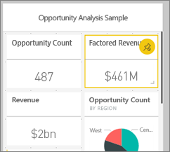
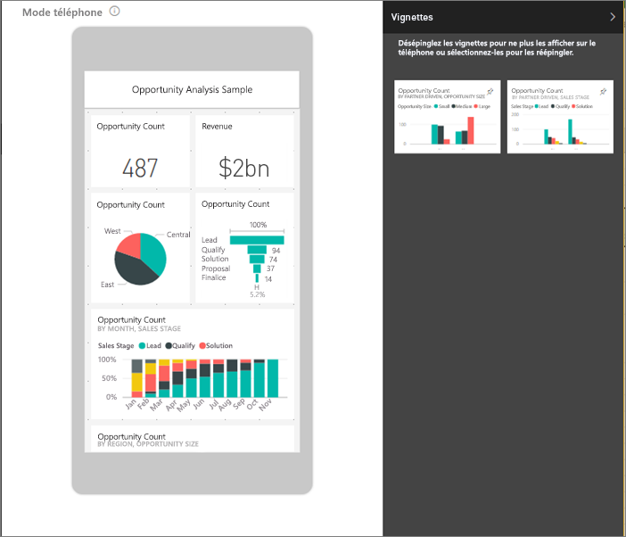

# Créer une vue de tableau de bord Power BI optimisée pour les téléphones mobiles
Quand vous affichez les tableaux de bord dans l’application mobile Power BI sur un téléphone, les vignettes associées sont disposées l’une après l’autre et ont toutes la même taille. Dans le service Power BI, vous pouvez créer une vue personnalisée d’un tableau de bord que vous possédez, en particulier pour l’affichage sur les téléphones.

Quand vous tournez le téléphone sur le côté, le tableau de bord est affiché comme dans le service, et non comme vous l’avez conçu pour le téléphone.

> [!NOTE]
> Quand vous modifiez la vue téléphone, les personnes qui consultent le tableau de bord sur un téléphone peuvent voir les modifications apportées en temps réel. Par exemple, si vous détachez tous les vignettes sur la vue téléphone du tableau de bord, le tableau de bord affiché sur le téléphone se retrouve soudain sans vignette. 
> 
> 

## Créer une vue téléphone d’un tableau de bord
1. Dans le service Power BI, ouvrez un tableau de bord.
2. Sélectionnez la flèche en regard de **Affichage web** dans le coin supérieur droit, puis sélectionnez **Vue téléphone**.

    

    Si vous n’êtes pas propriétaire du tableau de bord, cette option n’apparaît pas.

    

    La vue de modification du tableau de bord du téléphone s’ouvre. Ici, vous pouvez détacher, redimensionner et réorganiser les vignettes pour les ajuster à la vue téléphone. La version web du tableau de bord ne change pas.

1. Sélectionnez une vignette pour la faire glisser, la redimensionner ou la détacher. Les autres vignettes se déplacent à mesure que vous faites glisser une vignette.
   
    
   
    Les vignettes désépinglées passent dans le volet Vignettes désépinglées, où elles restent, sauf si vous les replacez.
   
    
2. Si vous changez d’avis, sélectionnez **Réinitialiser les vignettes** pour qu’elles retrouvent leur taille et leur ordre de départ.
   
    
   
    L’ouverture de la vue téléphone dans le service Power BI modifie légèrement la taille et la forme des vignettes sur un téléphone. Par conséquent, pour que le tableau de bord retrouve l’apparence qu’il avait avant l’ouverture dans la vue de modification du téléphone, sélectionnez **Réinitialiser les vignettes**.
3. Quand la disposition du tableau de bord sur le téléphone vous convient, sélectionnez la flèche en regard de **Vue téléphone** dans le coin supérieur droit, puis sélectionnez **Affichage web**.
   
    Power BI enregistre automatiquement la disposition du téléphone.

## Étapes suivantes
* [Créer des rapports optimisés pour les applications Power BI pour téléphone](desktop-create-phone-report.md)
* [Créer des visuels réactifs optimisés pour toute taille](visuals/desktop-create-responsive-visuals.md)
* D’autres questions ? [Essayez d’interroger la communauté Power BI](http://community.powerbi.com/)

